**NIO非阻塞网络编程**


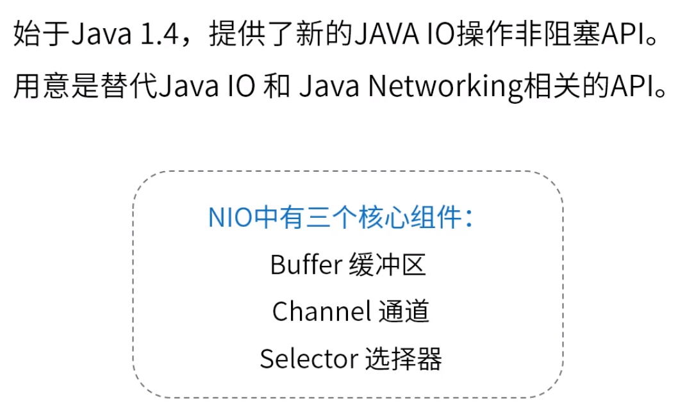

### 一、Buffer缓冲区

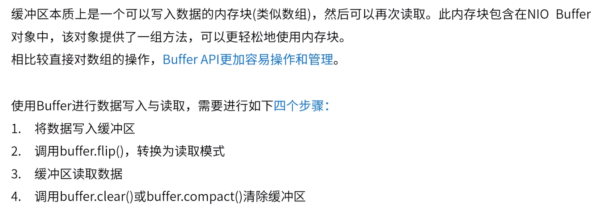

ByteBuffer（堆内存中申请缓冲区--数组形式；）

```java
ByteBuffer byteBuffer = ByteBuffer.allocate(4);//构建一个byte字节缓冲区，容量为4
ByteBuffer directByteBuffer = ByteBuffer.allocateDirect(4);//堆外内存获取方式
//堆外未实现array()方法
```

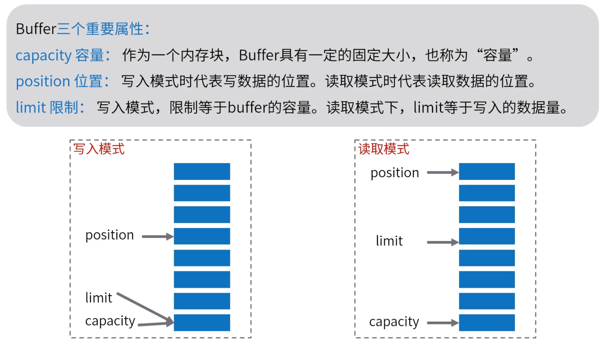


put() 写  get() 读

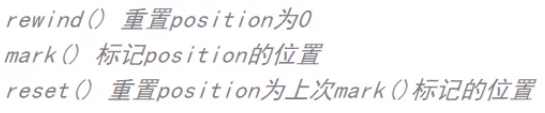


GC会移动对象内存，为防止IO操作受影响，会先把数据复制到堆外。堆外内存不受GC管理，但会通过Cleaner对象实现间接管理（后续JVM中详解）。

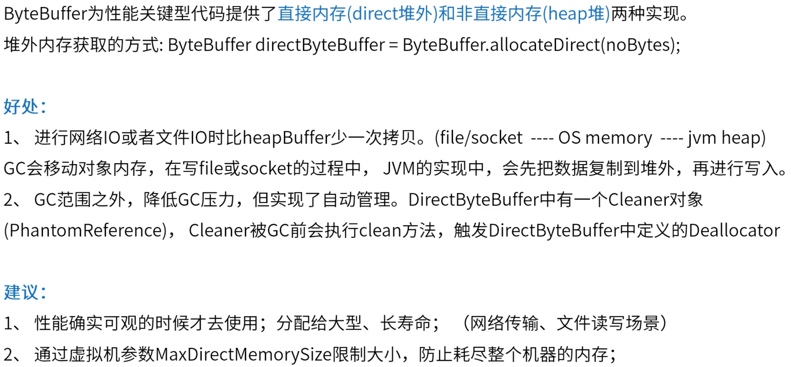


### 二、Channel通道

Channel	创建网络连接，传输数据（BIO：socket & stream）

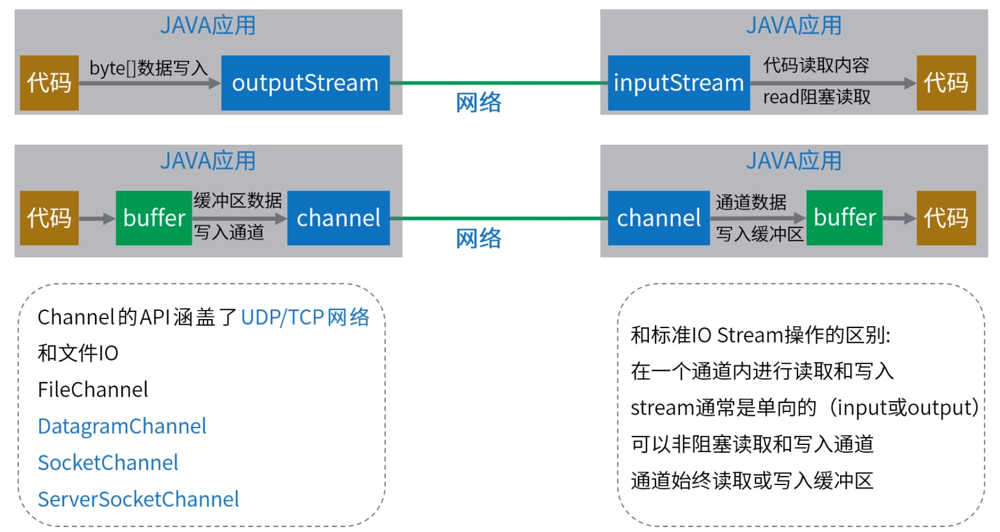

Socket底层接口默认阻塞。

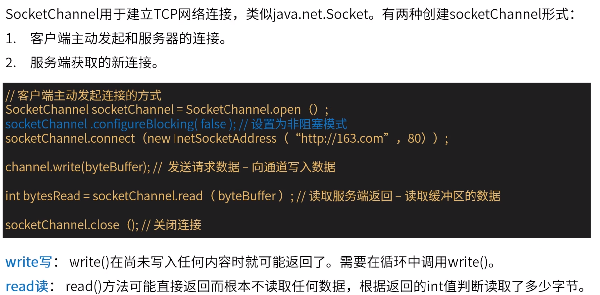


循环检查，低效。

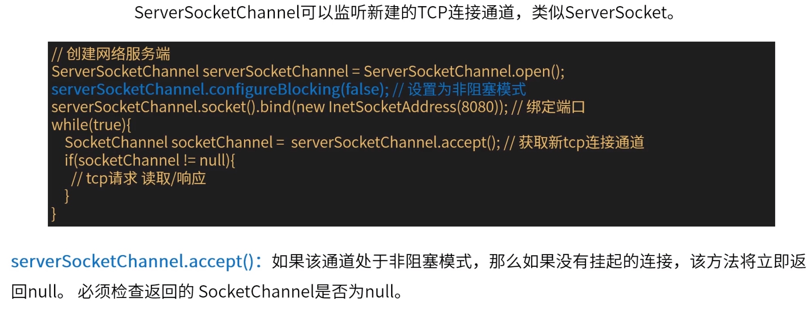


### 三、Selector选择器

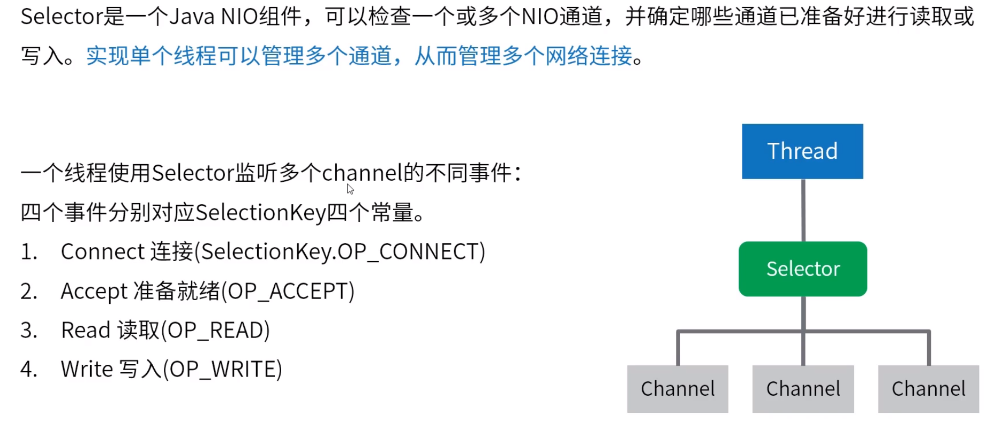


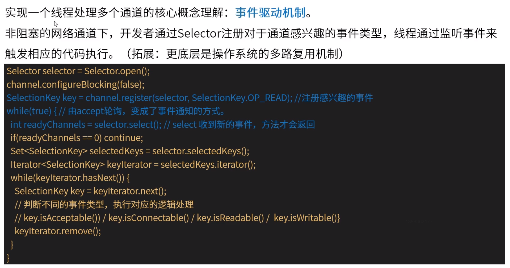


### 四、NIO VS BIO

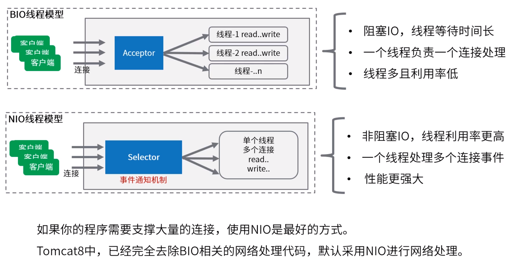


### 五、NIO与多线程结合

问题：一个Selector监听所有事件，一个线程处理所有请求事件，会成为瓶颈！要有多线程的运用。


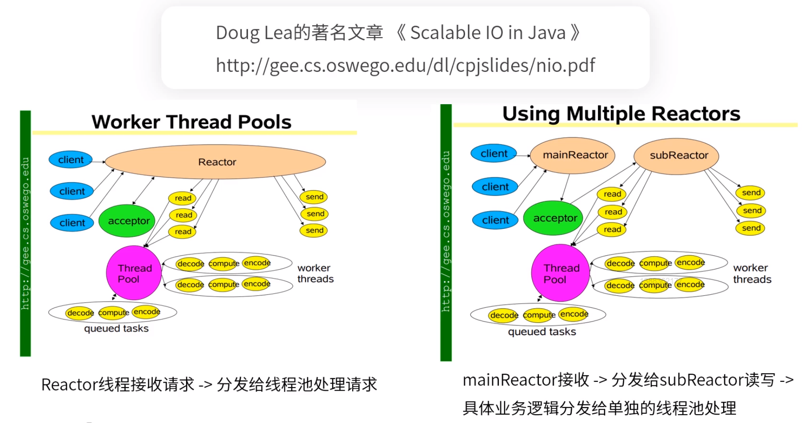


### 六、小结

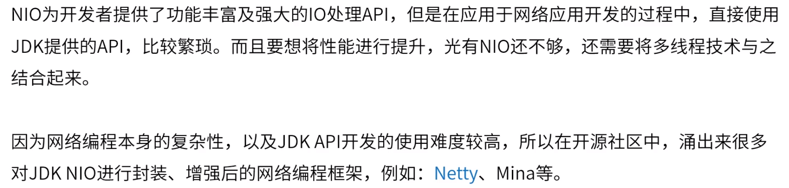

