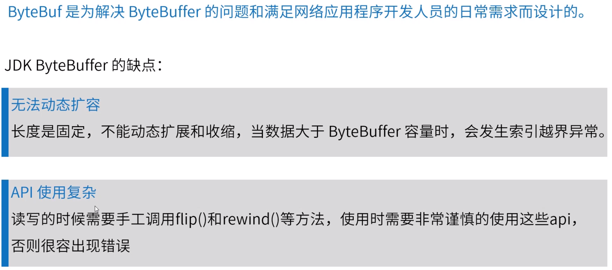
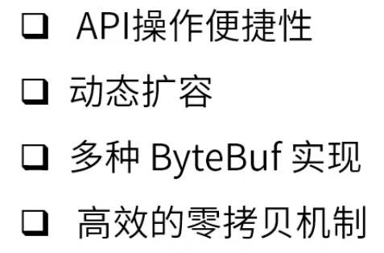
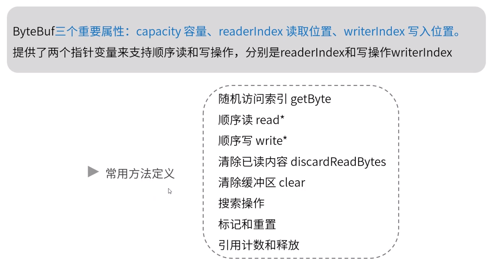
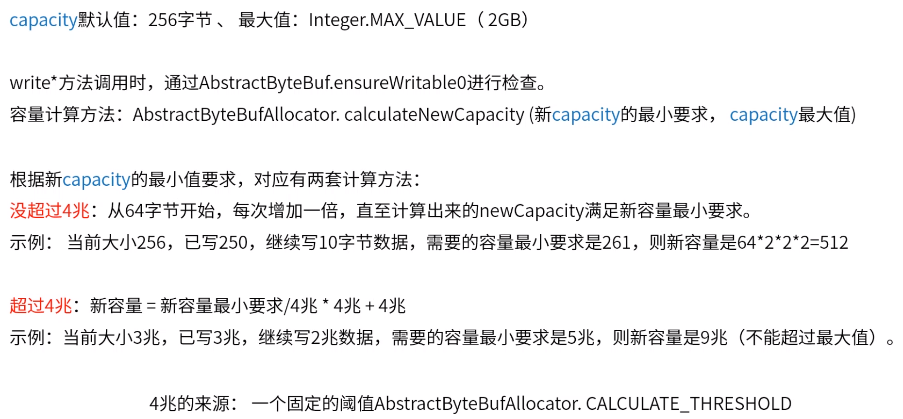
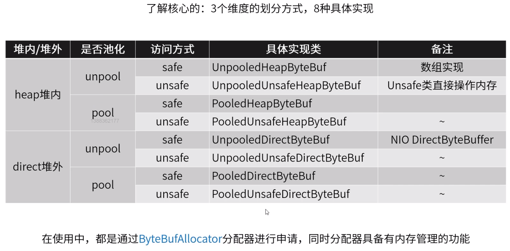
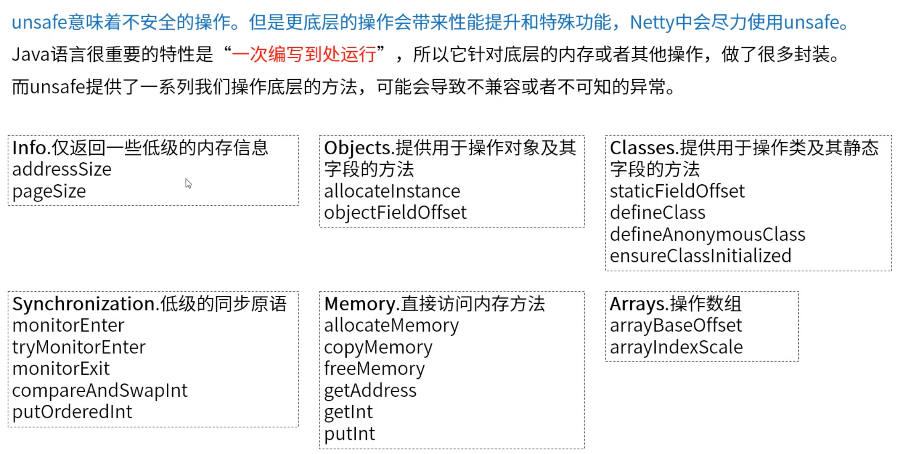
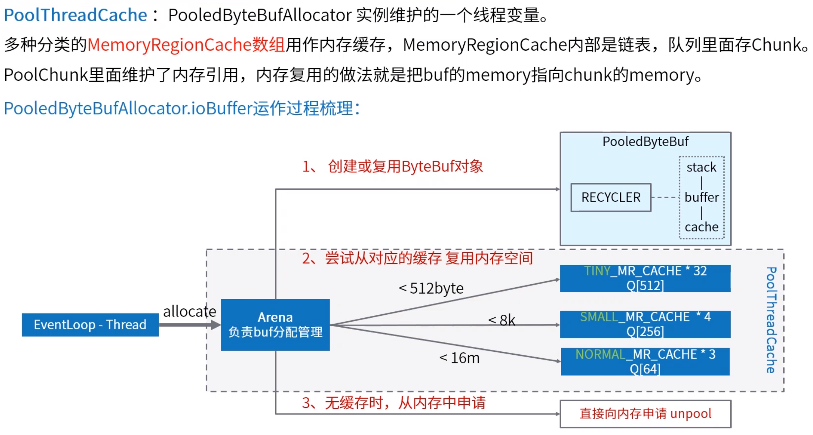
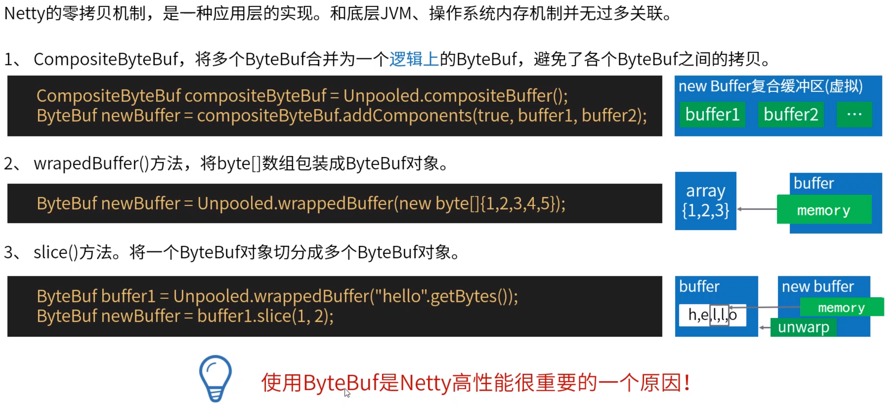

**零拷贝机制**











```java
//非池化：没有内存复用
ByteBuf buf = Unpooled.buffer(10);//创建一个堆内非池化的ByteBuf,大小为10字节
ByteBuf buf = Unpooled.directBuffer(10);//创建一个堆外非池化的ByteBuf,大小为10字节
//堆外ByteBuf未实现array()方法
```







unsafe使用unsafe直接操作内存







ByteBuf对象没有释放就不会回收复用




