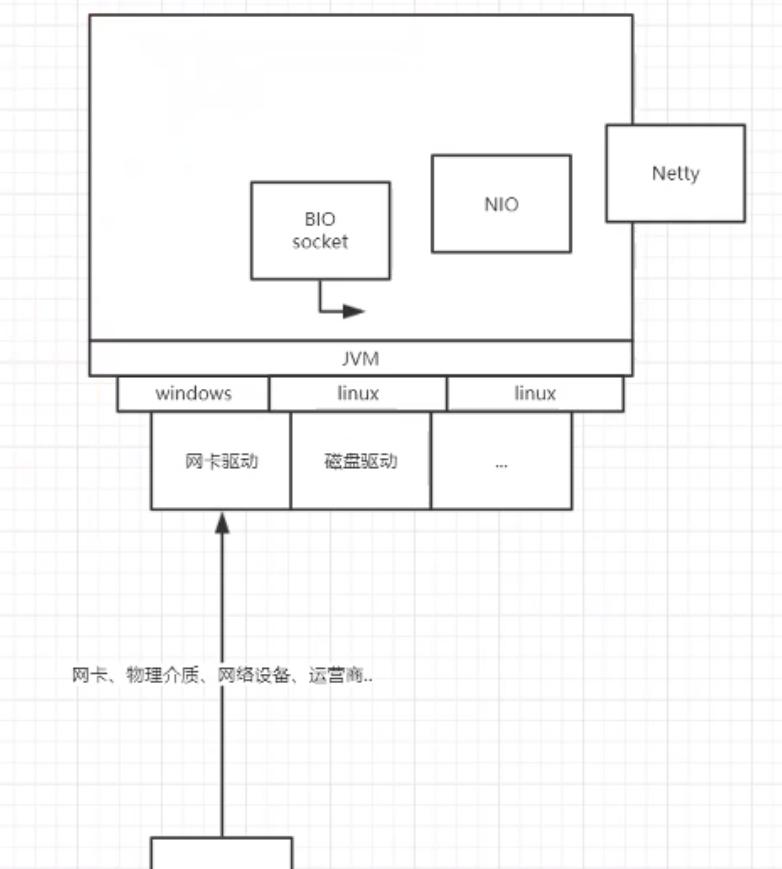
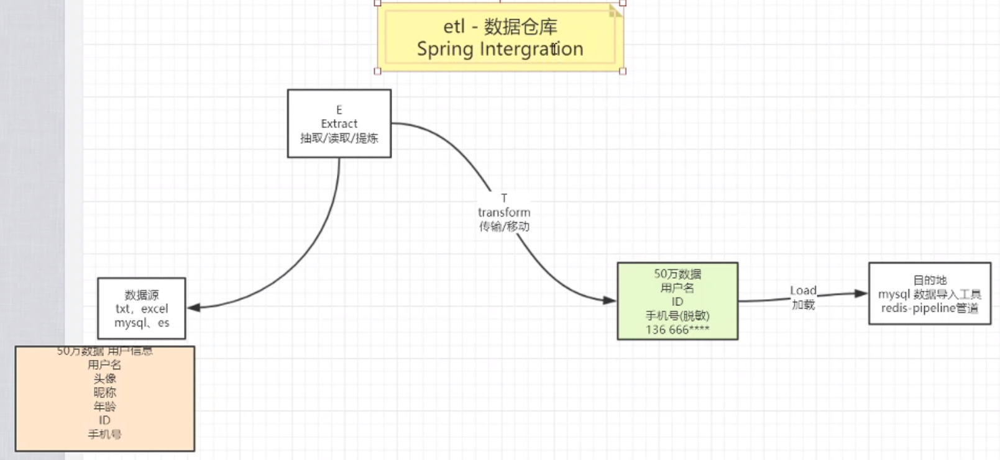
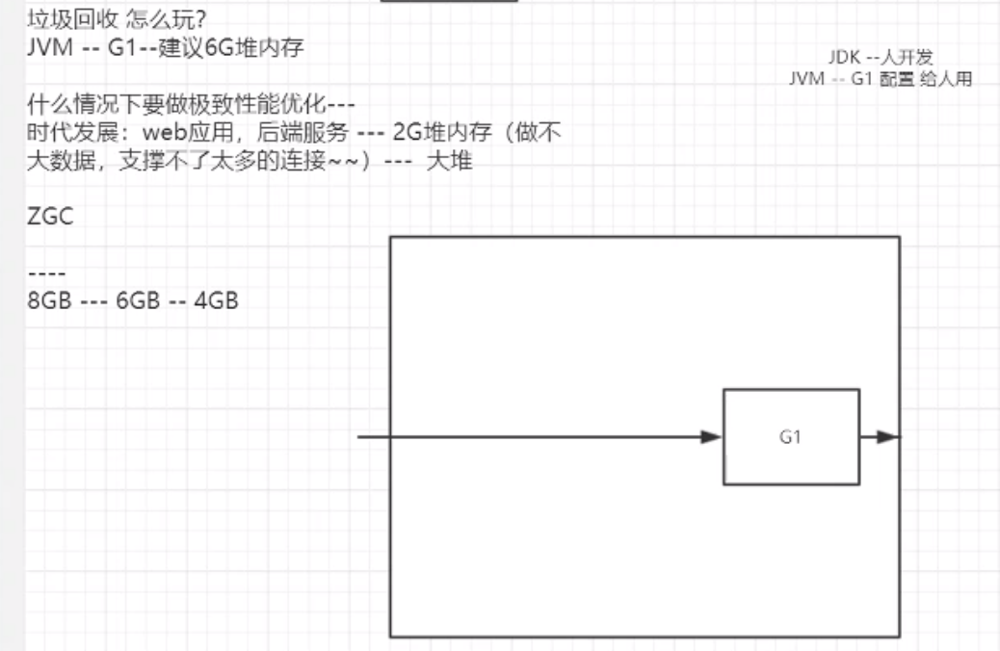

**netty答疑**

Netty常被作为底层网络入口，在它之上开发应用，如dubbo，spring5中的webflux。

handler中存在各种协议解码器。

Netty封装reactor线程模型。

成熟工具：kettle、yugong、ogg、mysql migration toolkit等。

微服务中工具类可以打成jar包，通过源码结构管理（maven）。

AIO：Asynchronous Input and Output，字面上讲就是异步的IO。