**网易后端开发中的Netty最佳实例（网易邮箱）**


可扩容，弹性应用

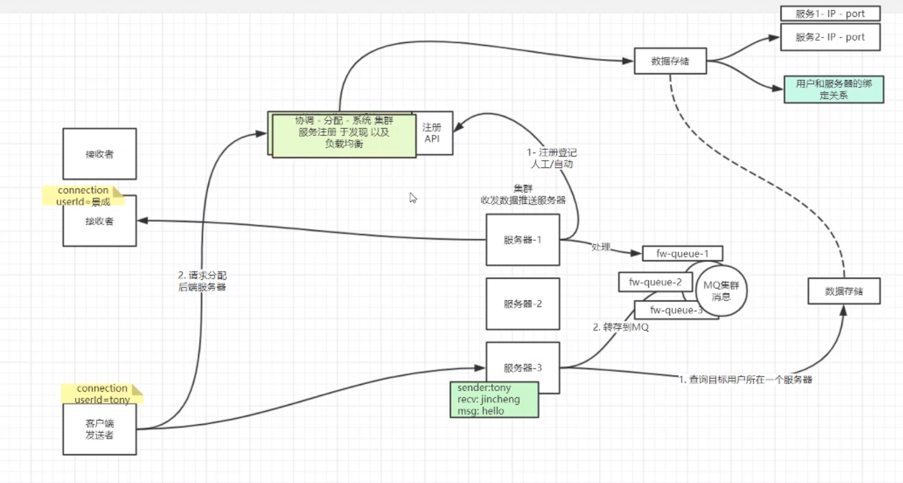


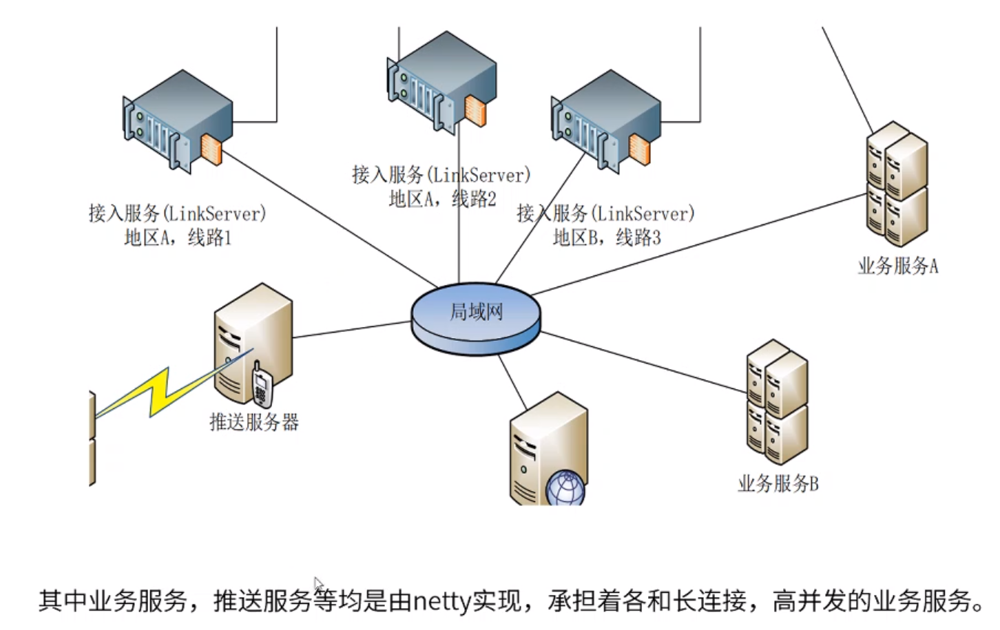


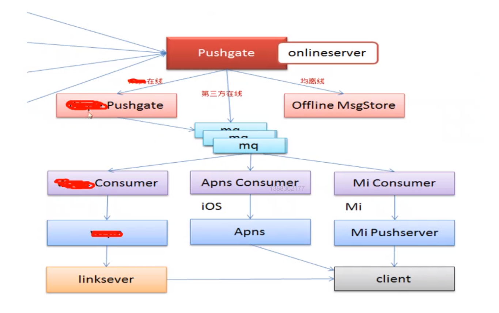


优化

#### 1、Handler复用

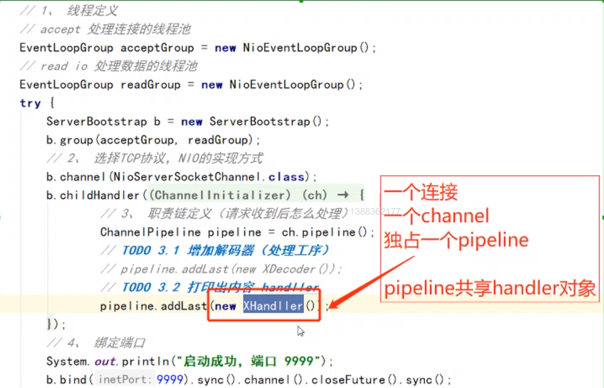


```java
@ChannelHandler.Sharable//标识为可共享
```

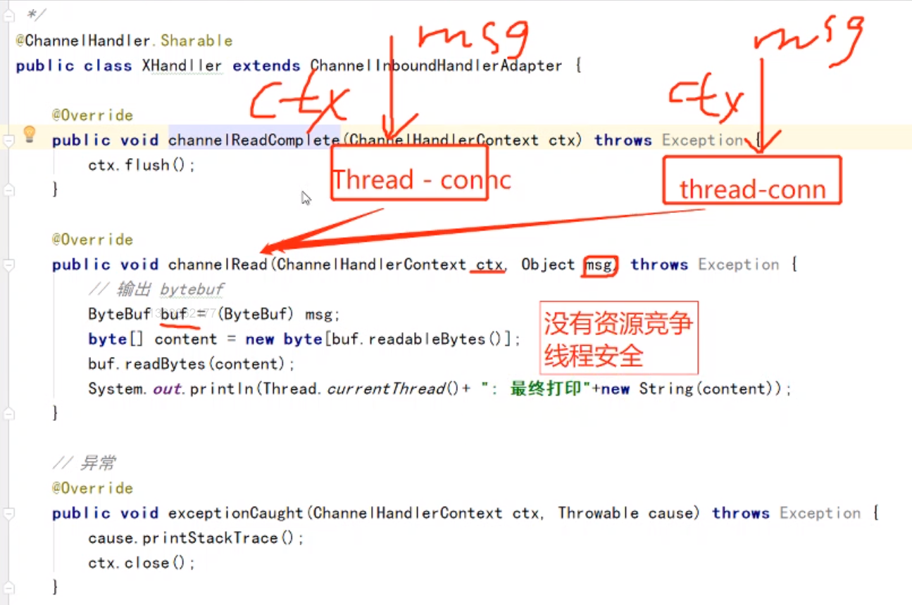


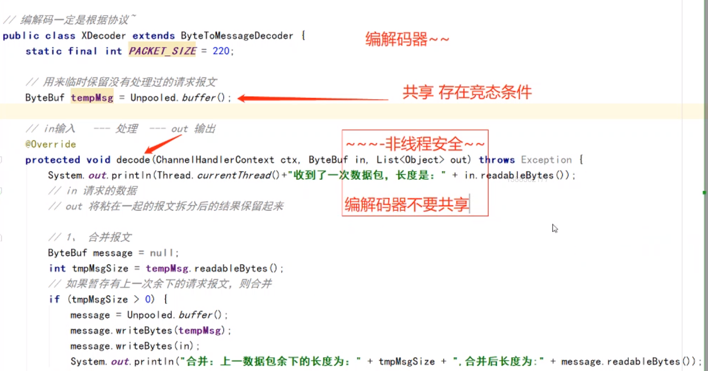


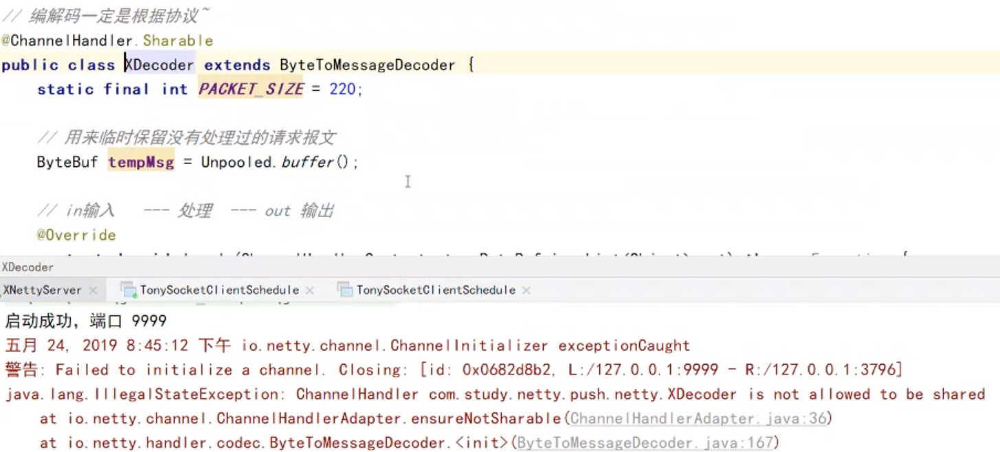


#### 2、耗时操作引入专用线程池


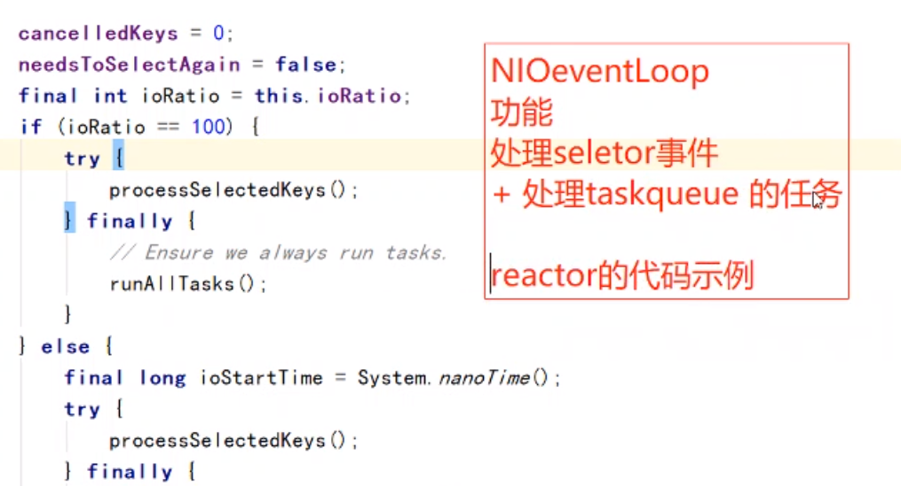


#### 3、分批推送，防止IO线程被一个连接长时间占用


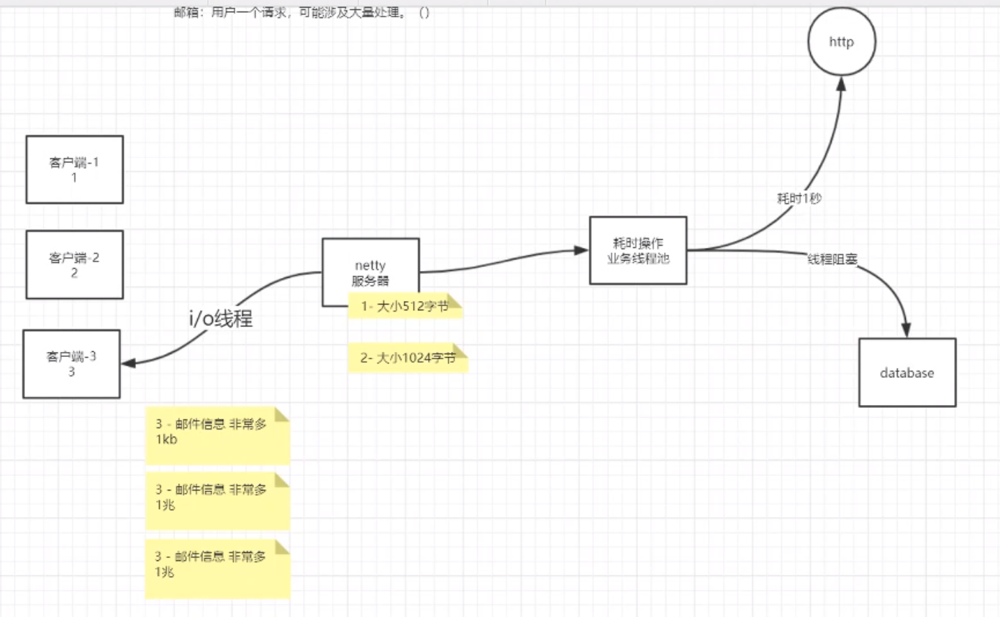


#### 4、线程模型、责任链、ByteBuf

ByteBuf高性能：对象复用、零拷贝、内存复用


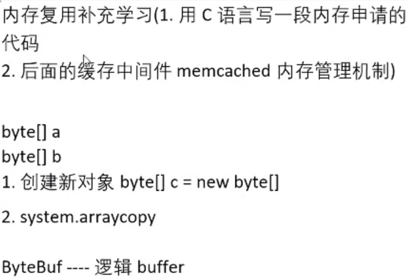


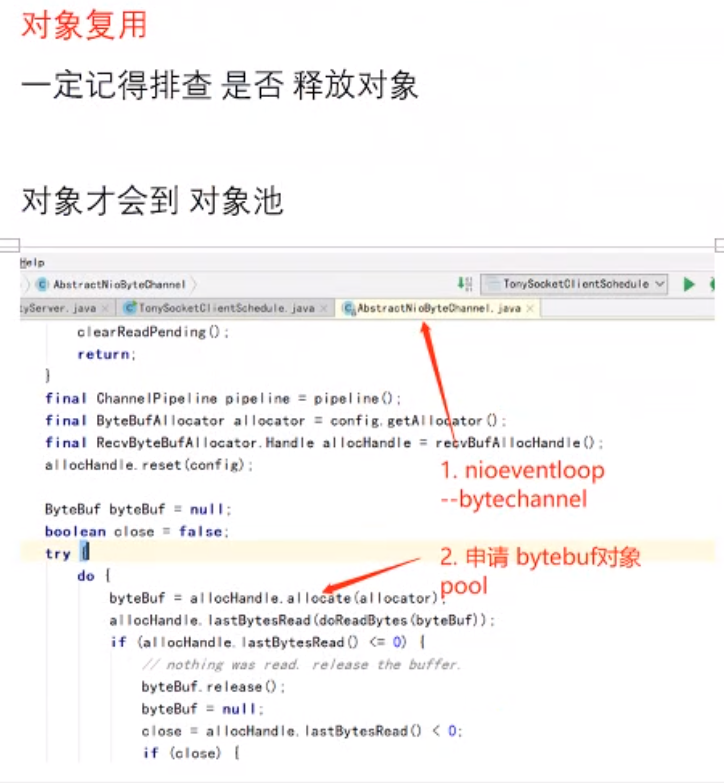

