**垃圾回收机制**

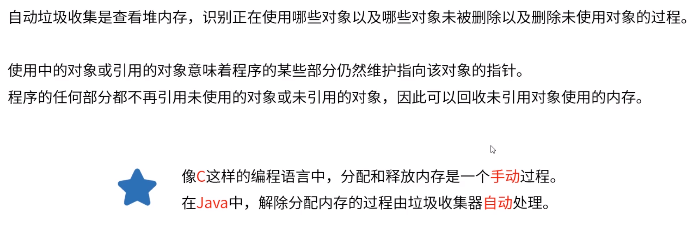

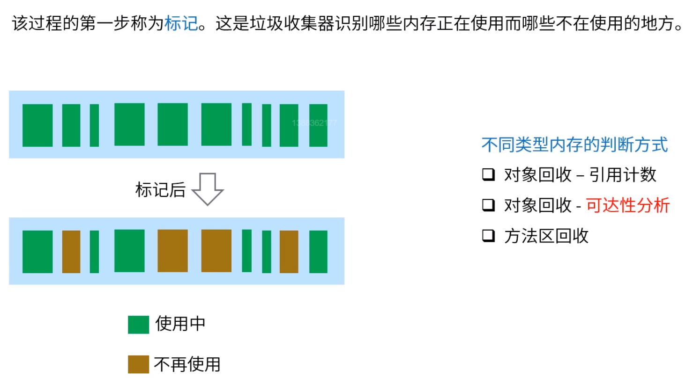

标记出正在使用的Object

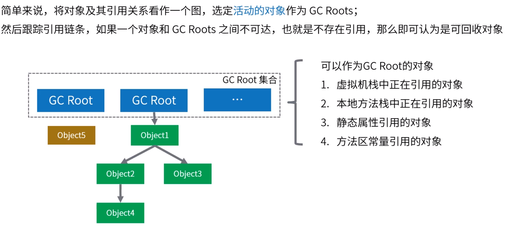

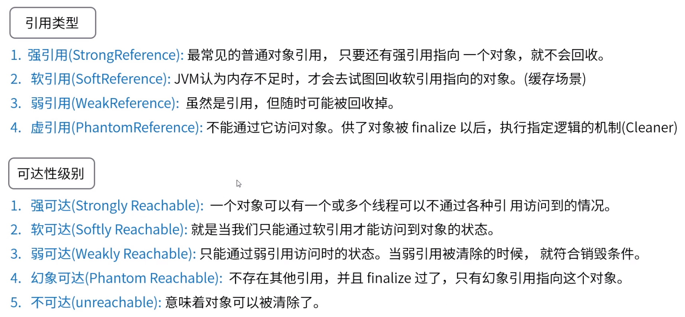

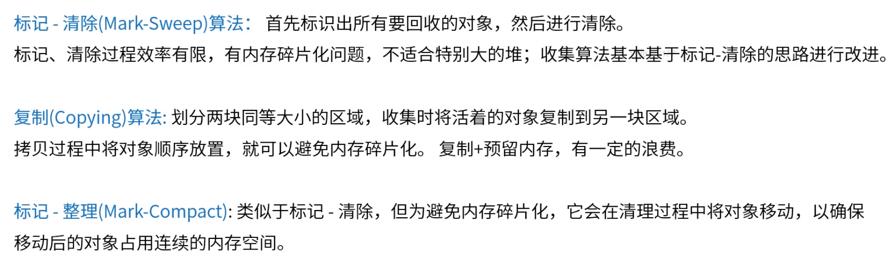

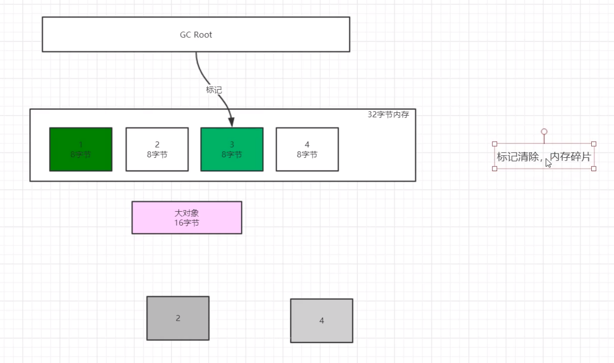

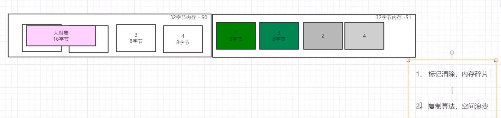

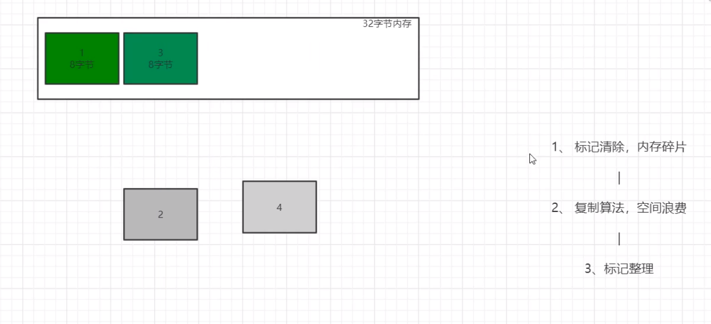

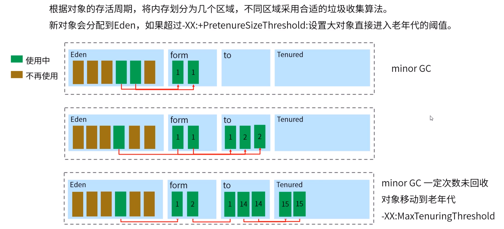

新生代对象存活时间短

新生成对象放至Eden区（1:1:8 与1:2 空间大小比）

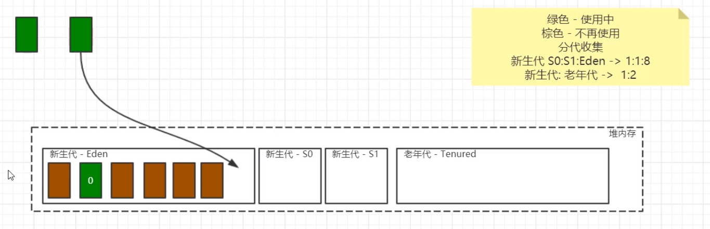

新生代回收：复制算法，Eden区回收：将对象复制至S0，Eden区全部回收

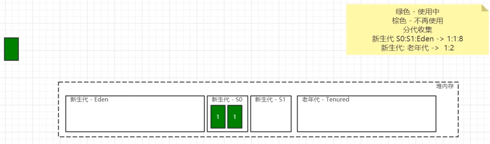

对象从新生代进入老年代：

1、经过复制一定次数（参数可定义）后任存活，可以认为该对象是持久存活的，进入老年代；

2、新生代内存不足，新对象直接进入老年代；

3、大对象被创建会直接进入老年代（阈值参数可定义）。

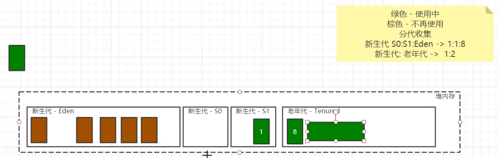

老年代回收：标记整理

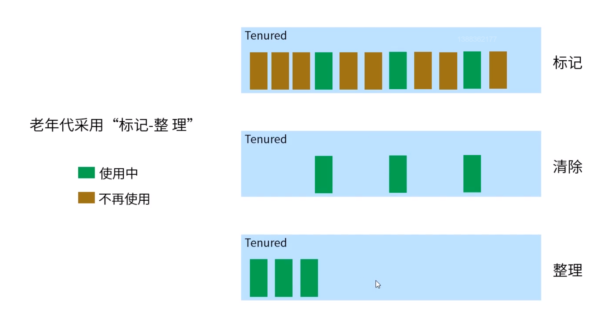

串行收集器

客户端JVM默认选项

stop-the-world 停止所有事情，等待回收完成后继续（新生代与老年代）（GC优化，减少停止时间）

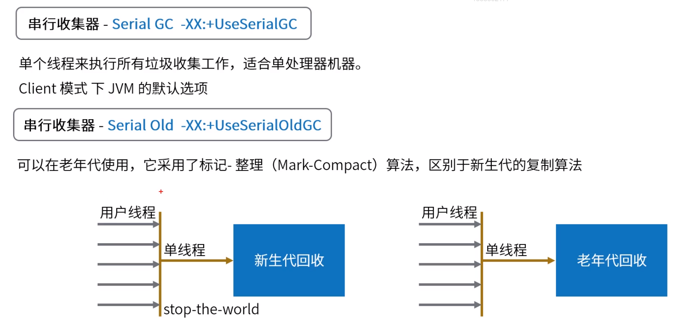

并行收集器

服务器默认

最大垃圾收集停顿时间：JVM尽量满足要求

stop-the-world 仍存在

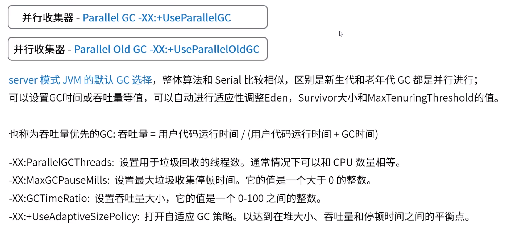

并发收集器（不再维护）

full GC 对全局堆内存进行GC

初始标记：找出GC Root

并发标记：标记对象

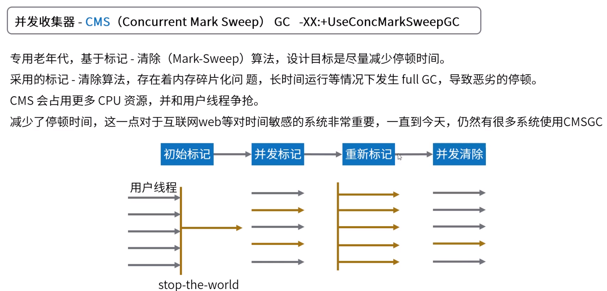

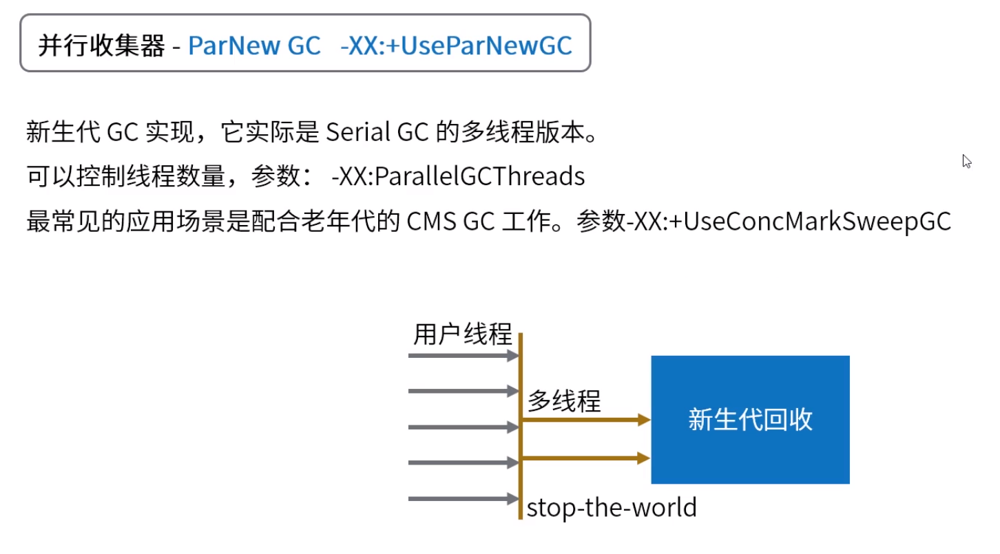

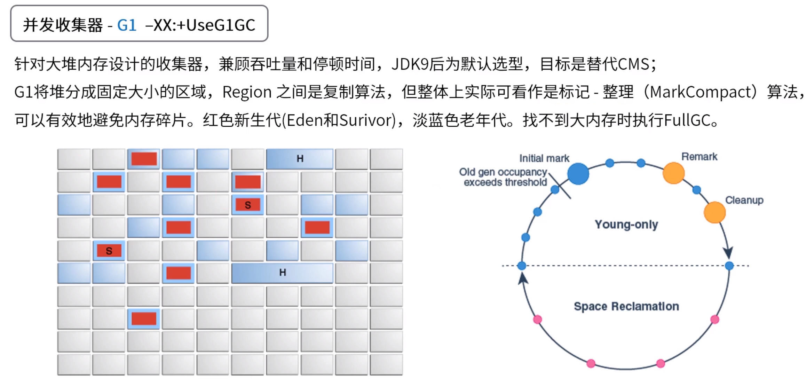

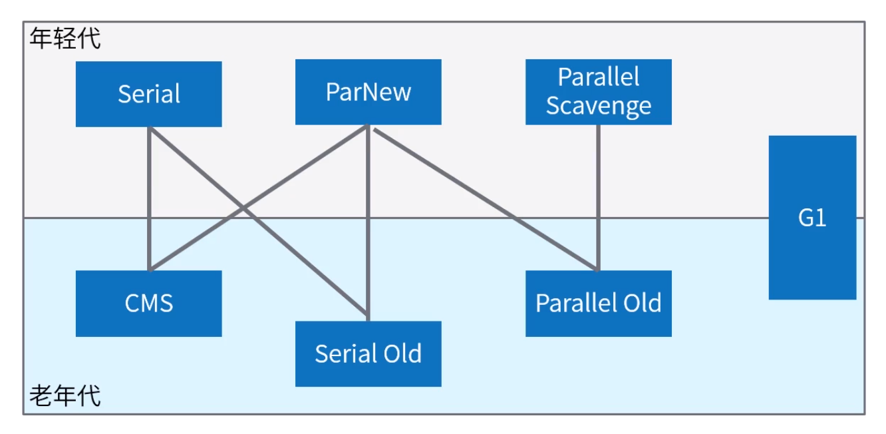

