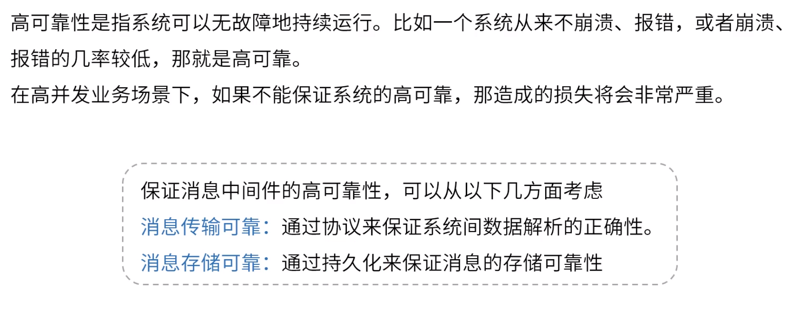

**分布式消息中间件设计篇**

# 1.什么是消息中间件

解决系统之间的耦合

单体架构

分布式系统架构

基于消息中间件分布式系统架构

消息中间件核心设计

# 2.协议

http：内容很多，功能很多，格式复杂、短连接

OpenWire：Activemq

AMQP

MQTT

Open Message

kafka

# 3.持久化

# 4.消息分发

# 5.高可用

部署方式

同步占用带宽，开放读，写在主

开放读写

相互知道数据位置信息。数据仅在broker-1，易遗失。

# 6.高可靠

