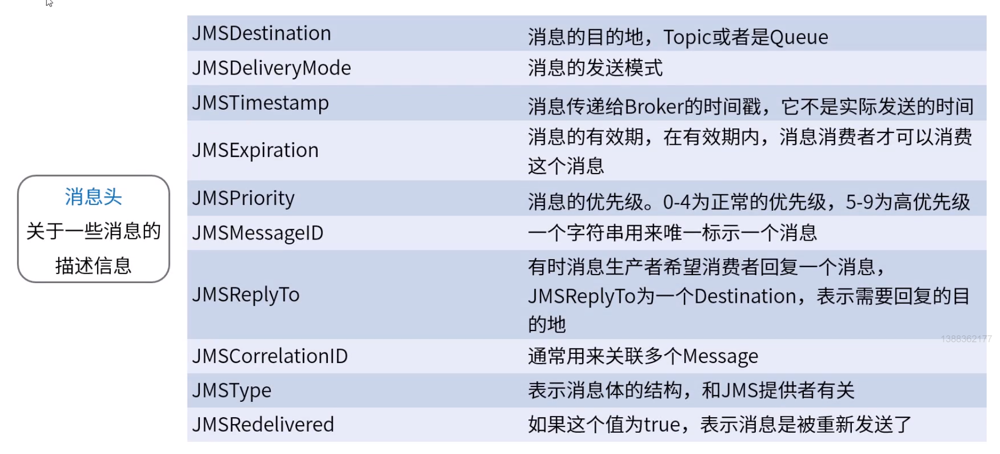

**amq入门**


# 1.ActiveMQ是什么


# 2.JMS规范

## JMS


## JMS对象模型


## JMS消息模型


## JMS消息结构


### 消息头



### 消息属性


### 消息体


# 3.ActiveMQ的特性


# 4.ActiveMQ如何安装

## ActiveMQ安装环境

**CentOS7	JDK1.8**


## ActiveMQ下载


## Linux中ActiveMQ下载


## Linux中ActiveMQ安装


## Linux中ActiveMQ启动


## ActiveMQ作为服务启动


### 创建ActiveMQ服务

syslog：系统日志（/var/log/message）

找到java命令所在目录：

```
whereis java
```


### ActiveMQ服务操作


### 防火墙增加ActiveMQ端口

​	内网可以直接关闭防火墙


# 5.ActiveMQ如何使用

## web管理平台


## web管理配置


## Java中使用ActiveMQ


## Spring中使用ActiveMQ


