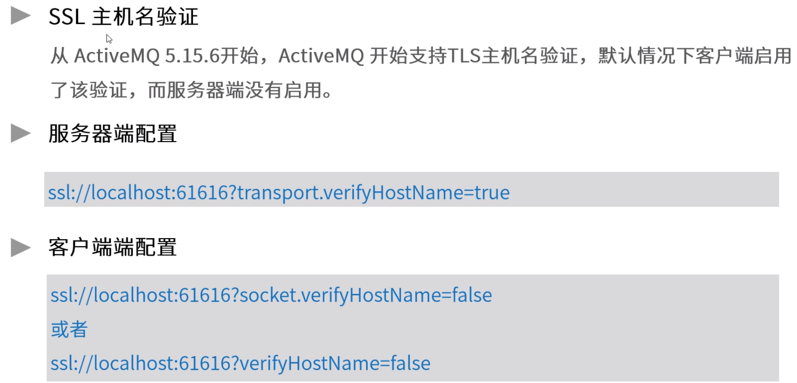

**amq支持的消息协议**

# 1.ActiveMQ支持协议

​	VM：方法直接调用方式

​	对AMQP支持不太好，用1.0版本，客户端支持较少

​	ActiveMQ综合能力较强

# 2.数据传输方式

### TCP

​	TCP默认：OpenWire

​	日志：/var/activemq/data/activemq.log

### SSL

​	

host校验(localhost,ip)，在固定的主机使用

### NIO

​	ActiveMQ默认BIO

​	灵活，例：mqtt + nio + ssl

### UDP

### HTTP

​	HTTPS：rest方式

### VM

# 3.OpenWire协议

​	ActiveMQ中较通用

# 4.MQTT协议

​	重发

​	QoS level 2服务端不能存储相同数据

​	foo.x.bar	foo.y.bar	都可以被订阅

# 5.AUTO协议

