**Activemq高可用集群方案**

# 1.ActiveMQ高可用集群方案介绍

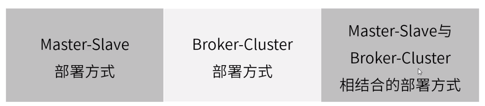

# 2.Master-Slave部署方式

### Shared filesystem Master-Slave部署方式

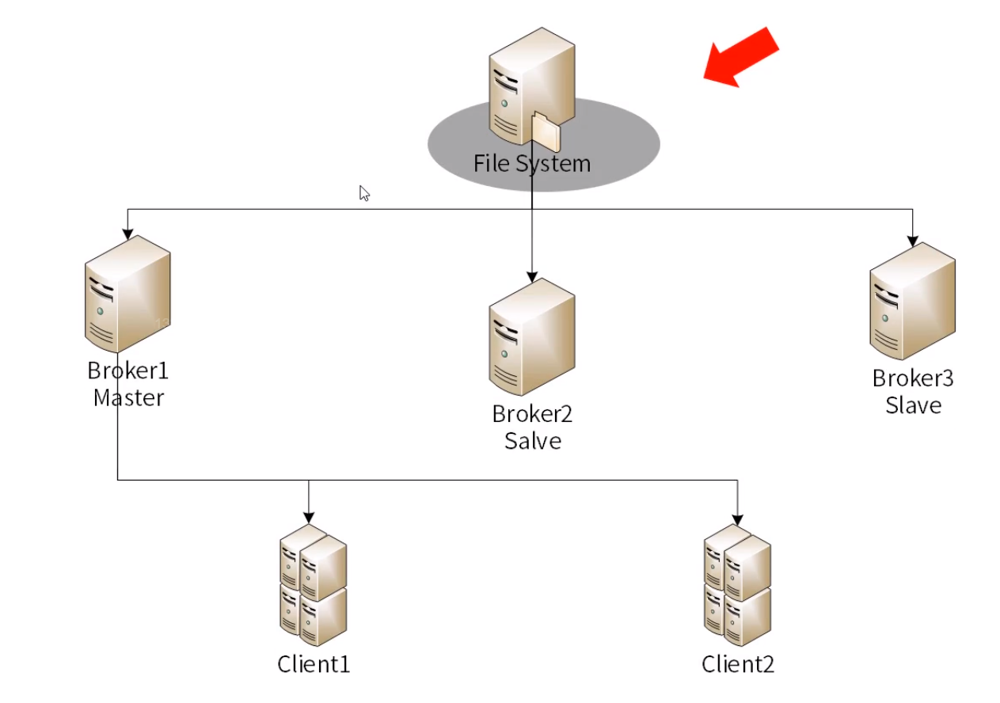

### Shared databaseMaster-Slave部署方式

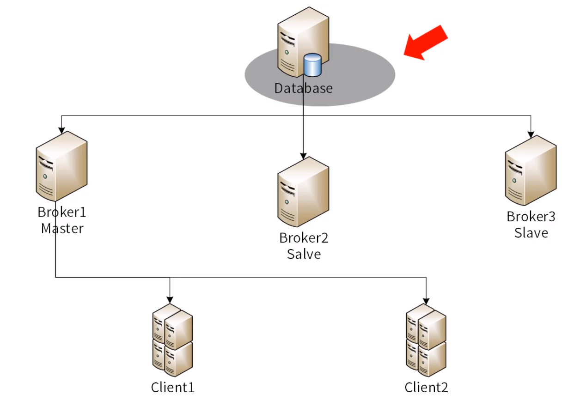

### Replicated LevelDB Store方式（弃用）

数据库层面进行同步

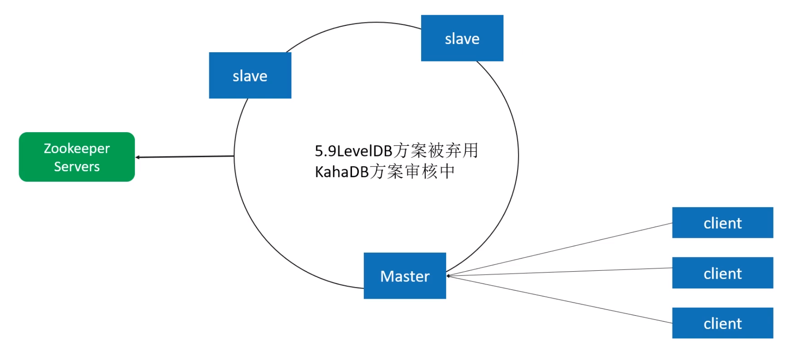

# 3.Broker-Cluster部署方式

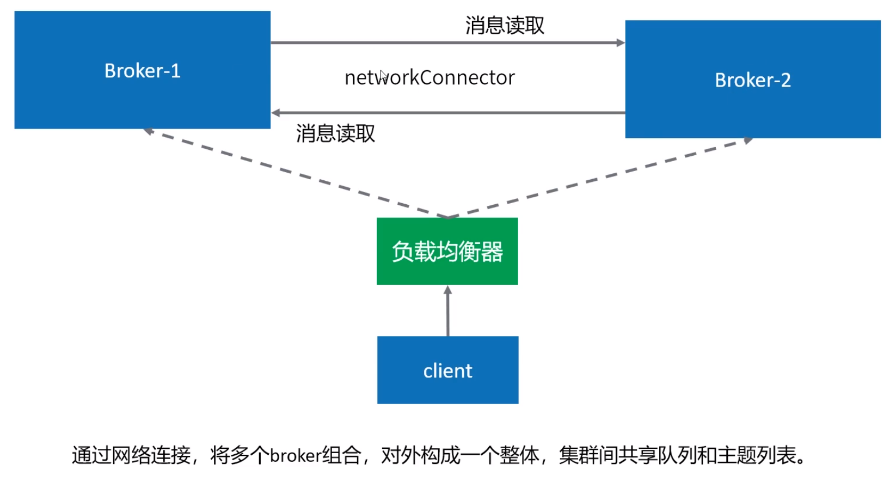

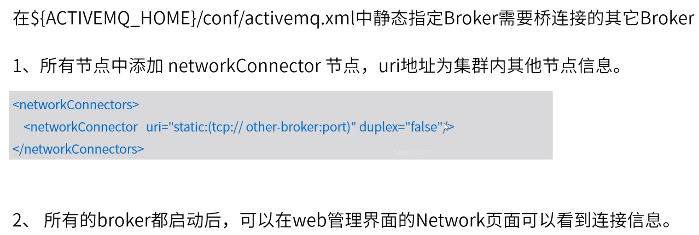

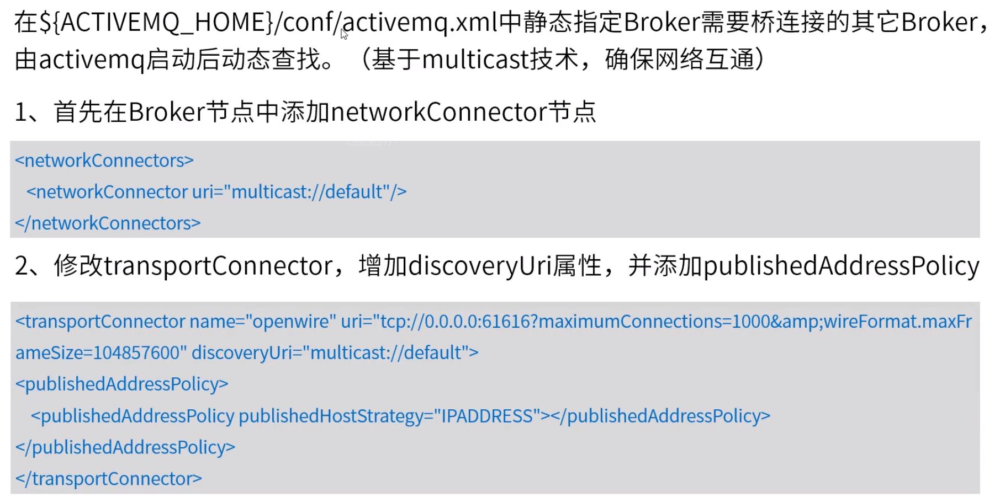

# 4.Master-Slave与Broker-Cluster相结合的部署方式

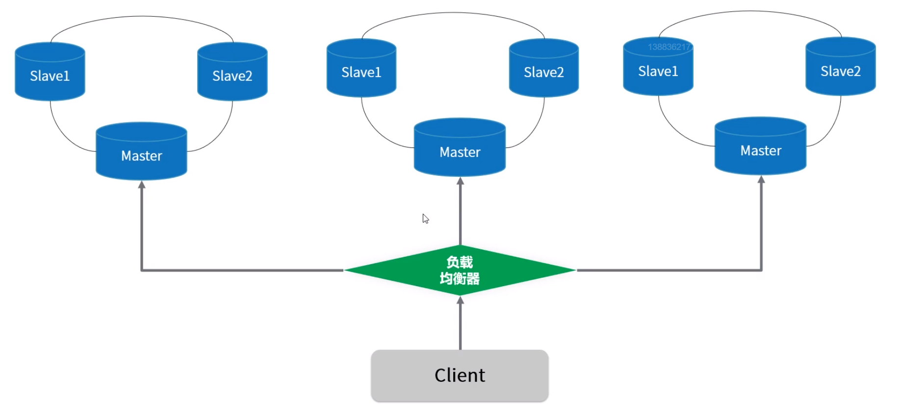

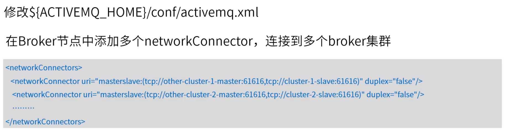

# 5.networkConnector网络连接器配置说明

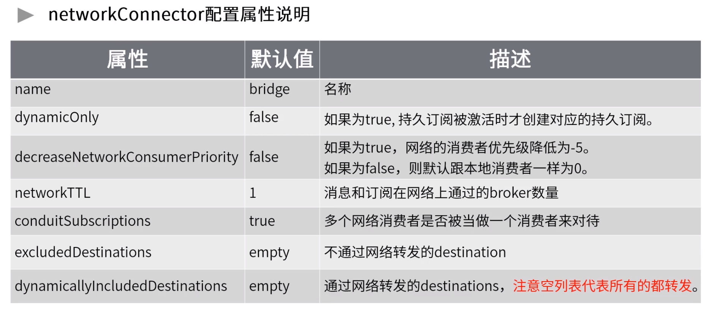

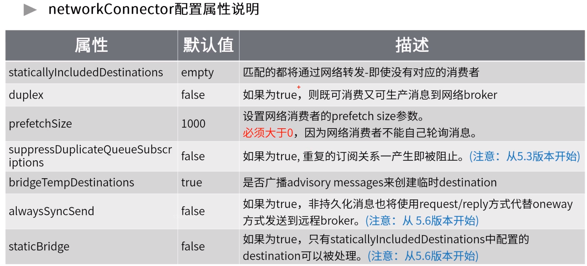

