**持久化原理及事务机制**

# 1.ActiveMQ持久化方案介绍

​	针对queue与topic

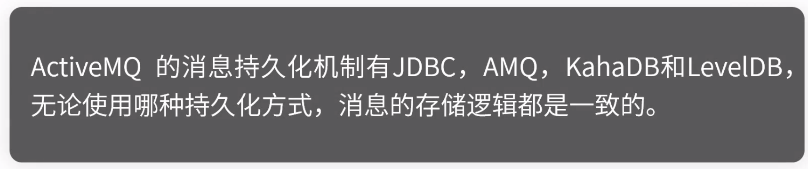

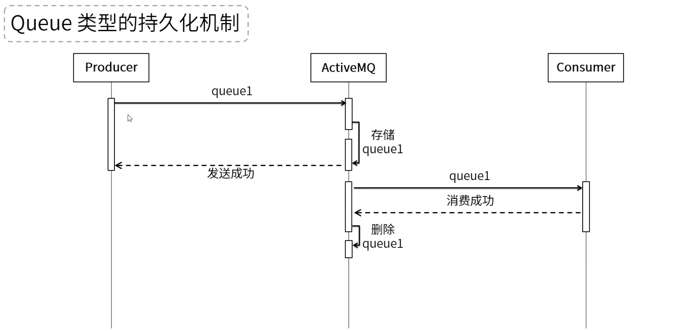

​	保留不同订阅者处理进度。定期GC策略。

# 2.JDBC方式

​	如果不是特别需要mq特性，建议直接操作数据库。

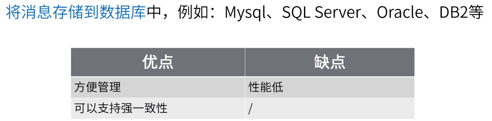

# 3.AMQ方式

​	5.4后已被替换

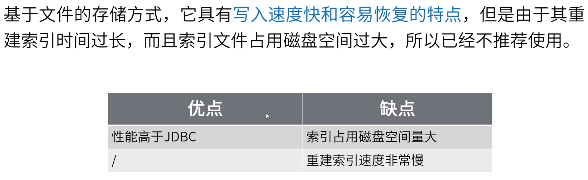

# 4.KahaDB方式

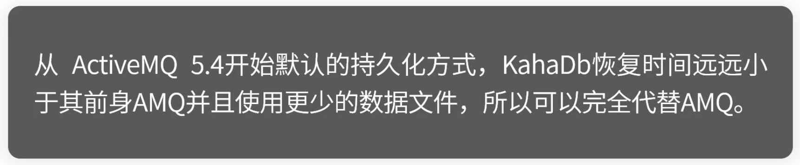

​	配置详见官网

# 5.LevelDB方式

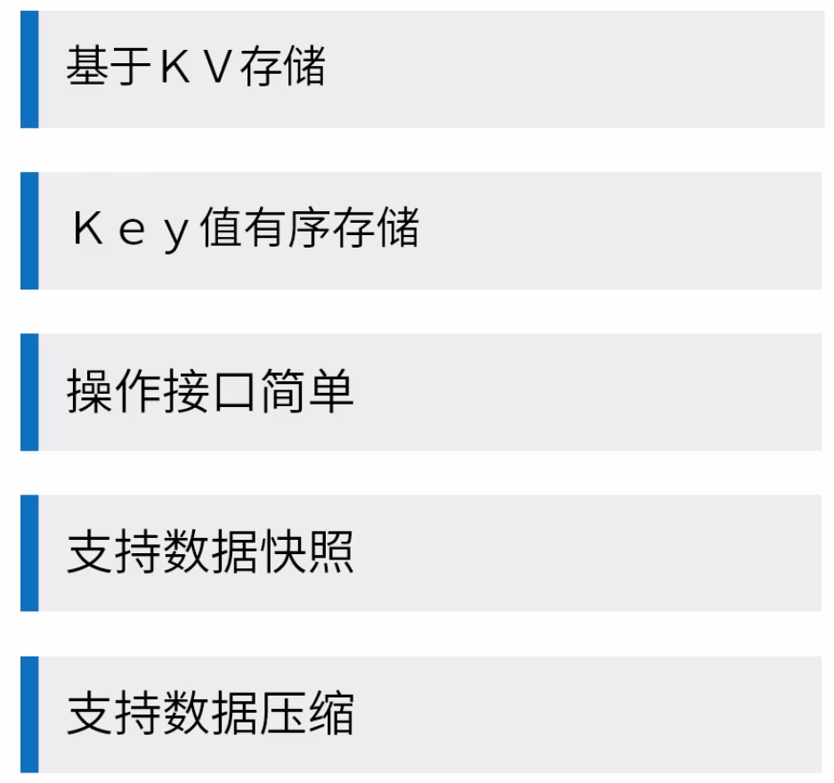

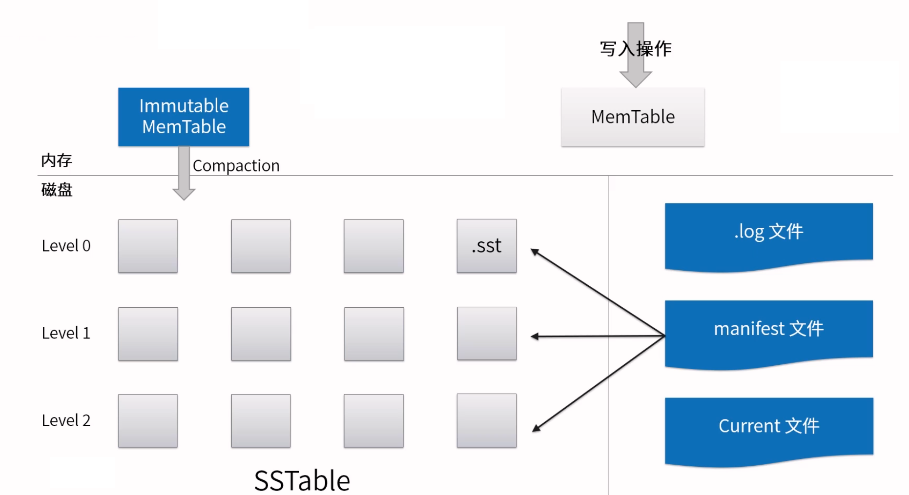

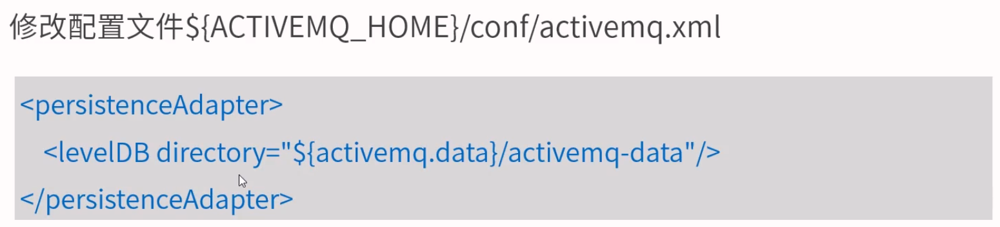

# 6.事务机制

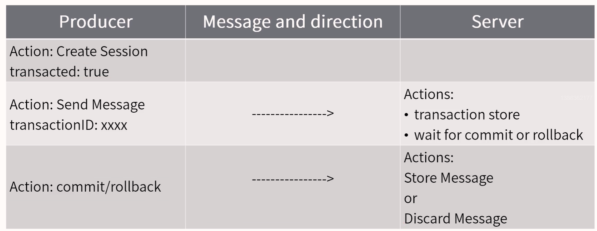

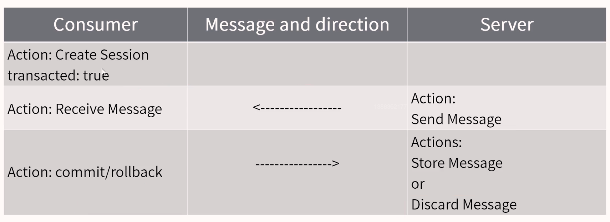

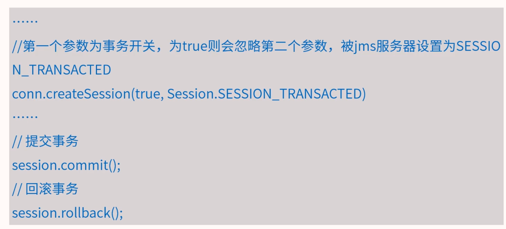

