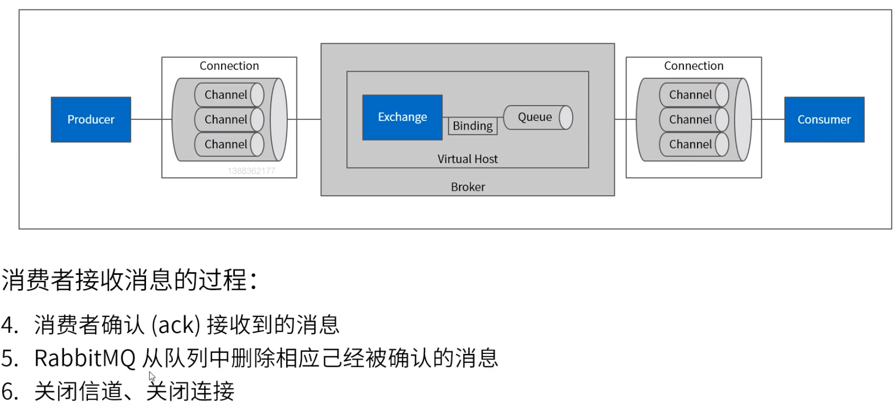
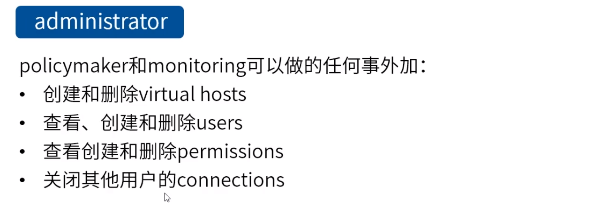

**rabbitmq入门及内部消息分发机制**

# 1.AMQP协议

 

​	消费者默认自动确认

# 2.RabbitMQ简介

# 3.RabbitMQ核心概念

*RabbitMQ*可以设置*basicQoS*(Consumer Prefetch)来对consumer进行流控

默认生成，通过queue分发

​	分发到全部有关联的queue中

​	绑定分发

​	模糊匹配

​	头信息匹配，不要求完全相同。如header:x=1, 消息中头信息有x=1与y=1一样匹配。

​	分派消息，一条消息不会重复派发

# 4.RabbitMQ安装运行

环境

CentOS7、Erlang

# 5.RabbitMQ基本配置

# 6.RabbitMQ管理界面

# 7.Hello World

