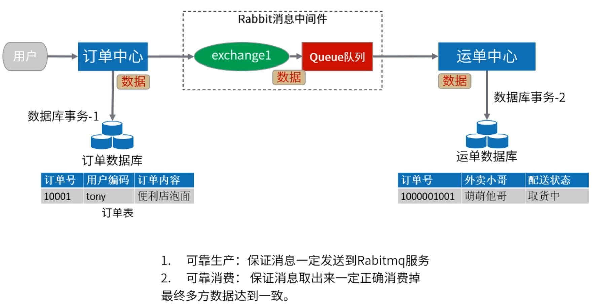

**饿了么外卖场景，分布式事务解决方案**

# 1.5分钟了解MQ

# 2.分布式事务问题

# 3.实现分布式事务的5个步骤

## 可靠消息生产-记录消息发送

## 可靠消息生产-修改消息发送状态

## 可靠消费处理-正常处理

## 可靠消费处理-消息重发

## 可靠消费处理-消息丢弃

# 4.总结及扩展

​	ActiveMQ、RabbitMQ、RocketMQ有可靠消息机制。kafka主要是OLAP。RocketMQ偏向OLTP。

