Kafka入门及使用场景

Scala具有高水平扩展与高吞吐量优势，大数据应用广泛，数据计算有优势:	Spark

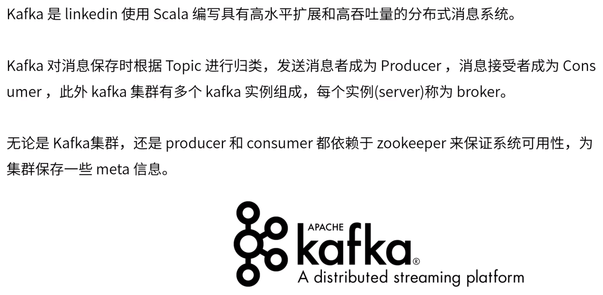

kafka吞吐量与分布式占优势	Kafka > RabbitMQ > ActiveMQ

数据准确性	RabbitMQ > ActiveMQ > Kafka

kafka集群有优势，水平扩展旨在提高吞吐量、性能，至少三台较好，zookeeper一般也是三台起，但集群目的不同。zookeeper不是越多越好，旨在提高可用性，越多可能导致性能越低可用性越高。

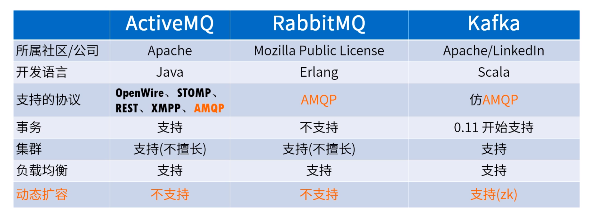

以文件形式存储，向文件后追加内容，顺序存储，磁盘性能较高。

处理方式：Streams API（轻量级流处理工具，kafka一部分，类似客户端）接收处理数据再写会kafka，类似flink或spark streaming

若流处理宕机，kafka存在offset获取未及时处理的数据

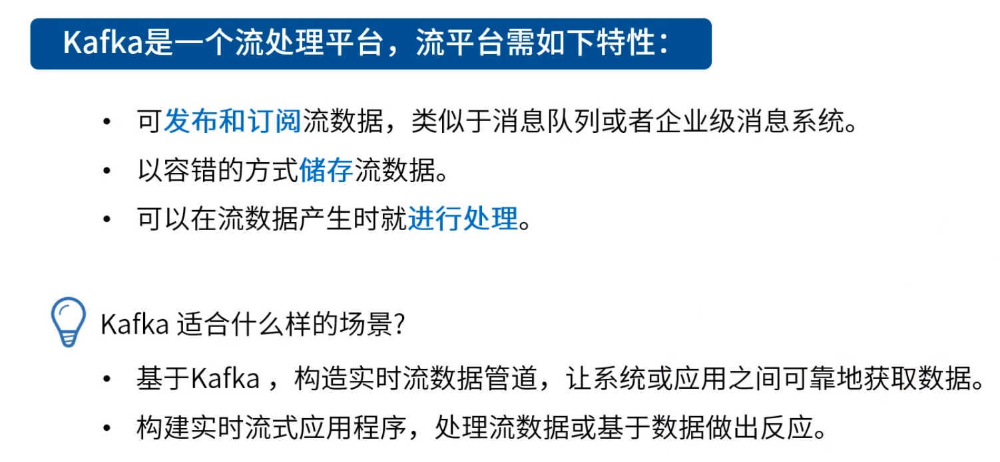

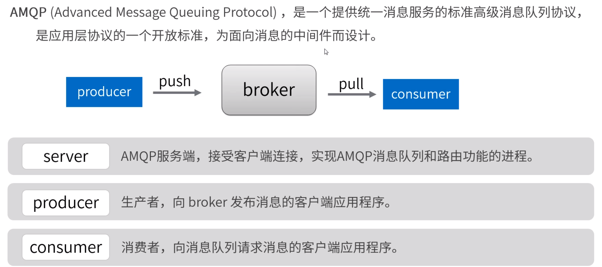

kafka： message system

topic：queue

分片好处：1.统一存储；2.提高并发级别；3.降低数据丢失风险；

replication（副本）：分片冗余备份

topic记录均匀分布于各个partition中（分布算法：轮询，根据key哈希，。。。）

kafka在partition级别是有序的。多个partition是无序的

partitionID + offset 确定一条数据

保证kafka数据有序：1.设置partition数目为1；2.通过key控制（相同key进入同一partition中）；

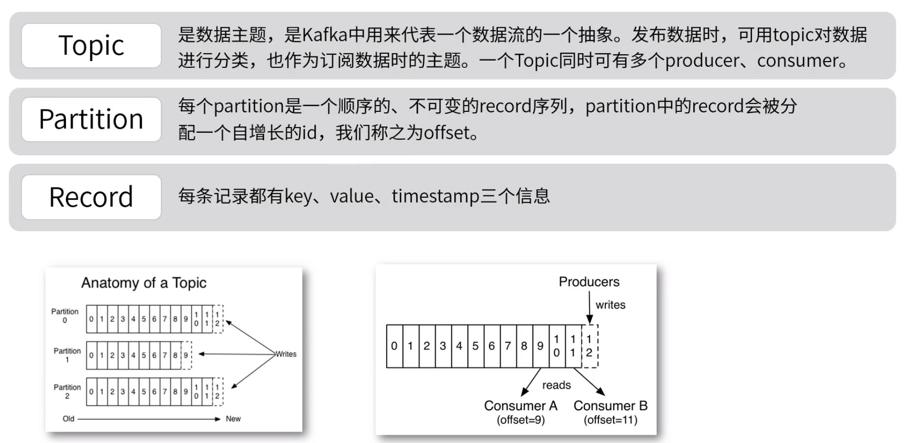

follower不能读写

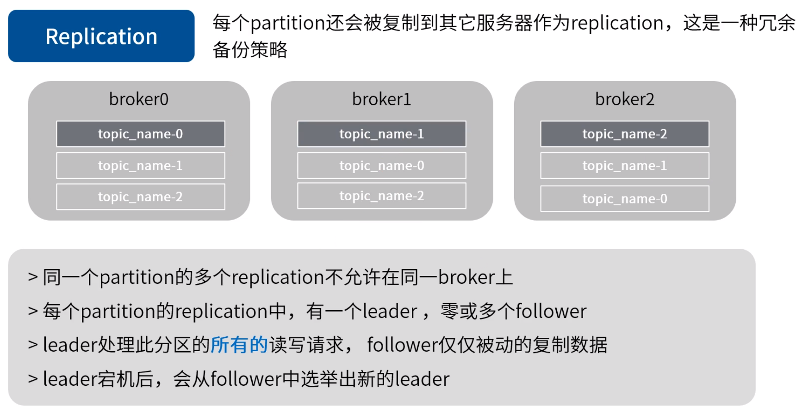

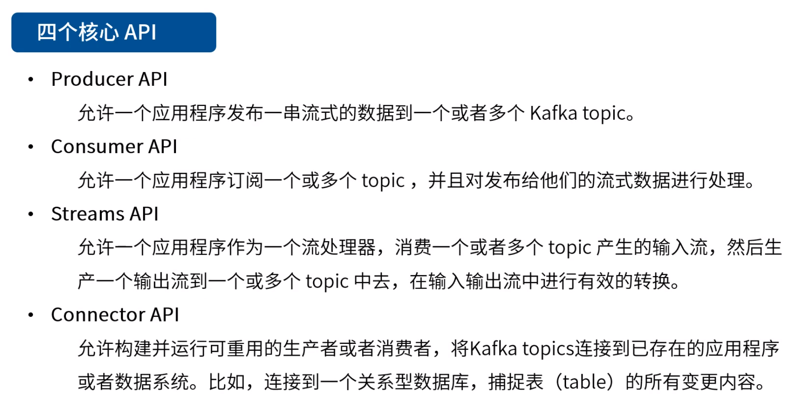

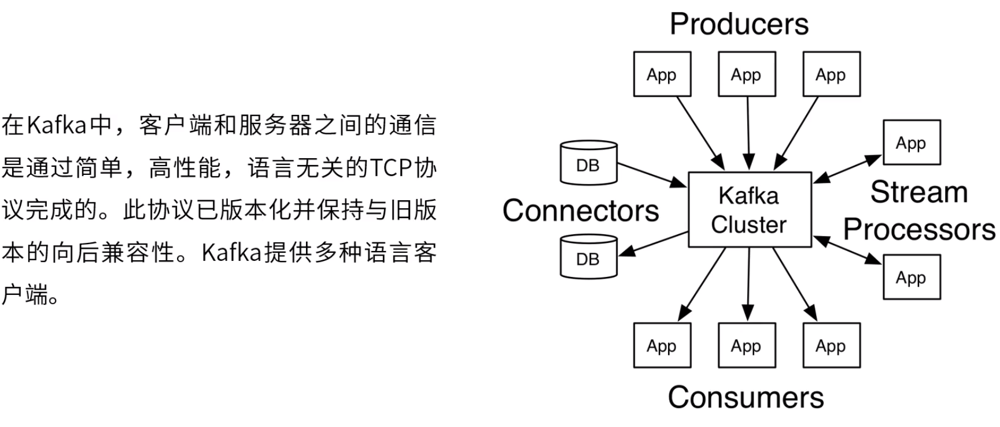

exactly once		at least once

kafka	exactly once

linger.ms,batch.size到达界限开始批量发送数据

acks值: all：所有follower都成功才会返回成功,0：不管服务端返回的请求,1：leader成功，客户端认为是成功的

​		0与1：可能导致数据丢失

​		all：replication-factor设为1时，即只有一个replication，即只有leader而没有follower，也可能导致数据丢失

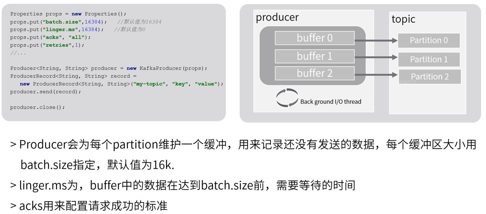

group.id

同一group内consumer平均获取topic内partition数据

一个group中consumer数目不能比partition数目多

topic内partition增减或group内consumer增减都会引发rebalance

group内consumer减少：

1. ​	consumer进行poll数据时维护heatbeat，当heatbeat停止时服务端知道该consumer已经停止（session.timeout.ms）；
2. ​	长时间没有执行poll方法（max.poll.interval.ms），为避免误判，可开启异步线程处理消息

异步处理消息注意：关闭自动提交（commit offset：确定最新访问到的位置；自动提交：每次poll时提交，老版本提交至zookeeper中，新版本提交至kafka内某个topic中），处理完之后手动提交

pause partition：客户端控制，暂停partition，无法获取消息，但不会影响其他group内consumer获取消息

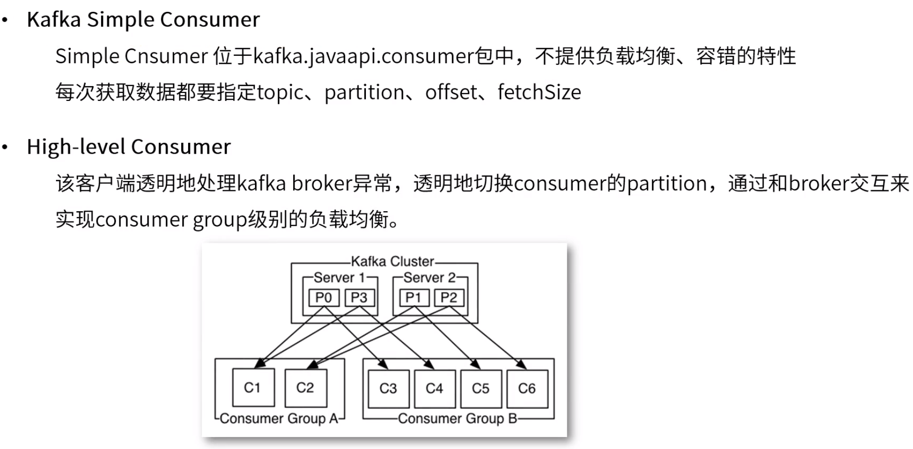

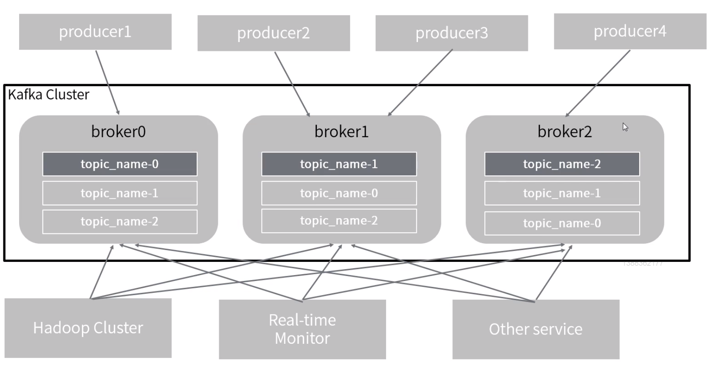

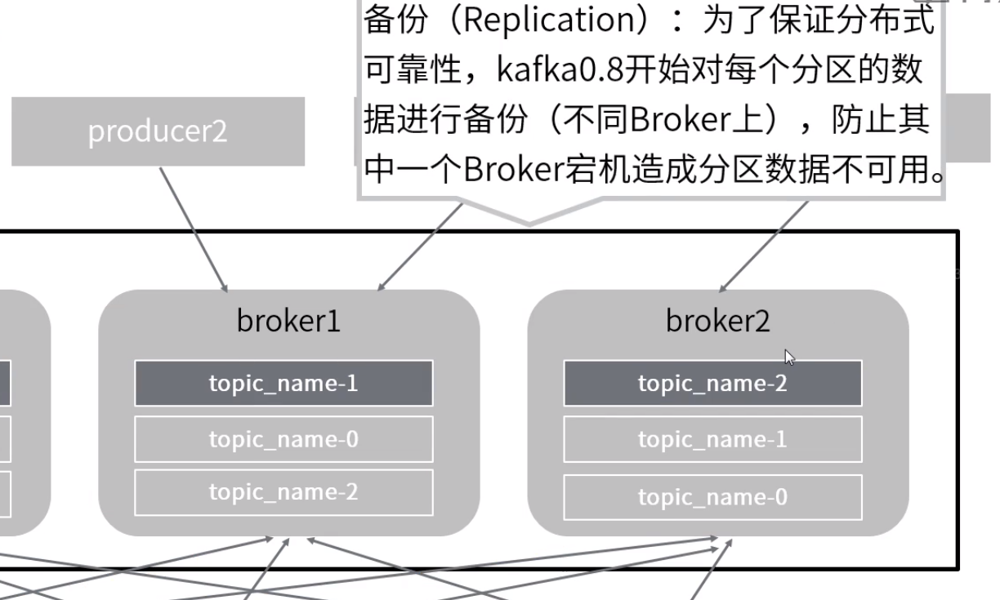

kafka有web管理控制台，主要起监控作用

kafka使用场景

消息系统

kafka在多线程下也可以保证某个粒度的顺序

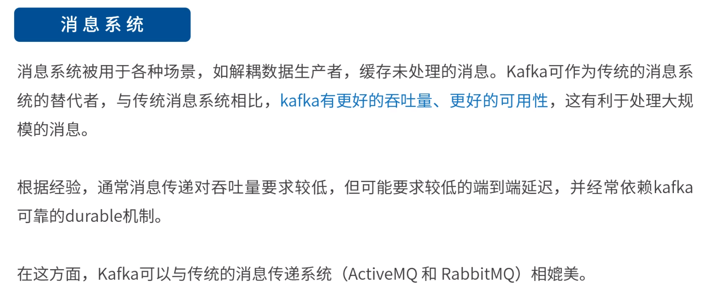

存储系统（流存储）

可根据offset回顾数据

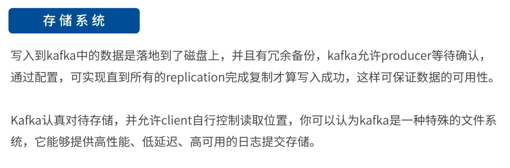

日志聚合

日志收集：通过Filebeat，Flume触发发送日志消息

相对而言，logstash对日志清洗效果较好

日志聚合：kafka比Flume可靠但更昂贵，kafka通过将各个topic转发消息至同一topic中聚合，浪费空间

ELK：Filebeat（日志收集）-->kafka（logstash是个瓶颈，kafka作为buffer，削峰填谷）-->logstash（通过正则清洗，较消耗性能）-->ElasticSearch-->Kibana（展示）

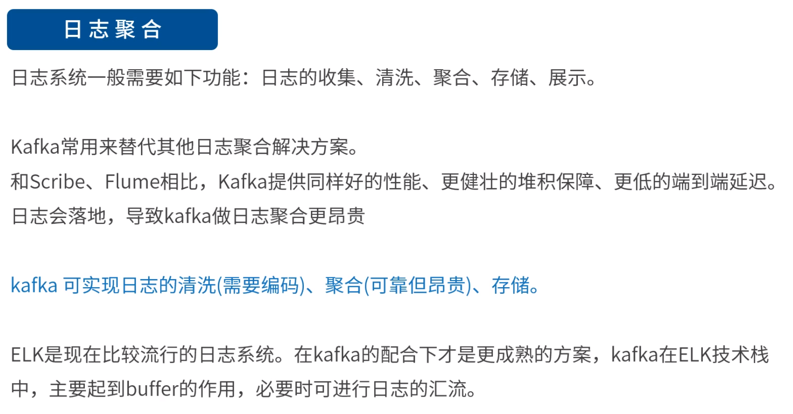

跟踪网站活动

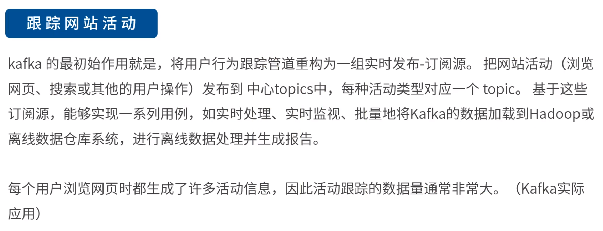

流处理

Streams API：轻量级流处理，少人用

storm：完全流处理，目前用较少

spark streaming：micro batch；既可以实现流，也可以实现批量

flink：较流行，完全流处理，可以提供batch处理

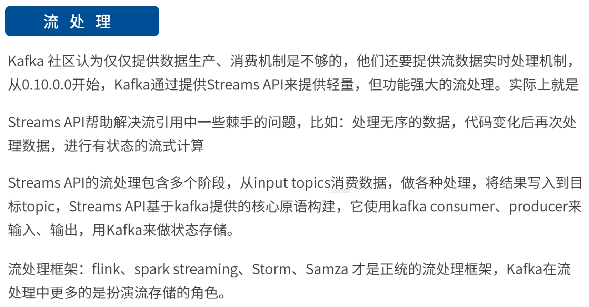

批处理缺点：延时

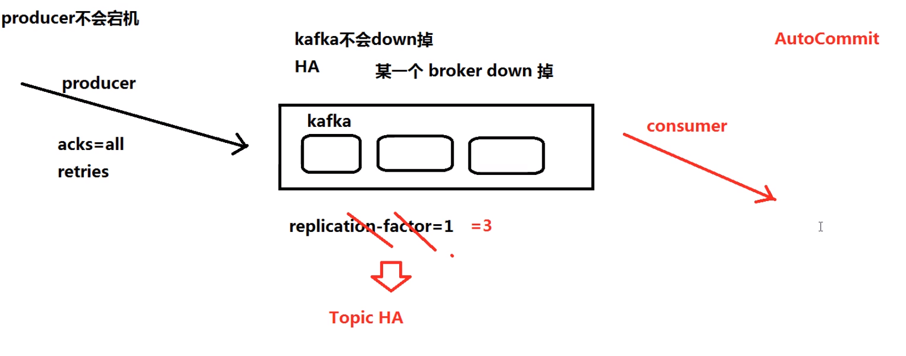

