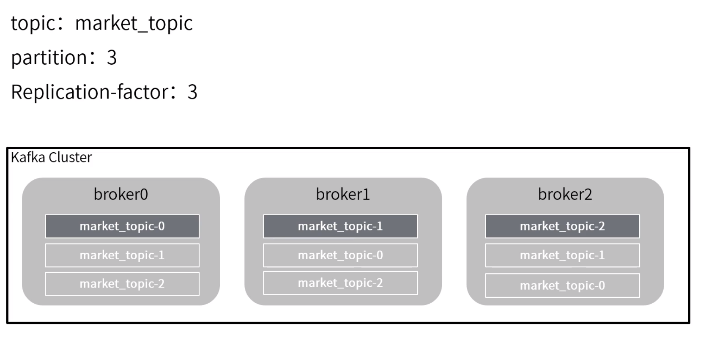

**Kafka Connect数据传输作业工具**

​	书籍《从Paxos到Zookeeper》

​	leader只有一个，follower存储在leader所在的broker以外的broker中

​	同一个consumer group中，一个partition只会分配给一个consumer

​	建议：partition个数是consumer整数倍

​	zookeeper：提供少量数据存储，并保证数据的一致性；临时节点自动删除；顺序节点自增长；发布/订阅等特性；从而能为分布式程序提供协调服务。基于它，可实现分布式锁，统一命名服务，配置中心，分布式同步等功能。

​	Kafka中leader与follower是partition级别，zookeeper中leader与follower是实例（进程）级别。Kafka中各实例是平行的（等价的）。

​	zookeeper实例数一般为2n+1个，运行时如果少于n+1个无法工作（保证可靠性）。

********************************************************************

问

一、为什么zookeeper要部署基数台服务器？
		**所谓的zookeeper容错是指，当宕掉几个zookeeper服务器之后，剩下的个数必须大于宕掉的个数，也就是剩下的服务数必须大于n/2，zookeeper才可以继续使用，无论奇偶数都可以选举leader。**5台机器最多宕掉2台，还可以继续使用，因为剩下3台大于5/2。说为什么最好为奇数个，是在以最大容错服务器个数的条件下，会节省资源，比如，最大容错为2的情况下，对应的zookeeper服务数，奇数为5，而偶数为6，也就是6个zookeeper服务的情况下最多能宕掉2个服务，所以从节约资源的角度看，没必要部署6（偶数）个zookeeper服务。

​		zookeeper有这样一个特性：集群中只要有过半的机器是正常工作的，那么整个集群对外就是可用的。也就是说如果有2个zookeeper，那么只要有1个死了zookeeper就不能用了，因为1没有过半，所以2个zookeeper的死亡容忍度为0；同理，要是有3个zookeeper，一个死了，还剩下2个正常的，过半了，所以3个zookeeper的容忍度为1；同理你多列举几个：2->0;3->1;4->1;5->2;6->2会发现一个规律，2n和2n-1的容忍度是一样的，都是n-1，所以为了更加高效，何必增加那一个不必要的zookeeper呢。

​		根据以上可以得出结论：出现资源节省的角度

二、zookeeper脑裂（Split-Brain）问题

Leader == Master, Follower == Slaver.

​	2.1、什么是脑裂？
​		白话点说，就是比如当你的 cluster 里面有两个结点，它们都知道在这个 cluster 里需要选举出一个 master。那么当它们两之间的通信完全没有问题的时候，就会达成共识，选出其中一个作为 master。但是如果它们之间的通信出了问题，那么两个结点都会觉得现在没有 master，所以每个都把自己选举成 master。于是 cluster 里面就会有两个 master。

​		对于Zookeeper来说有一个很重要的问题，就是到底是根据一个什么样的情况来判断一个节点死亡down掉了。 在分布式系统中这些都是有监控者来判断的，但是监控者也很难判定其他的节点的状态，唯一一个可靠的途径就是心跳，Zookeeper也是使用心跳来判断客户端是否仍然活着。

​		使用ZooKeeper来做master HA基本都是同样的方式，每个节点都尝试注册一个象征master的临时节点其他没有注册成功的则成为slaver，并且通过watch机制监控着master所创建的临时节点，Zookeeper通过内部心跳机制来确定master的状态，一旦master出现意外Zookeeper能很快获悉并且通知其他的slaver，其他slaver在之后作出相关反应。这样就完成了一个切换。这种模式也是比较通用的模式，基本大部分都是这样实现的，但是这里面有个很严重的问题，如果注意不到会导致短暂的时间内系统出现脑裂，因为心跳出现超时可能是master挂了，但是也可能是master，zookeeper之间网络出现了问题，也同样可能导致。这种情况就是假死，master并未死掉，但是与ZooKeeper之间的网络出现问题导致Zookeeper认为其挂掉了然后通知其他节点进行切换，这样slaver中就有一个成为了master，但是原本的master并未死掉，这时候client也获得master切换的消息，但是仍然会有一些延时，zookeeper需要通讯需要一个一个通知，这时候整个系统就很混乱可能有一部分client已经通知到了连接到新的master上去了，有的client仍然连接在老的master上如果同时有两个client需要对master的同一个数据更新并且刚好这两个client此刻分别连接在新老的master上，就会出现很严重问题。

​		总结：

​		假死：由于心跳超时（网络原因导致的）认为master死了，但其实master还存活着。
​		脑裂：由于假死会发起新的master选举，选举出一个新的master，但旧的master网络又通了，导致出现了两个master ，有的客户端连接到老的master 有的客户端链接到新的master。
​	2.2、什么原因导致的？
​		主要原因是Zookeeper集群和Zookeeper client判断超时并不能做到完全同步，也就是说可能一前一后，如果是集群先于client发现，那就会出现上面的情况。同时，在发现并切换后通知各个客户端也有先后快慢。一般出现这种情况的几率很小，需要master与Zookeeper集群网络断开但是与其他集群角色之间的网络没有问题，还要满足上面那些情况，但是一旦出现就会引起很严重的后果，数据不一致。

​	2.2、zookeeper是如何解决的？
​		要解决Split-Brain的问题，一般有3种方式:

​		Quorums（ˈkwôrəm 法定人数） ，比如3个节点的集群，Quorums = 2, 也就是说集群可以容忍1个节点失效，这时候还能选举出1个lead，集群还可用。比如4个节点的集群，它的Quorums = 3，Quorums要超过3，相当于集群的容忍度还是1，如果2个节点失效，那么整个集群还是无效的
​		采用Redundant communications，冗余通信的方式，集群中采用多种通信方式，防止一种通信方式失效导致集群中的节点无法通信。
​		Fencing, 共享资源的方式，比如能看到共享资源就表示在集群中，能够获得共享资源的锁的就是Leader，看不到共享资源的，就不在集群中。
​		ZooKeeper默认采用了Quorums这种方式，即只有集群中超过半数节点投票才能选举出Leader。这样的方式可以确保leader的唯一性,要么选出唯一的一个leader,要么选举失败。在ZooKeeper中Quorums有2个作用：

​		集群中最少的节点数用来选举Leader保证集群可用
​		通知客户端数据已经安全保存前集群中最少数量的节点数已经保存了该数据。一旦这些节点保存了该数据，客户端将被通知已经安全保存了，可以继续其他任务。而集群中剩余的节点将会最终也保存了该数据
假设某个leader假死，其余的followers选举出了一个新的leader。这时，旧的leader复活并且仍然认为自己是leader，这个时候它向其他followers发出写请求也是会被拒绝的。因为每当新leader产生时，会生成一个epoch，这个epoch是递增的，followers如果确认了新的leader存在，知道其epoch，就会拒绝epoch小于现任leader epoch的所有请求。那有没有follower不知道新的leader存在呢，有可能，但肯定不是大多数，否则新leader无法产生。Zookeeper的写也遵循quorum机制，因此，得不到大多数支持的写是无效的，旧leader即使各种认为自己是leader，依然没有什么作用。

******************************************************************

​	各节点时间不同步可能导致zookeeper启动失败。

​	zookeeper不能存储文件，不是文件系统。zookeeper中节点称为Znode，Znode可存储简单数据。创建节点时，若没有赋值，不会报错，但节点也不会被创建。

​	节点类型：持久节点(PERSISTENT)、持久顺序节点(PERSISTENT_SEQUENTIAL)、临时(EPHEMERAL)节点、临时顺序节点(EPHEMERAL_SEQUENTIAL)。（临时节点的生命周期和客户端会话绑定。也就是说，如果客户端会话失效，那么这个节点就会自动被清除掉。注意，这里提到的是会话失效，而非连接断开。临时节点只针对客户端，客户端退出后节点自动删除：主动退出（马上删除），被动退出（如宕机，心跳时间后删除））。`*（？临时节点存在时，其他客户端是否可以看到？临时节点下面不能创建子节点）*`（顺序节点：在ZK中，每个父节点会为他的第一级子节点维护一份时序，会记录每个子节点创建的先后顺序。基于这个特性，在创建子节点的时候，可以设置这个属性，那么在创建节点过程中，ZK会自动为给定节点名加上一个数字后缀，作为新的节点名。这个数字后缀的范围是整型的最大值。即，纵然创建节点时给定节点名不同，数字后缀依旧递增而不会重新开始）（公开课：zookeeper；分布式锁（防止惊群效应）使用场景；）

​	`pwd`是`Print Working Directory`的缩写，其功能是显示当前所在工作目录的全路径。主要用在当不确定当前所在位置时，通过`pwd`来查看当前目录的绝对路径。

​	scp是secure copy的简写，用于在Linux下进行远程拷贝文件的命令，和它类似的命令有cp，不过cp只是在本机进行拷贝不能跨服务器，而且scp传输是加密的。可能会稍微影响一下速度。当你服务器硬盘变为只读 read only system时，用scp可以帮你把文件移出来。另外，scp还非常不占资源，不会提高多少系统负荷，在这一点上，rsync就远远不及它了。虽然 rsync比scp会快一点，但当小文件众多的情况下，rsync会导致硬盘I/O非常高，而scp基本不影响系统正常使用。

​	ls2 显示了数据的一些状态信息

​	 ls path 查看某个路径下目录列表

​	set与delete操作可指定版本号，版本号错误则操作失败，这个也就是常见的乐观锁的使用方式。

​	若删除节点存在子节点，那么delete无法删除该节点，必须先删除子节点，再删除父节点。或者选择使用rmr。

​	分布式锁中有应用

​	kafka配置listeners属性：老版本中，不配置listeners会监听所有网卡。listeners=PLAINTEXT://zkserver1:9092（zkserver1为hostname）

​	kafka配置zookeeper.connect属性（默认localhost，只有当前一台，若当前环境内zookeeper不可以，会导致kafka不可以，所以配置所有zookeeper）：zookeeper.connect=zkserver1:2181,zkserver2:2181,zkserver3:2181

查看topic详情：

	bin/kafka-topics.sh --zookeeper localhost:2181 --describe --topic test

其中，Isr里的代表与leader同步，数据保持一致的follower

客户端一定要配置kafka服务端的hosts，即使你使用的是IP来访问的

/etc/hosts

Commit offset：以group为单位保存offset。groupid，{partitionid:offset}。保存至topic:_consumer_offsets中。早期保存至ZK，但ZK写的性能不高，已修改为保存至kafka。

自动提交offset，具体是什么时候提交呢？

consumer关闭 或 下次poll时，会将上次poll的消息的offset commit。各客户端提交自己的offset，互不冲突。客户端运行过程中读取消息时不会从_consumer_offsets中获取最新offset，重启之后才会从 _consumer_offsets中获取最新offset。因此 _consumer_offsets只会在消费者重启时起作用。客户端会缓存自己当前消费的offset，并据此获取数据。

可能导致重复消费：

成功消费一批消息后，commit offset前 consumer程序挂了，可能导致重复消费。

手动提交也有可能出现重复消费。

实现exactly once：

1、offset保存至db；

2、外部存储，数据与offset保存至一起。

