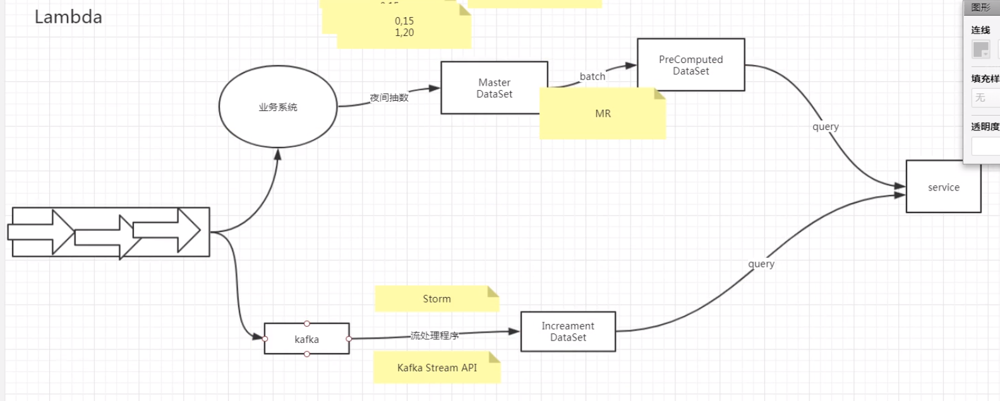
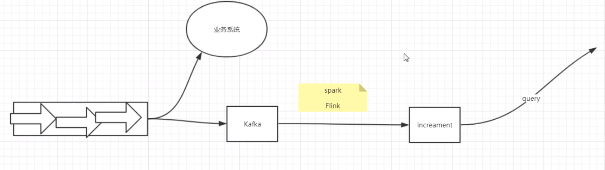
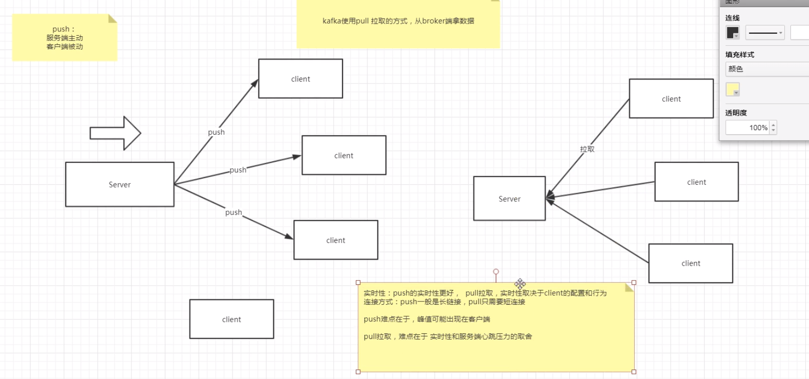
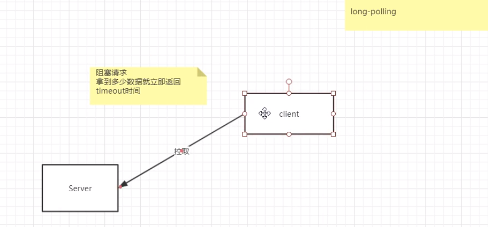
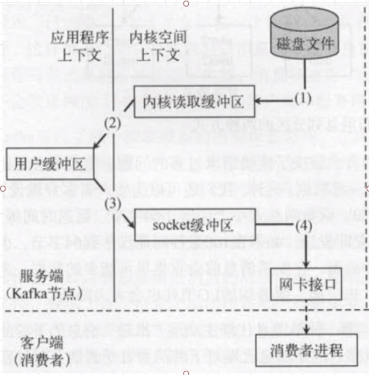
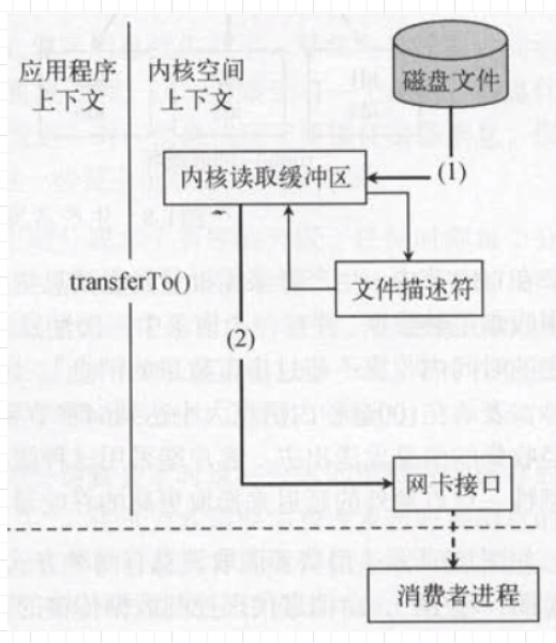

**Kafka Streams架构**

Lambda架构：流处理与批处理同时存在（需要同时维护MapReduce与storm两个系统，成本很高）

spark、flink可以进行流处理和批处理

Kafka Stream有input topic和output topic，从input topic中获取数据进行处理，将状态（state）保留至local storage中，并将状态变化量传入output topic中。

若想通过key值保证数据有序，partition数目不能改，如果partition数目发生变化，key值计算所得的partition值也会发生变化。若key为null，示例中按partition依次挨个传输。

kafka写性能高：1、使用pageCache（有OS维护）内存而不是buffer；2、顺序写。数据先通过Mapped Memory File方式保存至pageCache（顺序写，充分应用操作系统内存），一定条件下刷至磁盘。

顺序写入磁盘，读取时由于系统特性，每次读取磁盘数据入内存都会将该数据附近其他磁盘数据读入，如此kafka顺序的读速度很快。

**# 每当producer写入10000条消息时，刷数据到磁盘**

**log.flush.interval.messages=10000**

**# 每间隔1秒钟时间，刷数据到磁盘**

**log.flush.interval.ms=1000** 

宕机时pageCache丢失后，replication可以保证数据exactly once。

segment的index文件并不会存储所有log文件中的offset。

以起始偏移量命名并排序这些文件，只要根据offset **二分查找**文件列表，就可以快速定位到具体文件。

消费所耗费时间要小于消息过期删除时间。

zero copy：

kafka实现zero copy，类似Netty的堆外内存，借用NIO的零拷贝。

