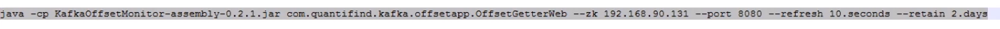
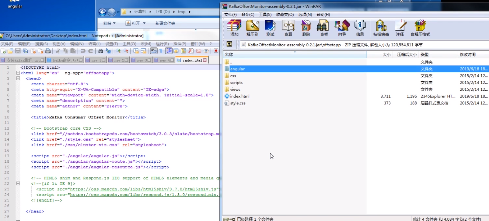
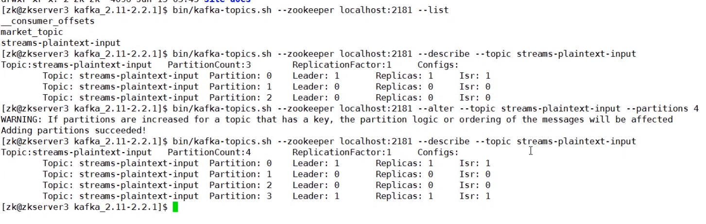
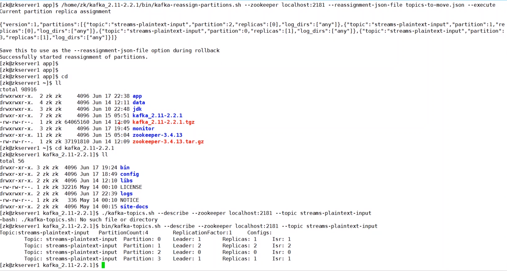
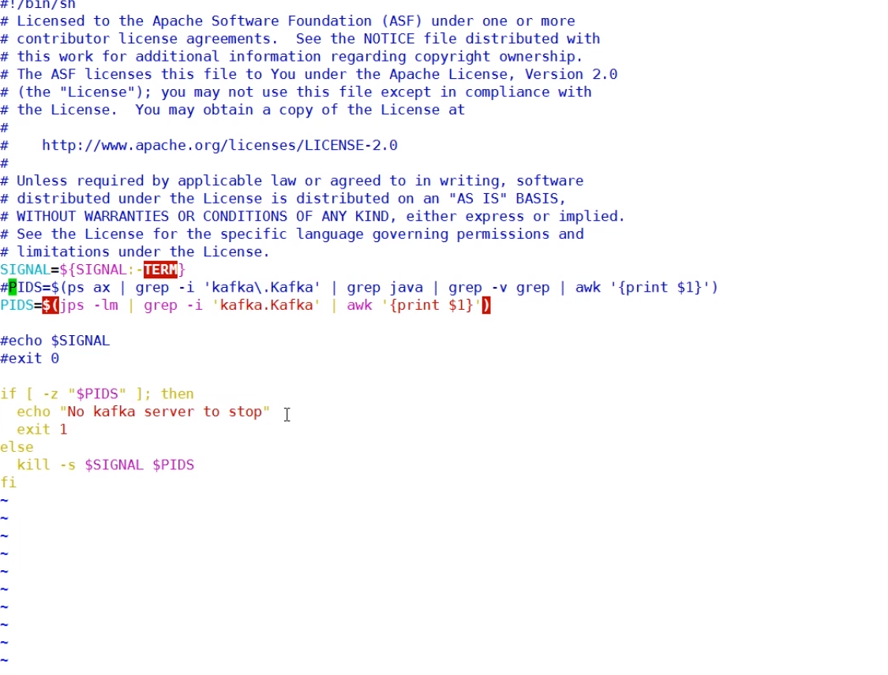

**Kafka优雅应用**

offset存在kafka内部一个topic下，Kafka Offset Monitor从ZK获取不到，可以定时将offset批量存储至ZK中。

Kafka Offset Monitor中部分文件需连接在线数据如js，css文件，可将相关文件提前下载并加入jar包内便可离线使用。

​	config命令（常用）或alter命令

follower监听注册到controller中，减缓ZK压力。controller监听ZK内的临时节点。当controller发现临时节点被删掉，表示leader已经挂机，就会在follower里进行选取。leader选取不会在所有的follower内选取，而是在ISR内进行选取。

同步数据控制：

replica.lag.time.max.ms(超过指定时间没有同步成功就将副本从ISR内移除)

replica.lag.max.messages(超过指定数据量没有同步成功就将副本从ISR内移除)（kafka消息量过大会导致参数值迅速达标，该副本会被频繁剔除与加入，故参数已被剔除）

ack=all（将数据成功同步至ISR内便返回成功）

Kafka会在Zookeeper上针对每个Topic维护一个称为ISR（in-sync replica，已同步的副本）的集合，该集合中是一些分区的副本。只有当这些副本都跟Leader中的副本同步了之后，kafka才会认为消息已提交，并反馈给消息的生产者。如果这个集合有增减，kafka会更新zookeeper上的记录。

  如果某个分区的Leader不可用，Kafka就会从ISR集合中选择一个副本作为新的Leader。

  显然通过ISR，kafka需要的冗余度较低，可以容忍的失败数比较高。假设某个topic有f+1个副本，kafka可以容忍f个服务器不可用。

partitioner重写可指定消息partition，纵然partition数目变化，消息发往的partition也不会改变。partitioner用于对key进行判断，每个消息都要历经，劲量保持高效。

吞吐量与数据一致性不可兼容。不过partition增大可以增大吞吐量，对数据可用性也没有影响。replication数目增多可用性变好但吞吐量变差。buffer存入磁盘时间增大，吞吐量也会增大，但数据可靠性变差。

吞吐量调优可参考参数（batch.size,linger.ms,buffer.memory）

KSQL是一个用于Apache kafka的流式SQL引擎，KSQL降低了进入流处理的门槛，提供了一个简单的、完全交互式的SQL接口，用于处理Kafka的数据，可以让我们在流数据上持续执行 SQL 查询，KSQL支持广泛的强大的流处理操作，包括聚合、连接、窗口、会话等等。

https://springcloud.cc/apache-kafka-zhcn.html

https://kafka.apache.org/documentation/#configuration