**rocketmq入门**

# 1.RocketMQ简介

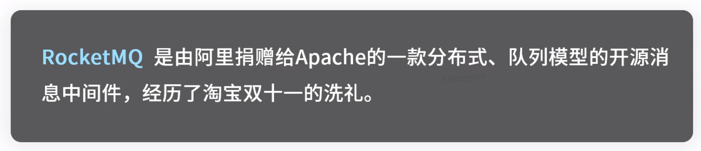

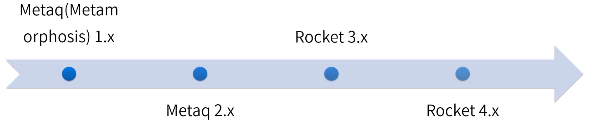

​	分组：消息均匀分布至同一组的多台机器。

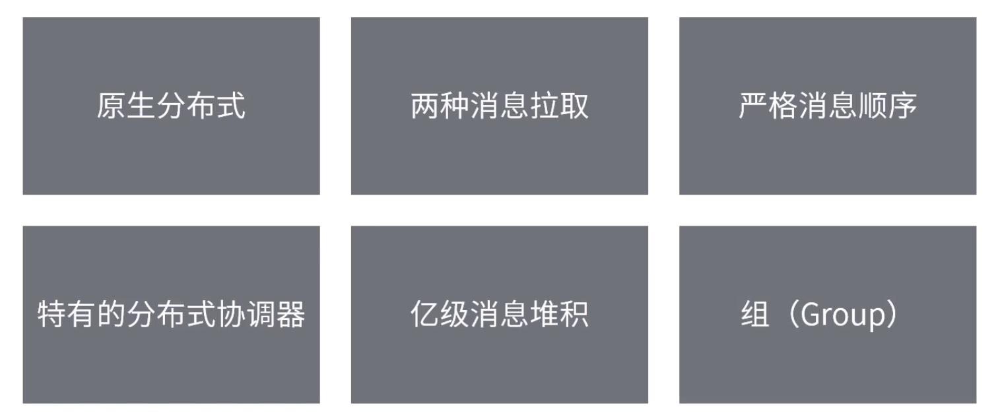

# 2.RocketMQ基本概念

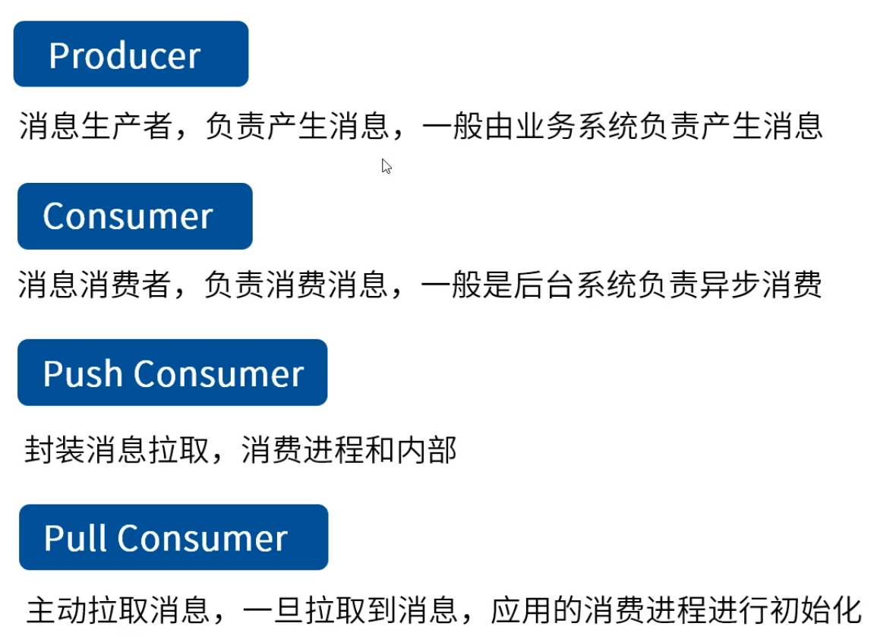

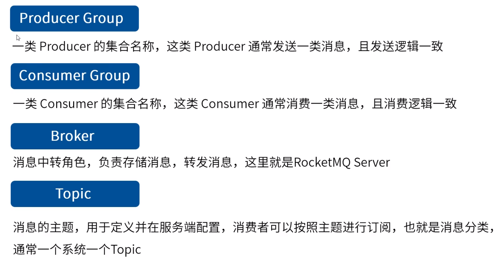

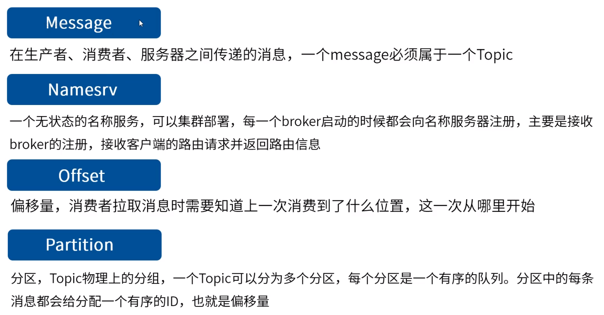

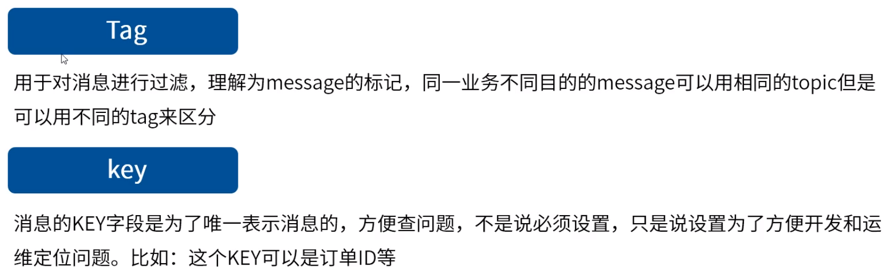

​	一个系统用一个topic，不同的message可以用tag区分。

# 3.RocketMQ安装运行

环境：CentOS7，jdk1.8

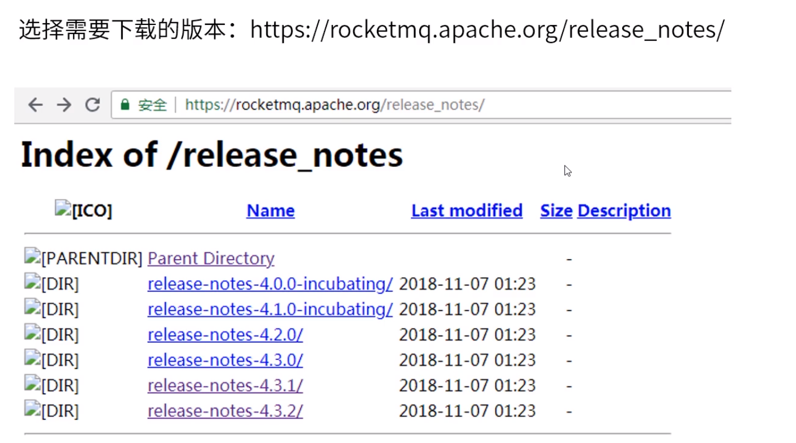

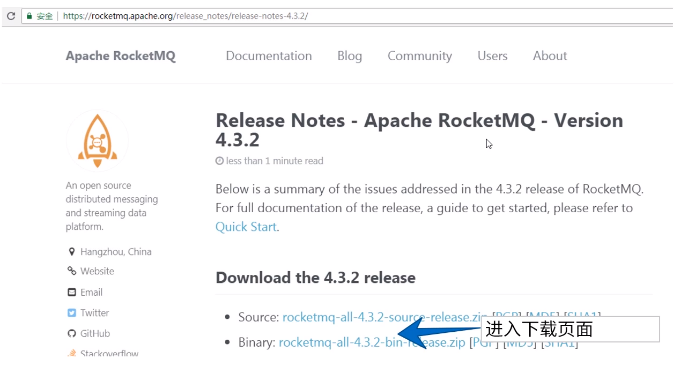

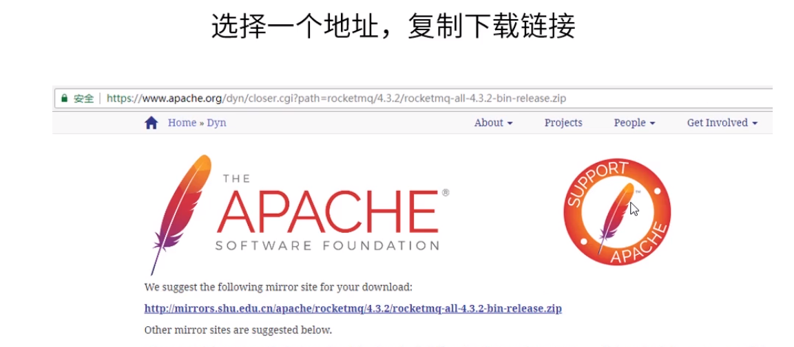

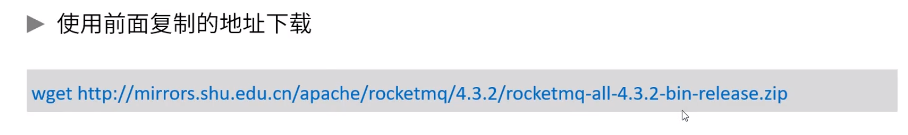

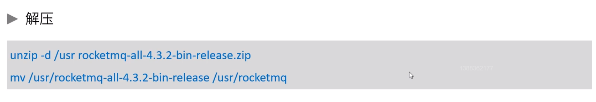

​	默认占用内存

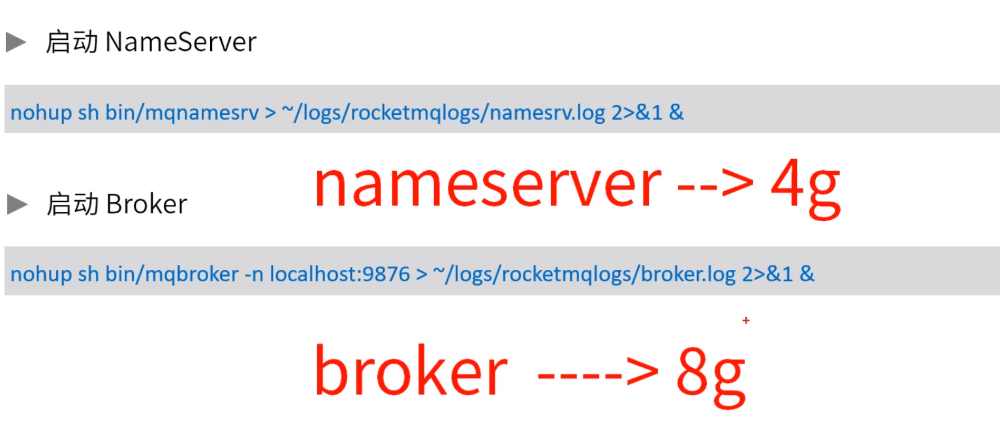

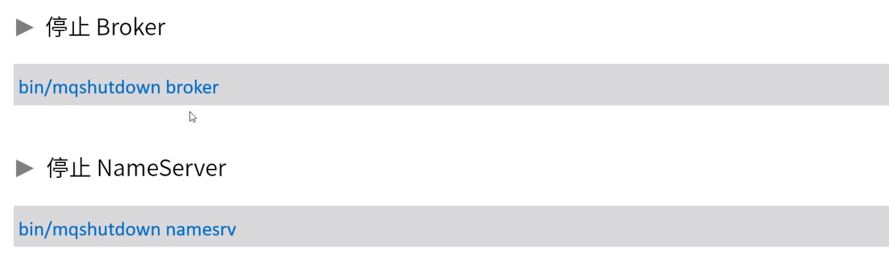

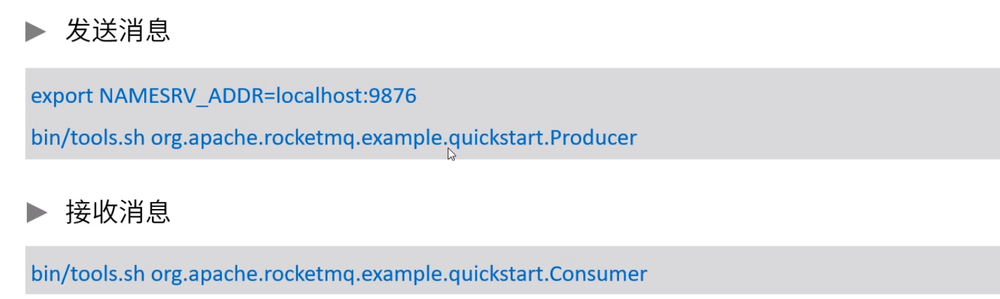

# 4.RocketMQ使用

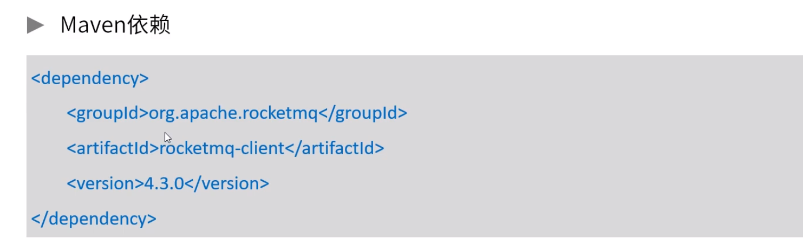

