**rocketmq架构方案及角色详解**

# 1.RocketMQ角色介绍

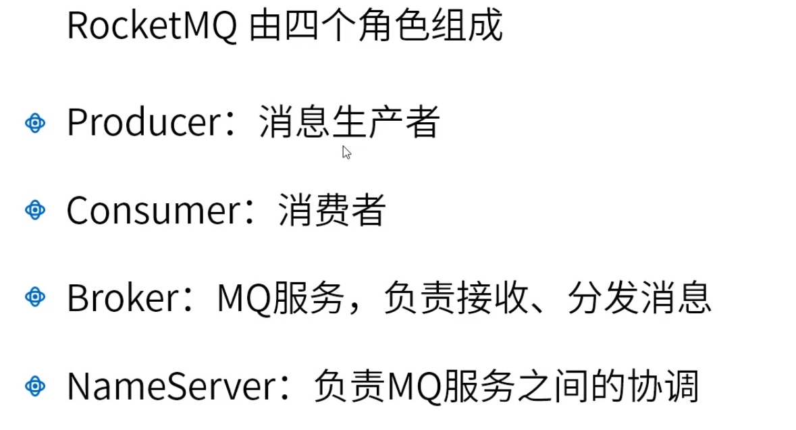

# 2.RocketMQ架构方案

​	NameServer：服务注册与发现（每个MQ启动后会将信息注册到NameServer中，producer与consumer通过NameServer发现服务）；路由管理（producer与Broker传输信息，如处理的topic，哪一个producer，哪一个Broker，这些信息保存在NameServer中）。

​	Broker：数据的真实存储，数据的分发、接收

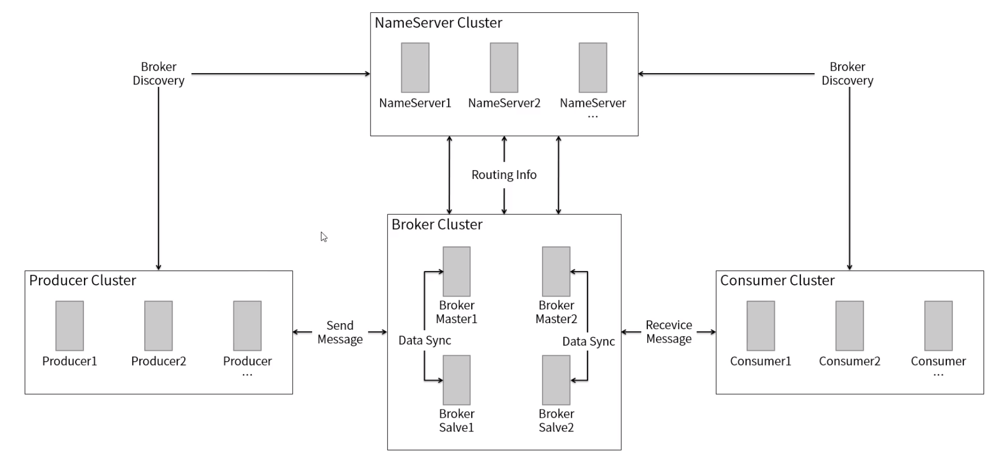

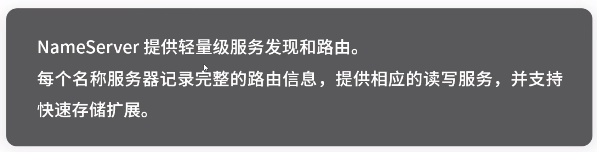

​	启动时内存修改：linux（runserver.sh,runbroker.sh）,windows（runserver.cmd,runbroker.cmd）

​	broker.conf文件可指定要使用的broker ip（还可以指定NameServer目的地，使得broker信息注册到NameServer中，同时还可以命令行启动时指定）

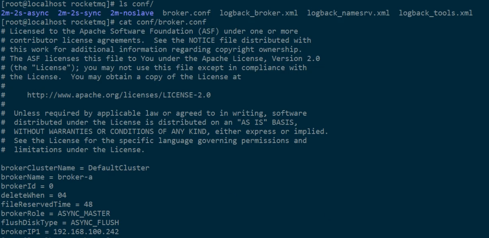

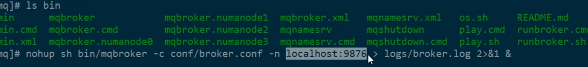

​	一个consumer可以同时消费多个queue，但一个queue只能被一个consumer消费。因此consumer数量不能大于queue总的数量。

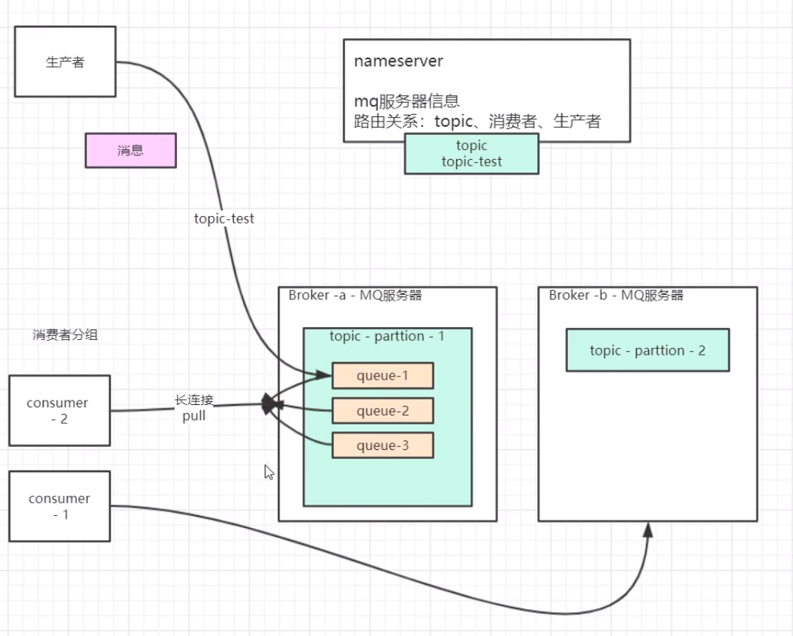

​	异步存入磁盘：数据先存在内存中，一段时间后存入磁盘。（可能导致数据丢失）

​	同步存入磁盘：数据存入磁盘成功后，才会返回写入成功的响应。

​	broker主从服务（一主多从），主从服务全部设为同步存入，可防止数据丢失。

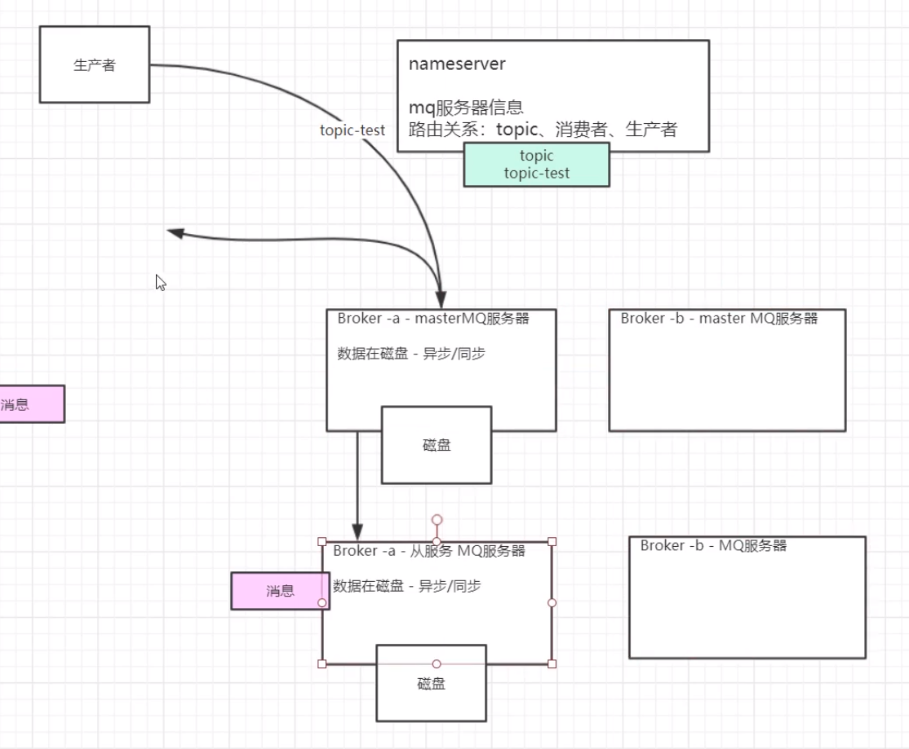

​	master之前没有数据交互，存储不同分区。

​	主从之间同步复制（双写）

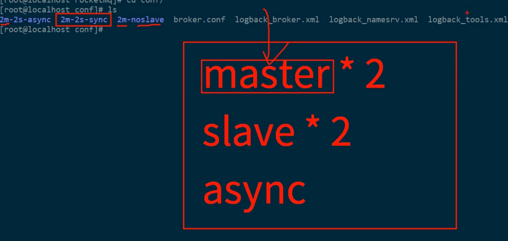

​	双主双从（master之间无数据交互，NameServer之间无数据交互）

​	每一个服务器启动时会配置多个NameServer，启动后自动注册信息，所以NameServer之间不需同步。

​	brokerClusterName值相同，则属于同一集群。主从之间保持brokerName一致。

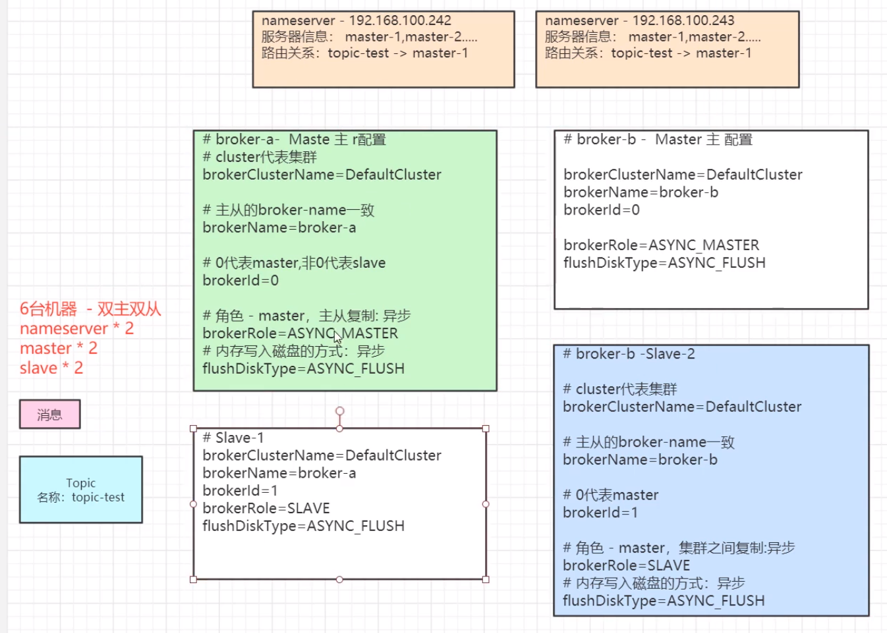

# 3.RocketMQ集群部署配置

环境准备：两台安装好RocketMQ的机器，分别启动两台机器的NameServer（或用一台机器的不同端口号）

defaultTopicQueueNums=4（每个分区有四个队列）

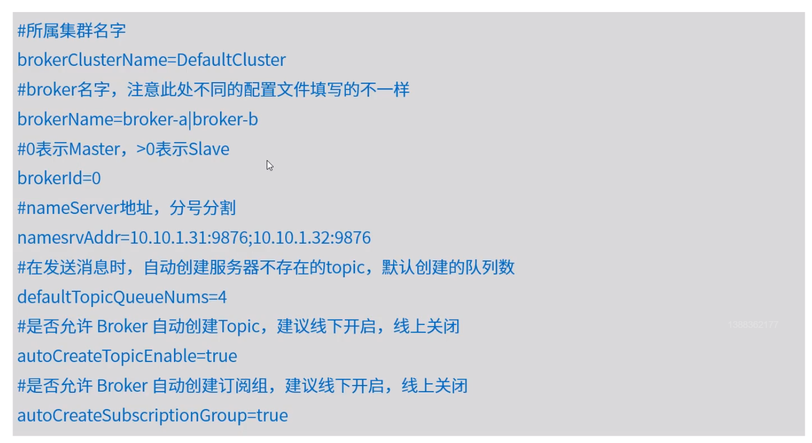

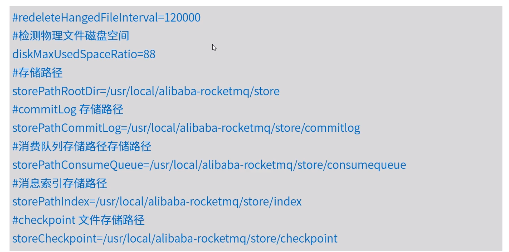

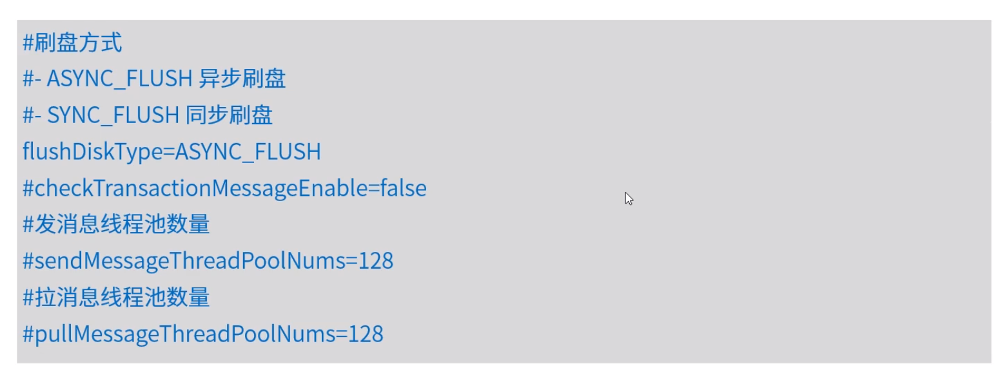

