**RocketMQ中高性能最佳实践**

# 1.最佳实践之Producer

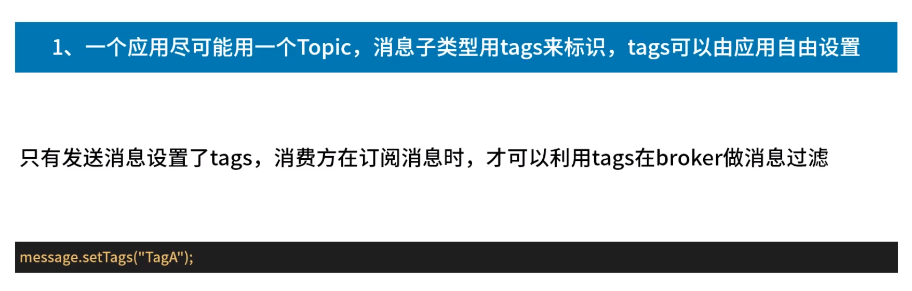

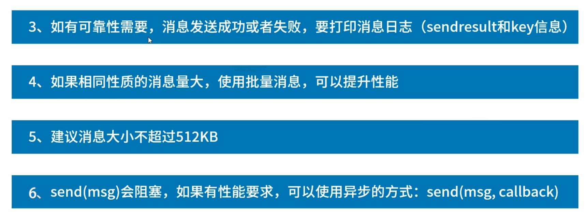

​	生产者不是越多越好，可能导致资源争用。为生产者设名方便管理。

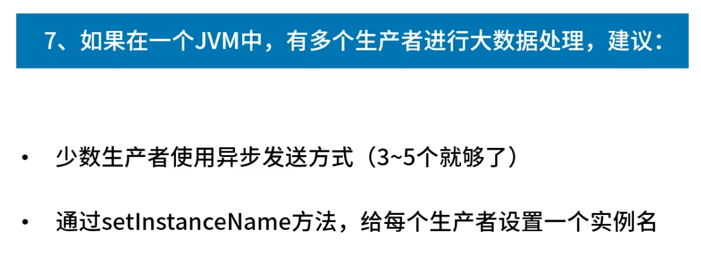

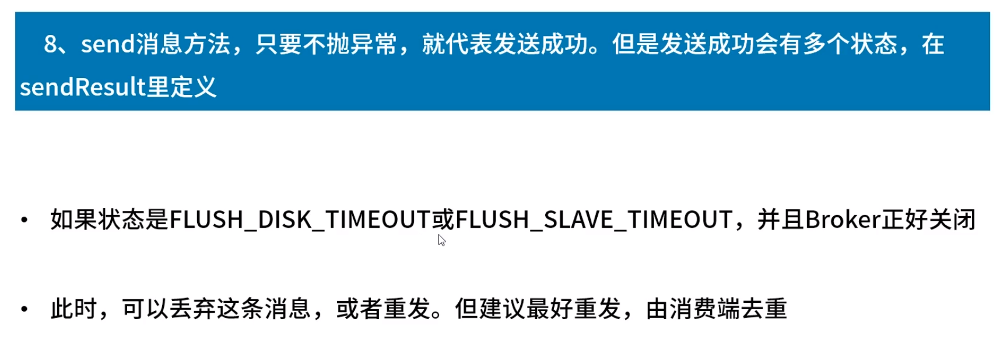

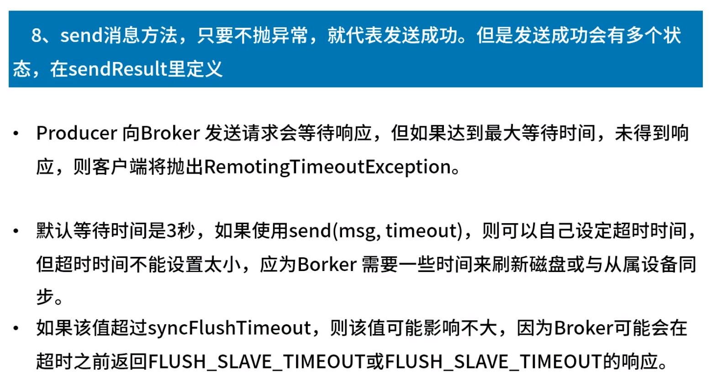

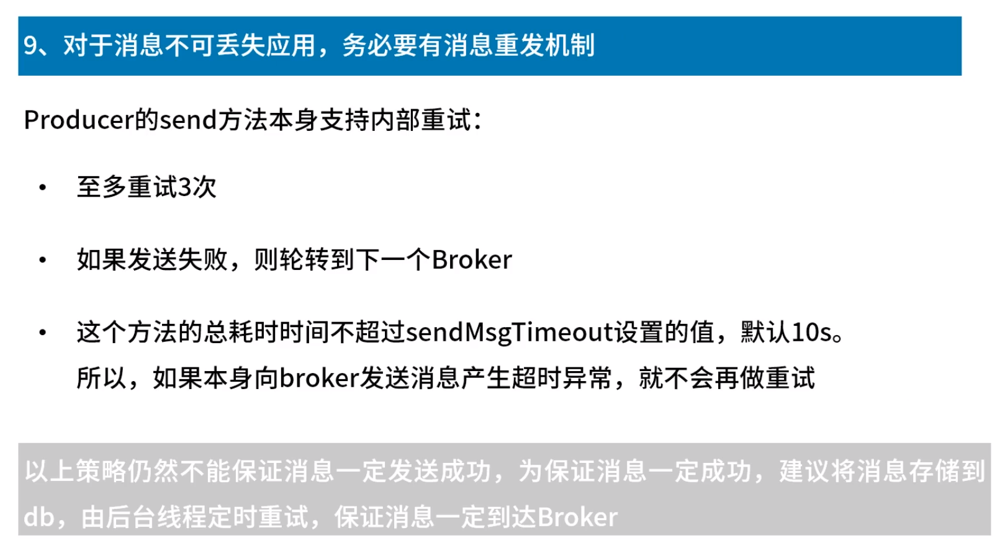

# 2.最佳实践之Consumer

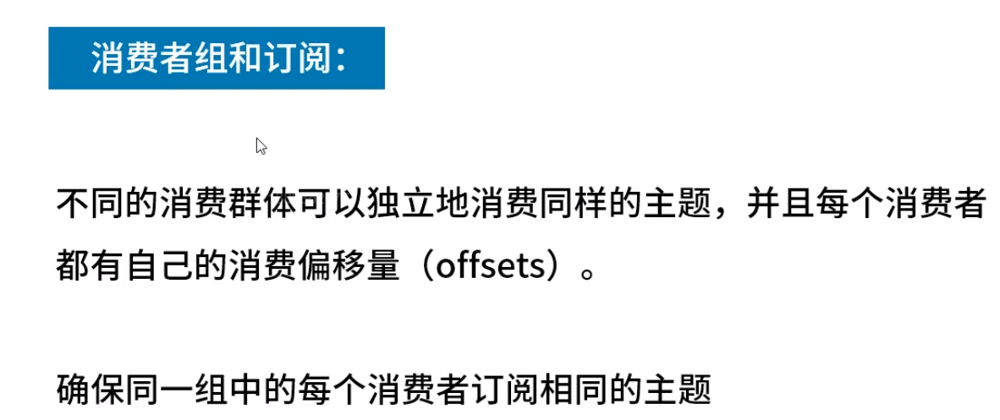

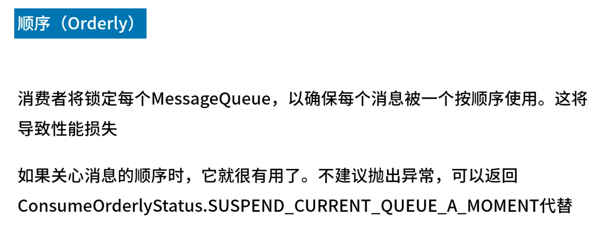

​	顺序消息消费：发送出错后，消息会发生变化，会由当前topic转换到retry topic处（如t1 -- %retry%t1），由普通的非延时消息变为延时消息。延时时间由level（默认从3开始）决定，失败后level等级不断增加。

​	consumer.setMaxReconsumeTimes(-1);//消费重试次数，-1代表16次

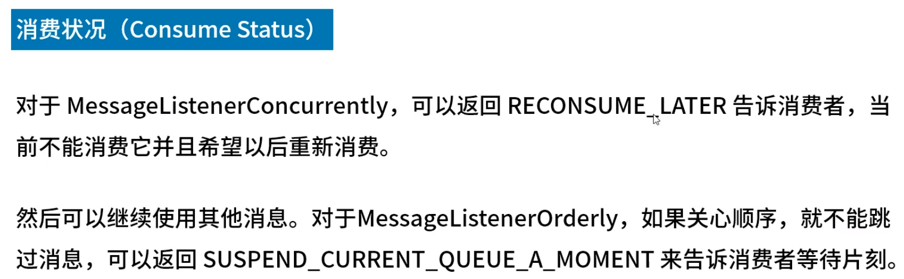

​	处理非顺序消息时开启线程池处理消息。

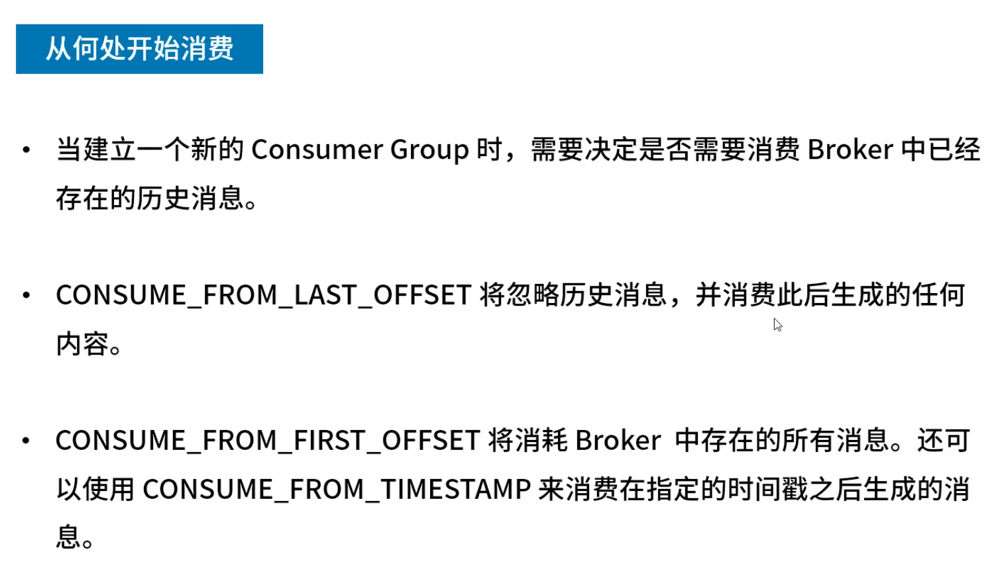

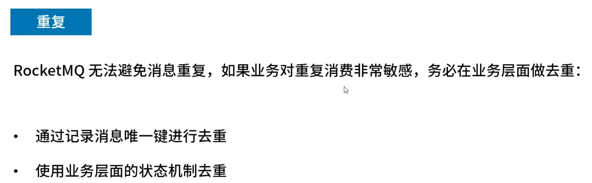

# 3.最佳实践之NameServer

​	NameServer集群之间不会交互数据，数据全部来自broker。

​	或者启动时 -c xx.properties加载配置文件

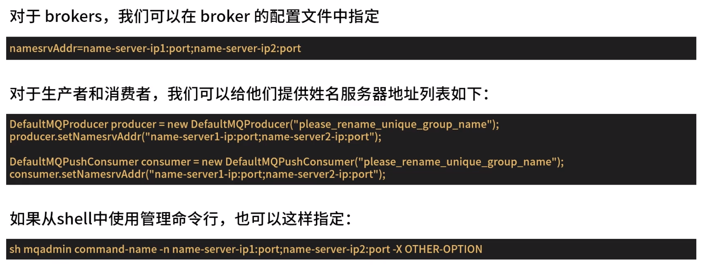

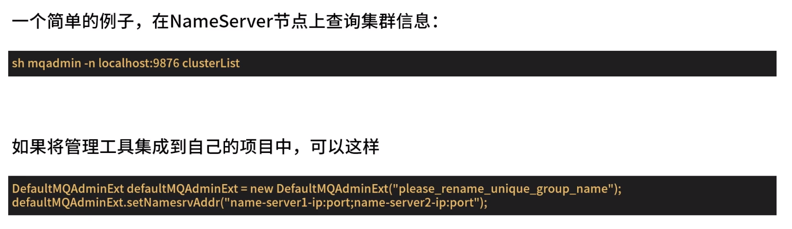

​	可以自己写自己指定。

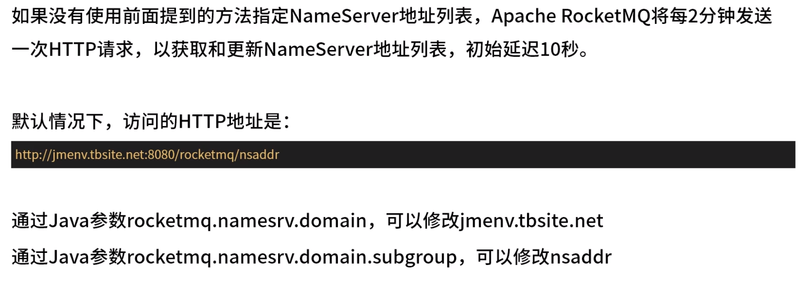

​	

​	优先级

# 4.JVM与Linux内核配置

​	默认开启时便占用8g内存。

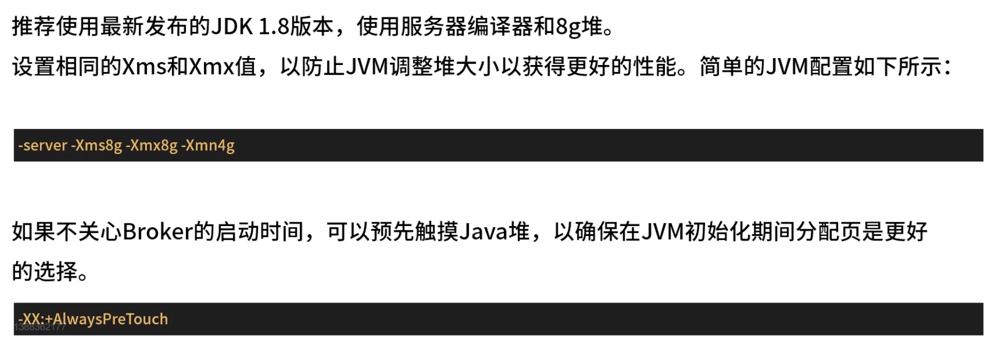

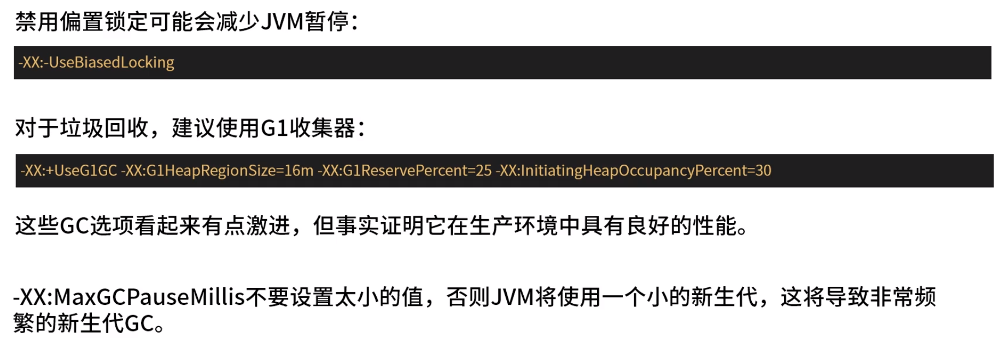

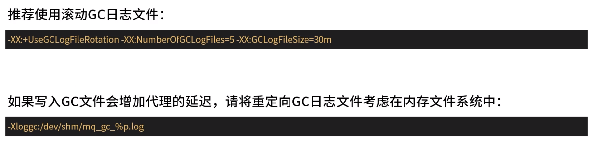

