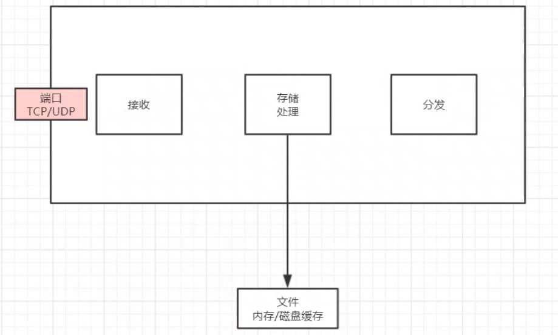
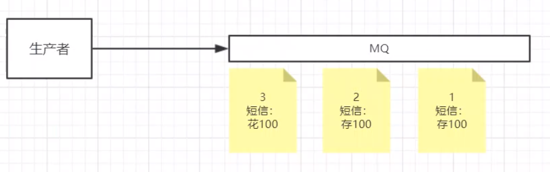
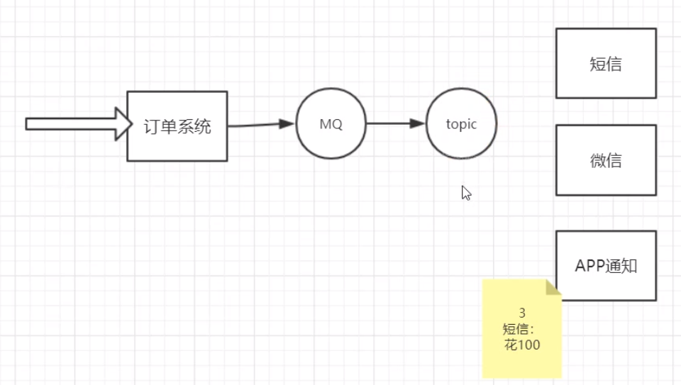
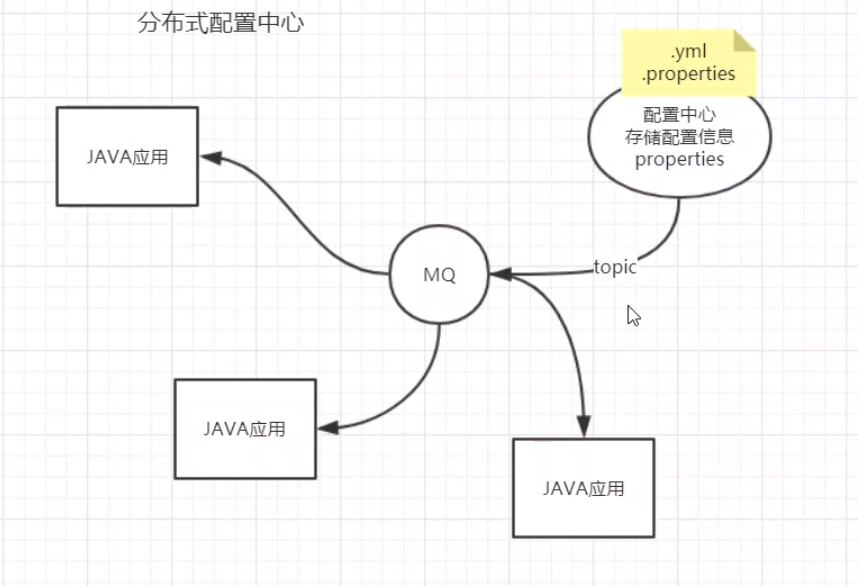
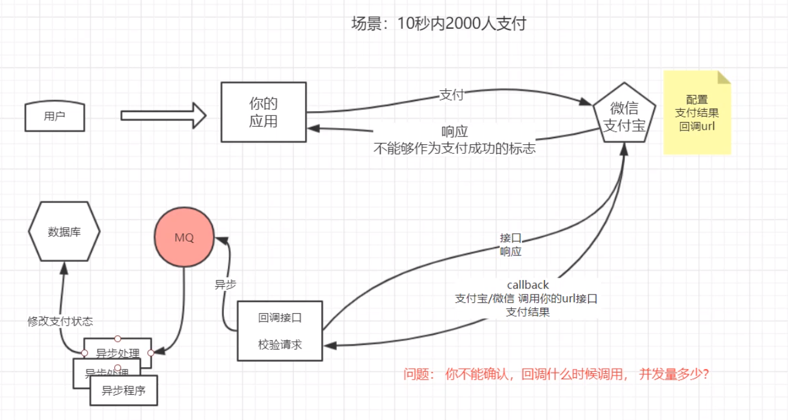
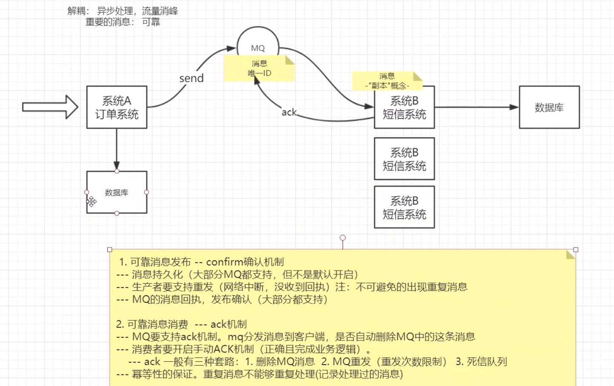
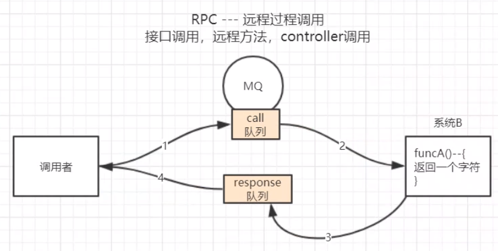
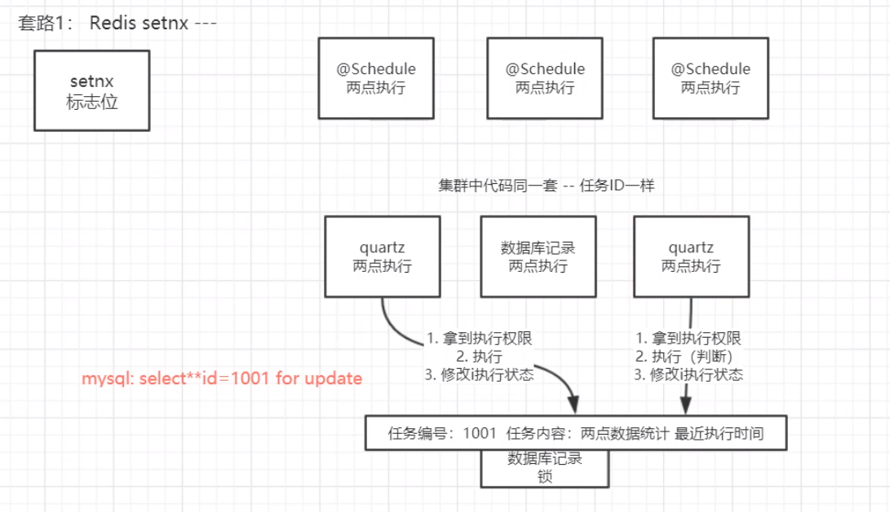
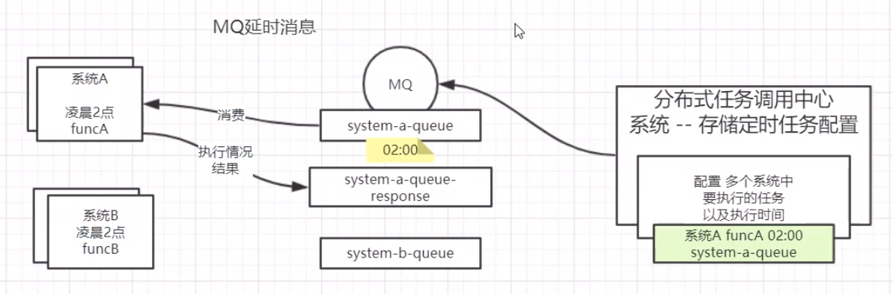
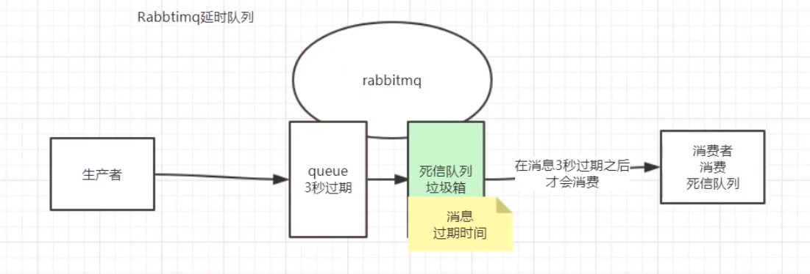

**消息中间件应用场景分析**

性能与可靠性不可兼得。

顺序消息，消费者不能使用多线程处理消息。

解决耦合，提高并发，但是没有事务，不能保证MQ数据不丢失。

其他定时任务

Redis setnx问题：定时任务执行过慢或过快，而集群中系统间时序不同步或某个系统卡顿延迟，可能导致重复操作。

quartz：无法进行统一管理。执行情况不明。（for update利用数据库的锁）

分布式任务调度中心（基于MQ）

MQ延时消息或调用中心定时发送。

可以类似rpc同步等待响应回复，超时重发等保证操作可靠。

不改业务系统数据库。

XXL-JOB -- 分布式任务调度中心（不是基于MQ）

http://www.xuxueli.com/xxl-job/#/

