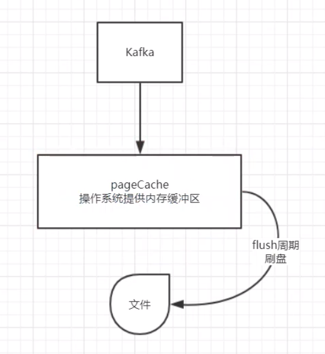
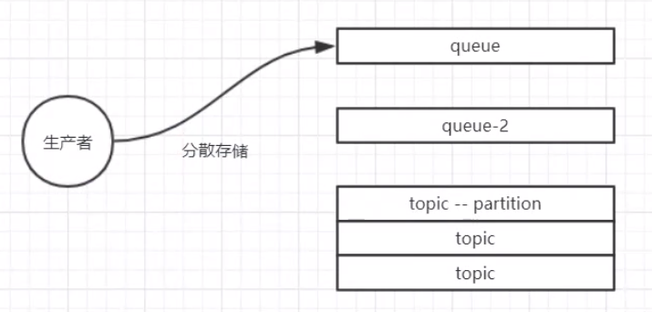
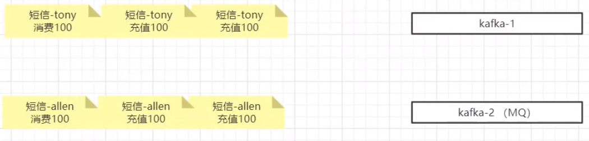
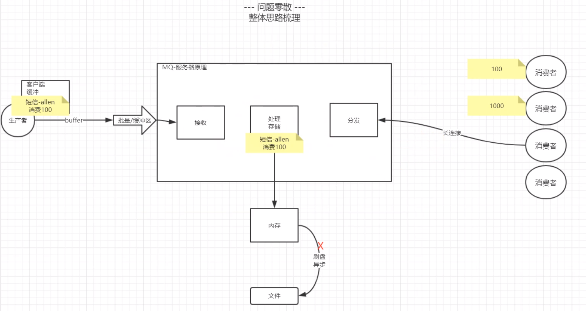
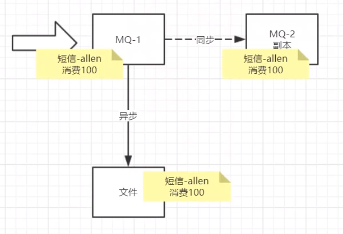
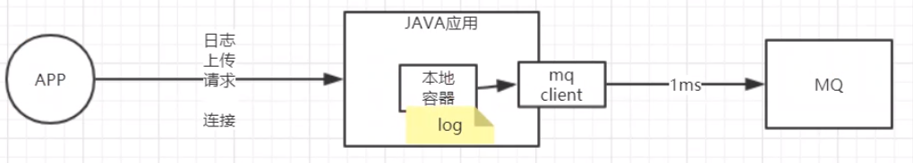

**网易后端架构中消息中间件应用（网易）**

有序消息，消费端如果无法使用多线程消费，那数据量很大的情况下，消费端怎么样去提高吞吐量？

拉取消息数量依据消费者处理能力而定。

推：若MQ是集群，向消费者推消息不好控制。

先同步至副本，返回回执，再慢慢同步至文件。

部分MQ生产者端未提供缓冲区，需开发者自己加。

本地缓存（提高吞吐量，消息不太重要的场景）

java -- linkedblockingqueue -- thread循环消费

disruptor

阻塞 --- 有数据时通知消费者线程 --- 涉及到线程通信，线程上下文切换 在极致性能情况下性能不高。

