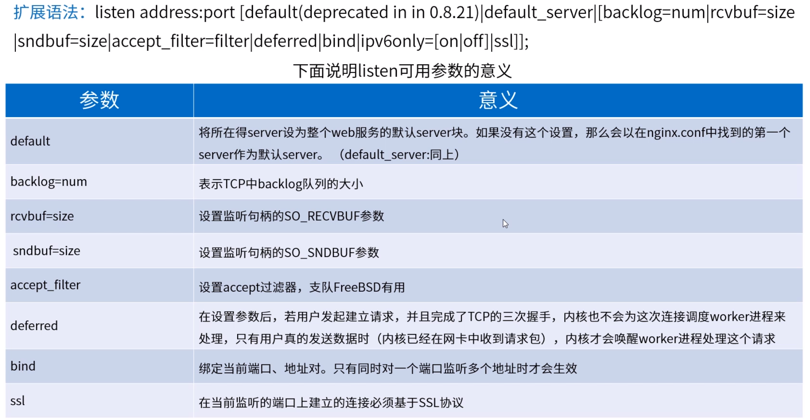
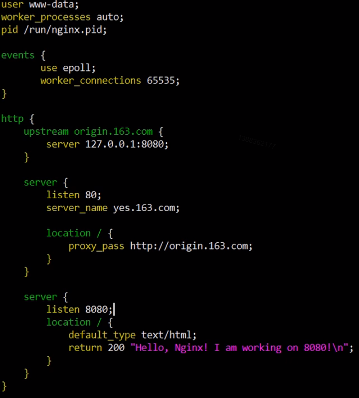
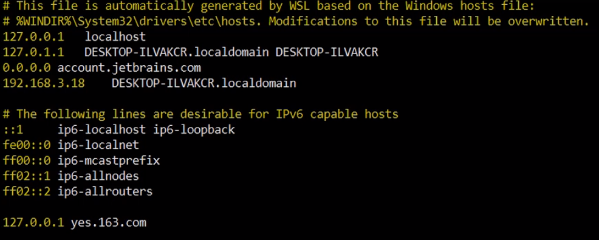
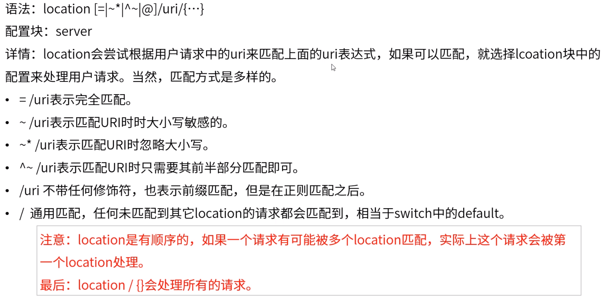
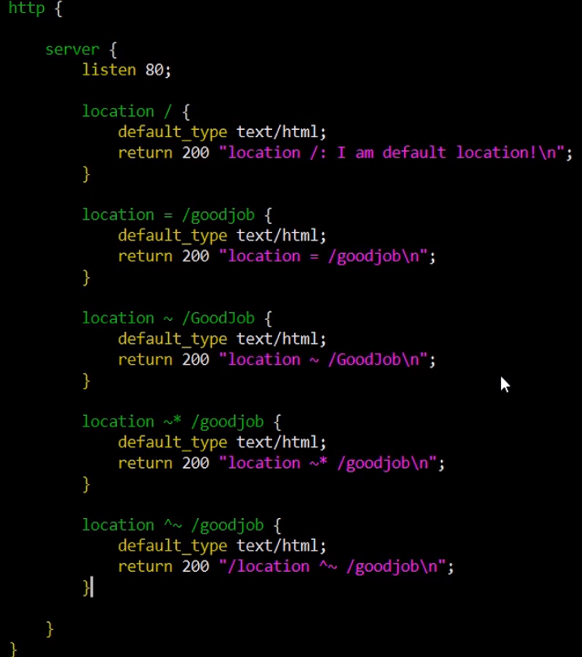
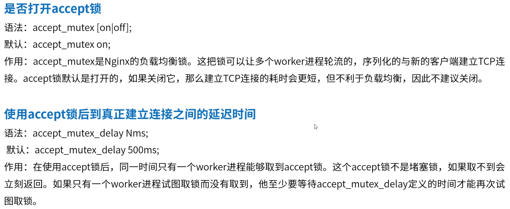
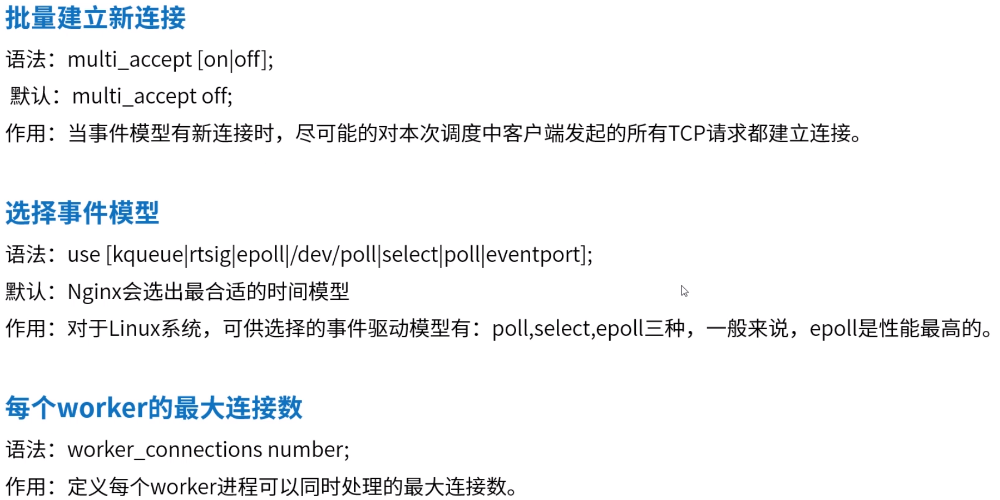
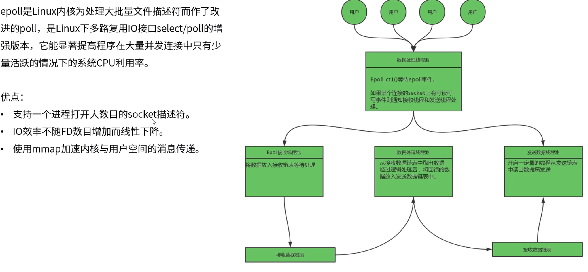
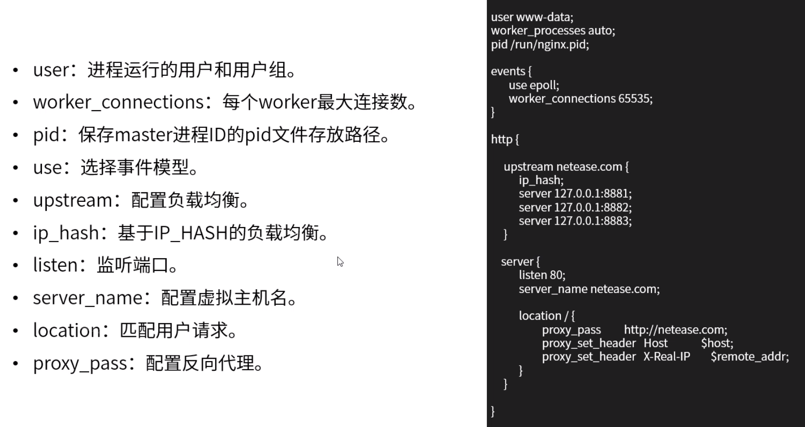

**高性能Nginx最佳实践**

# 1.Nginx简介

# 2.Nginx监听端口

# 3.Nginx虚拟主机

通过proxy_pass将请求转发给upstream。

# 4.Nginx配置location

# 5.Nginx常规配置

# 6.Nginx高性能配置

ab压力测试命令

ab  -n 请求总数   -c 并发用户数   -t  测试时间   -k  （发送keep-alive指令到服务器端） -w  "http://www.xxxxx/path?userId=12345"   >> /data/report/test.html

ab -n 2000 -k http://127.0.0.1/ 	可用于测试请求是否平均分配至各个CPU。

# 7.Nginx事件配置

内核每次只会返回变化的（已处理完成的）数据给用户态。10000个连接数中每次可能只有几十个发生变化，如此Nginx每次只需处理这几十个，剩下的还在等待。

