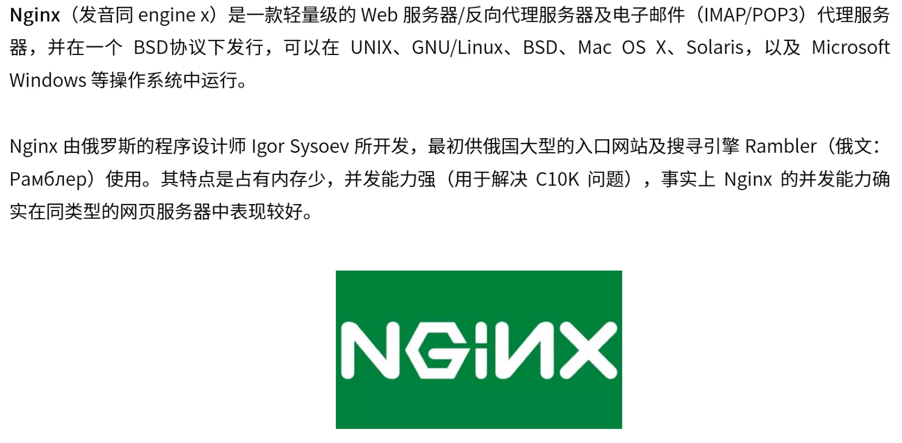
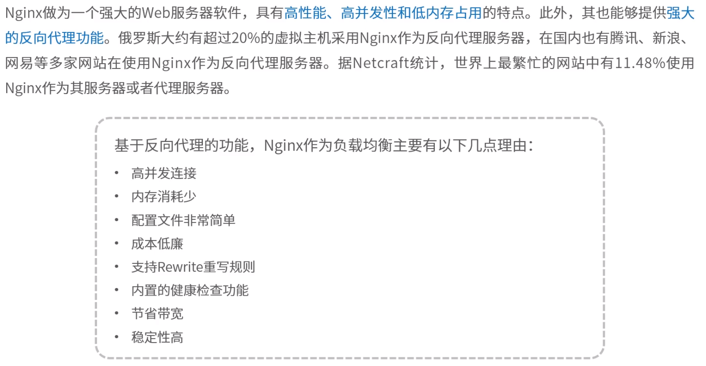
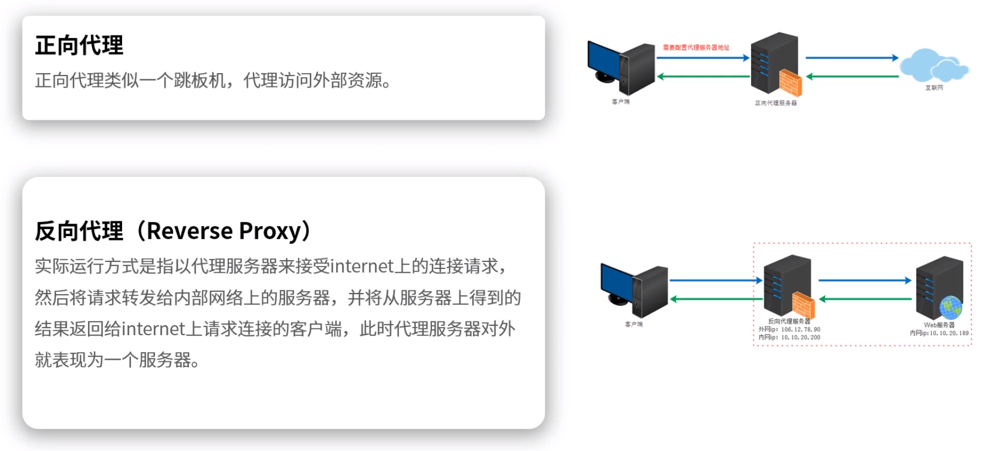
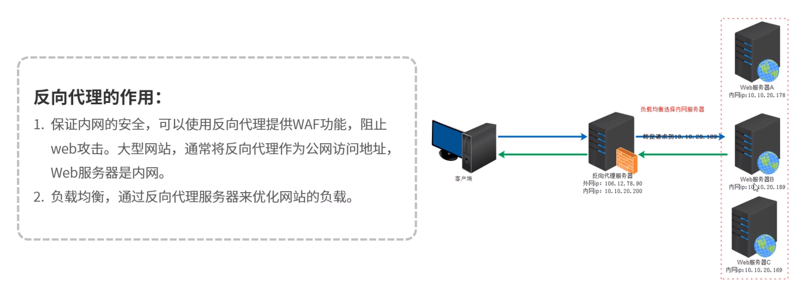
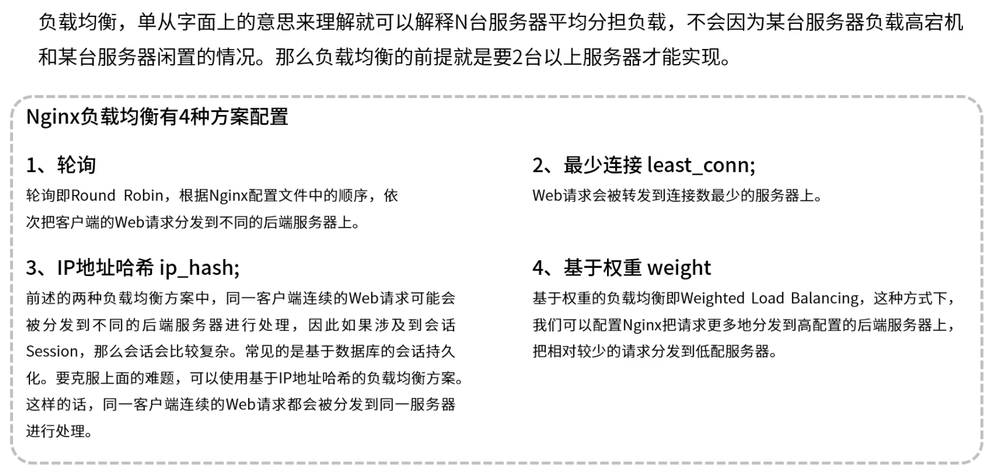
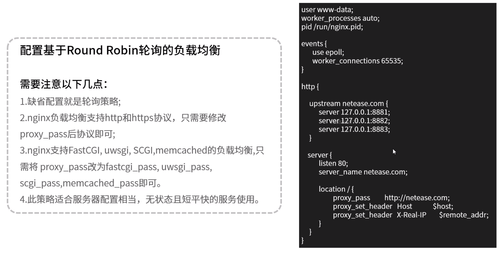
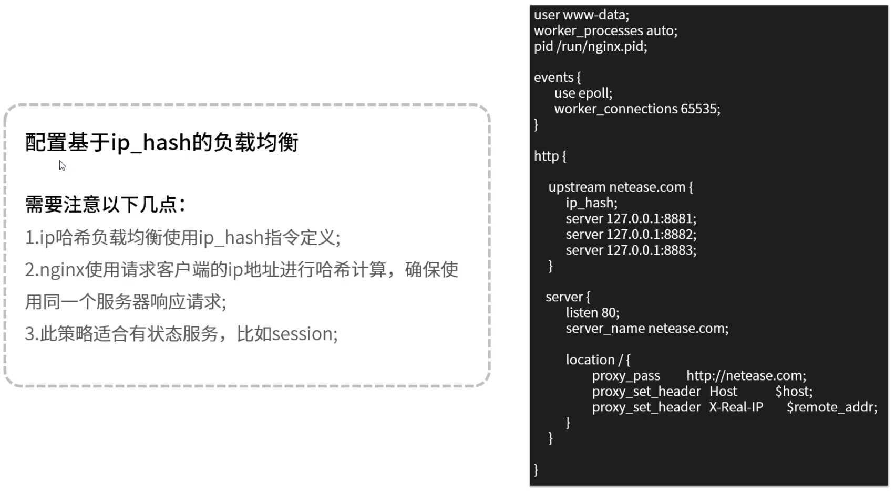
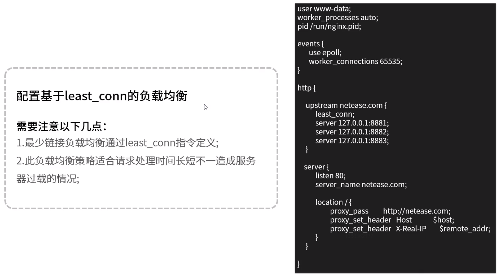
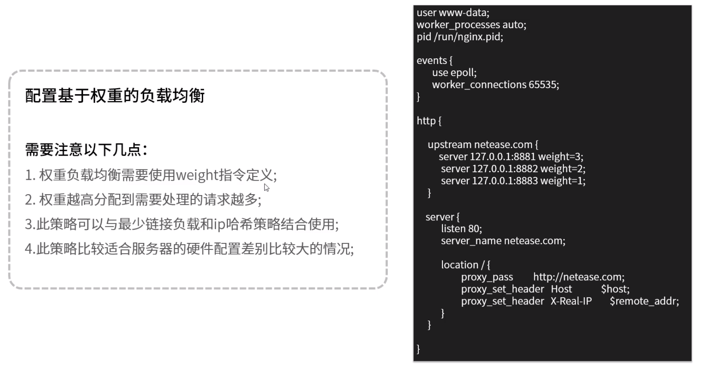

**Nginx负载均衡**

# 1.Nginx简介

​	C语言编写，采用编译形式部署，各模块都与Nginx联系在一起。高并发性（采用epoll nio形式高效处理网络请求）。设计了大量自带的数据结构，数据结构紧凑。类似零拷贝形式降低内存使用及数据复制。

web服务器：Apache（能增加PHP模块，支持PHP动态脚本，阻塞式模型），Tomcat（本身实现java servlet协议，可以运行java代码，可以运行java动态语言，如jsp，servlet），Nginx（通常作为静态服务器解析js，html等，不支持动态语言，NIO-性能较高）

# 2.正向代理和反向代理

# 3.负载均衡原理

3中，也可通过MySQL，Redis，Memcached存储用户session信息

# 4.负载均衡配置

​	配置文件：/etc/nginx/nginx.conf

​	支持高并发量：基于事件的网络IO（通常是NIO这种多路复用技术，最成熟的用最多的是linux下的epoll）

