**LVS基础概念解析**

# 1.LVS简介

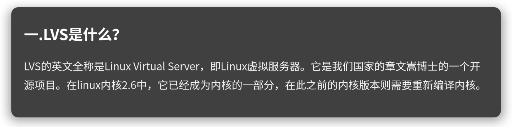

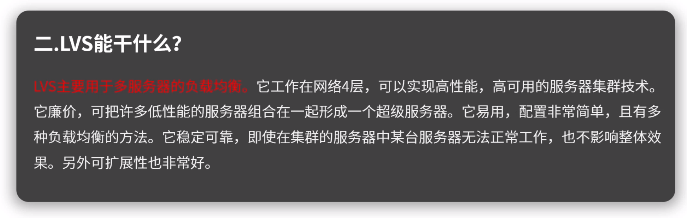

# 2.Linux Virtual Server项目

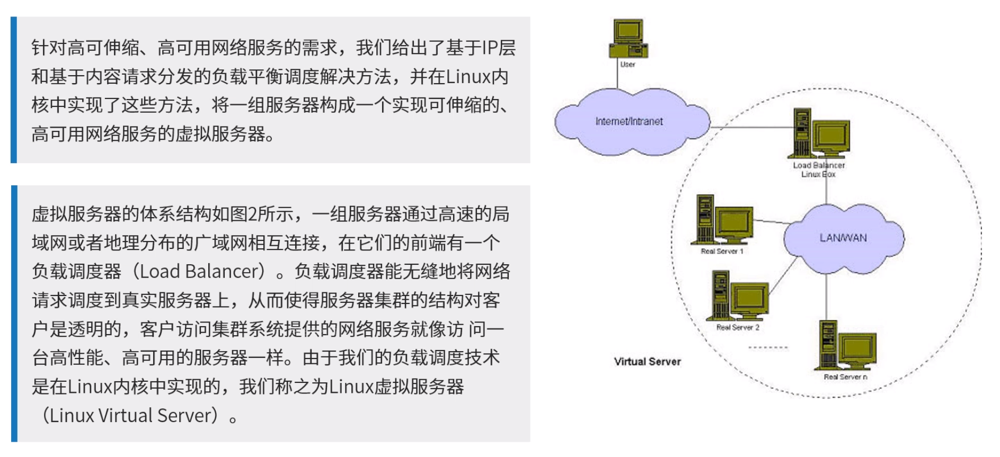

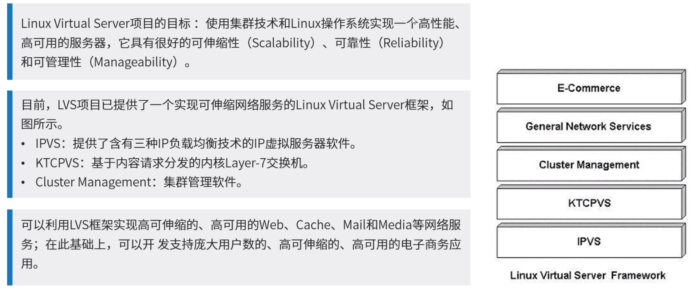

# 3.网络分层

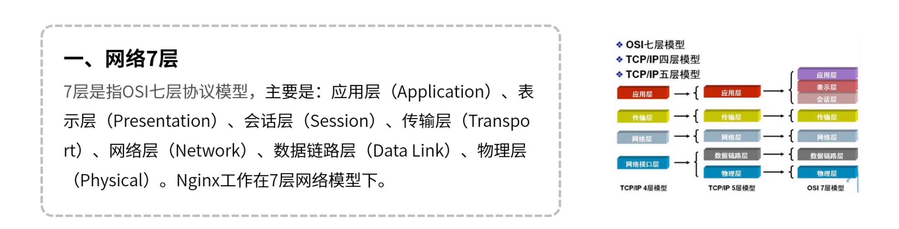

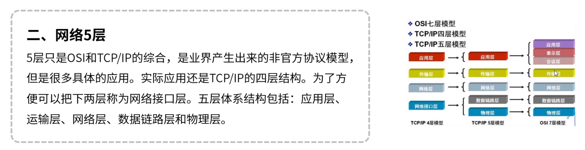

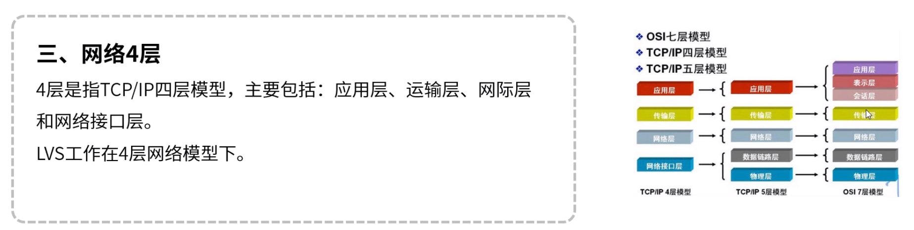

# 4.IP虚拟服务器软件

​	ARP协议

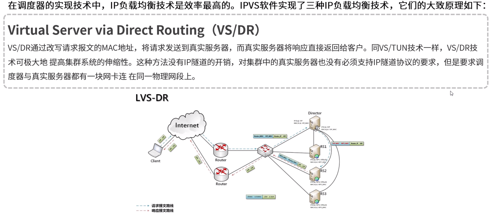

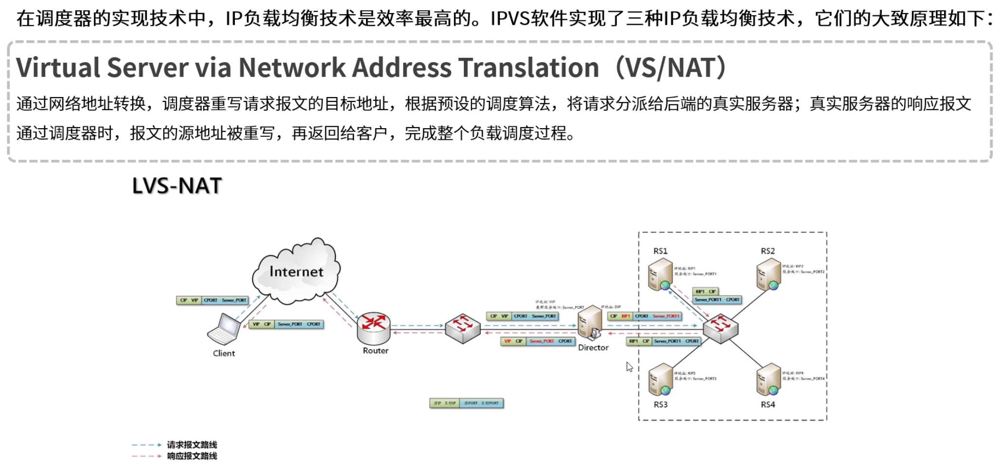

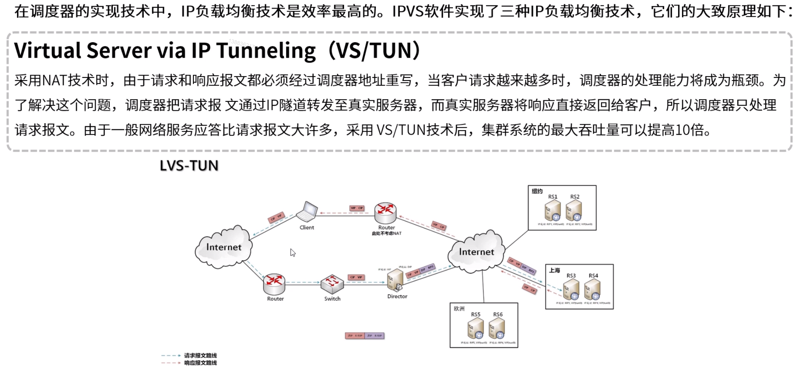

# 5.IPVS调度算法

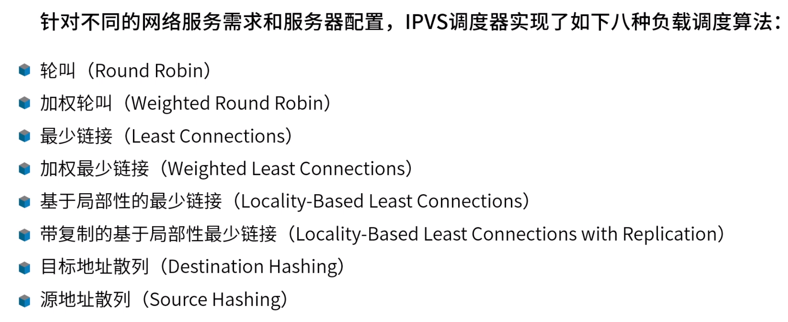

**1. 轮叫调度 rr**
这种算法是最简单的，就是按依次循环的方式将请求调度到不同的服务器上，该算法最大的特点就是简单。轮询算法假设所有的服务器处理请求的能力都是一样的，调度器会将所有的请求平均分配给每个真实服务器，不管后端 RS 配置和处理能力，非常均衡地分发下去。

**2. 加权轮叫 wrr**
这种算法比 rr 的算法多了一个权重的概念，可以给 RS 设置权重，权重越高，那么分发的请求数越多，权重的取值范围 0 – 100。主要是对rr算法的一种优化和补充， LVS 会考虑每台服务器的性能，并给每台服务器添加要给权值，如果服务器A的权值为1，服务器B的权值为2，则调度到服务器B的请求会是服务器A的2倍。权值越高的服务器，处理的请求越多。

**3. 最少链接 lc**
这个算法会根据后端 RS 的连接数来决定把请求分发给谁，比如 RS1 连接数比 RS2 连接数少，那么请求就优先发给 RS1

**4. 加权最少链接 wlc**
这个算法比 lc 多了一个权重的概念。

**5. 基于局部性的最少连接调度算法 lblc**
这个算法是请求数据包的目标 IP 地址的一种调度算法，该算法先根据请求的目标 IP 地址寻找最近的该目标 IP 地址所有使用的服务器，如果这台服务器依然可用，并且有能力处理该请求，调度器会尽量选择相同的服务器，否则会继续选择其它可行的服务器

基于局部性的最少链接调度（Locality-Based Least Connections Scheduling，以下简称为LBLC）算法是针对请求报文的目标IP地址的负载均衡调度，目前主要用于Cache集群系统，因为在Cache集群中客户请求报文的目标IP地址是变化的。这里假设任何后端服务器都可以处理任一请求，算法的设计目标是在服务器的负载基本平衡情况下，将相同目标IP地址的请求调度到同一台服务器，来提高各台服务器的访问局部性和主存Cache命中率，从而整个集群系统的处理能力。

LBLC调度算法先根据请求的目标IP地址找出该目标IP地址最近使用的服务器，若该服务器是可用的且没有超载，将请求发送到该服务器；若服务器不存在，或者该服务器超载且有服务器处于其一半的工作负载，则用“最少链接”的原则选出一个可用的服务器，将请求发送到该服务器。

**6. 带复制的基于局部性最少链接调度 lblcr**
记录的不是要给目标 IP 与一台服务器之间的连接记录，它会维护一个目标 IP 到一组服务器之间的映射关系，防止单点服务器负载过高。

带复制的基于局部性最少链接调度（Locality-Based Least Connections with Replication Scheduling，以下简称为LBLCR）算法也是针对目标IP地址的负载均衡，目前主要用于Cache集群系统。它与LBLC算法的不同之处是它要维护从一个目标IP地址到一组服务器的映射，而LBLC算法维护从一个目标IP地址到一台服务器的映射。对于一个“热门”站点的服务请求，一台Cache 服务器可能会忙不过来处理这些请求。这时，LBLC调度算法会从所有的Cache服务器中按“最小连接”原则选出一台Cache服务器，映射该“热门”站点到这台Cache服务器，很快这台Cache服务器也会超载，就会重复上述过程选出新的Cache服务器。这样，可能会导致该“热门”站点的映像会出现在所有的Cache服务器上，降低了Cache服务器的使用效率。LBLCR调度算法将“热门”站点映射到一组Cache服务器（服务器集合），当该“热门”站点的请求负载增加时，会增加集合里的Cache服务器，来处理不断增长的负载；当该“热门”站点的请求负载降低时，会减少集合里的Cache服务器数目。这样，该“热门”站点的映像不太可能出现在所有的Cache服务器上，从而提供Cache集群系统的使用效率。

LBLCR算法先根据请求的目标IP地址找出该目标IP地址对应的服务器组；按“最小连接”原则从该服务器组中选出一台服务器，若服务器没有超载，将请求发送到该服务器；若服务器超载；则按“最小连接”原则从整个集群中选出一台服务器，将该服务器加入到服务器组中，将请求发送到该服务器。同时，当该服务器组有一段时间没有被修改，将最忙的服务器从服务器组中删除，以降低复制的程度。

**7. 目标地址散列调度算法 dh**
该算法是根据目标 IP 地址通过散列函数将目标 IP 与服务器建立映射关系，出现服务器不可用或负载过高的情况下，发往该目标 IP 的请求会固定发给该服务器。

**8. 源地址散列调度算法 sh**
与目标地址散列调度算法类似，但它是根据源地址散列算法进行静态分配固定的服务器资源。

# 6.内核Layer-7交换机KTCPVS

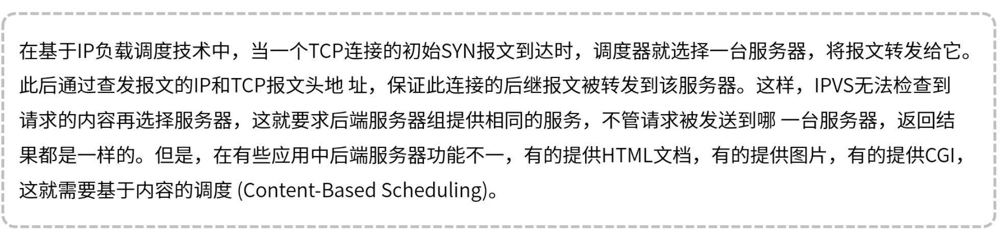

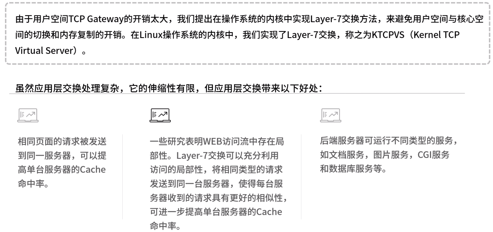

# 7.LVS集群特点

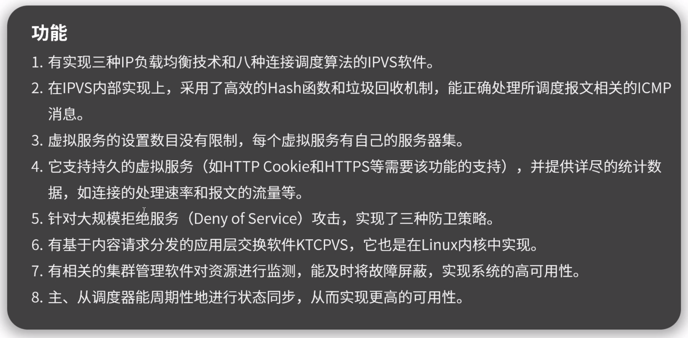

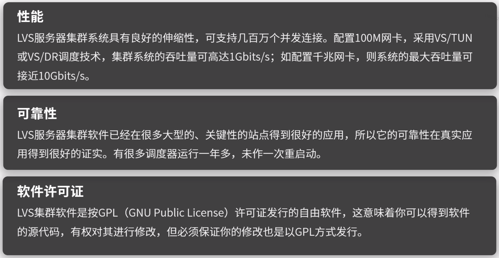

# 8.LVS与Nginx对比

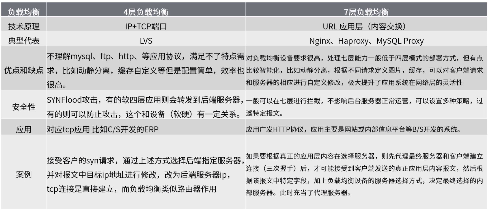

