**基于VIP的keepalived高可用架构讲解**

# 1.Keepalived简介

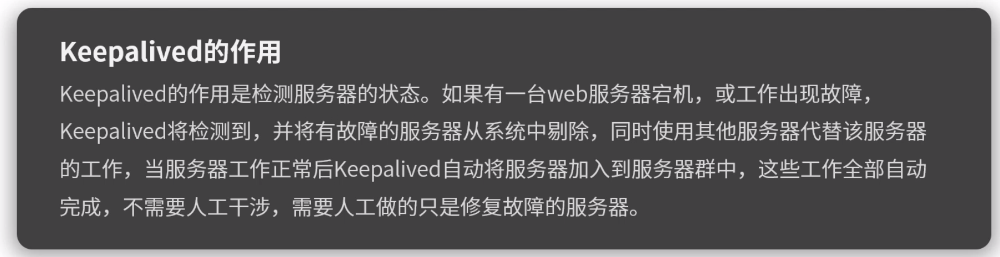

第三层：ICMP协议

第四层：TCP协议

第七层：网络层协议，如http

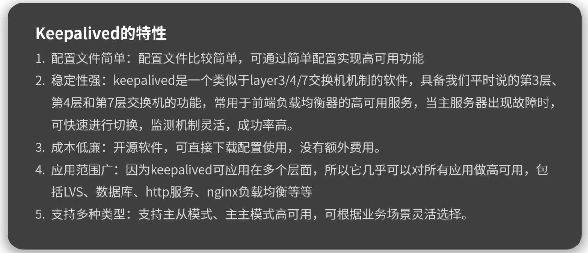

# 2.Keepalived工作原理

​	VRRP：Keepalived的一个协议。

​	vip：虚拟ip。

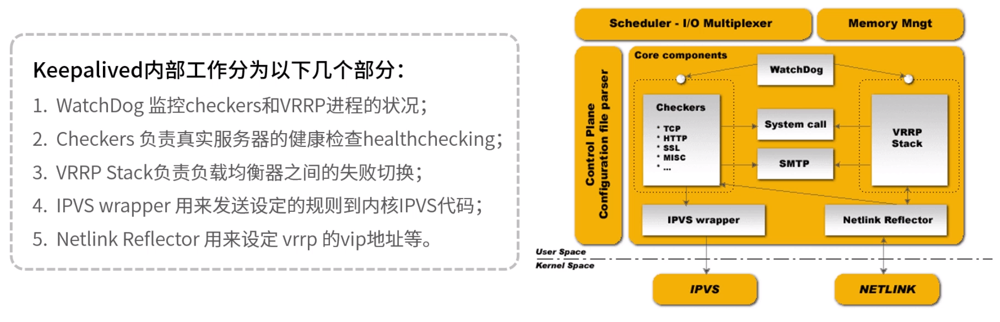

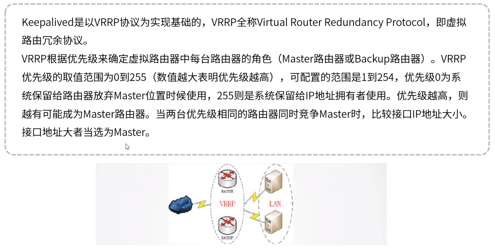

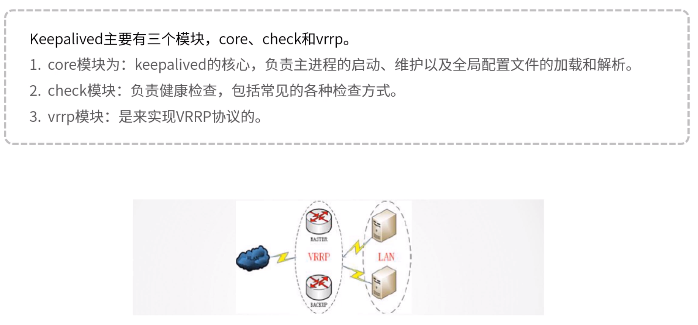

# 3.Keepalived应用场景

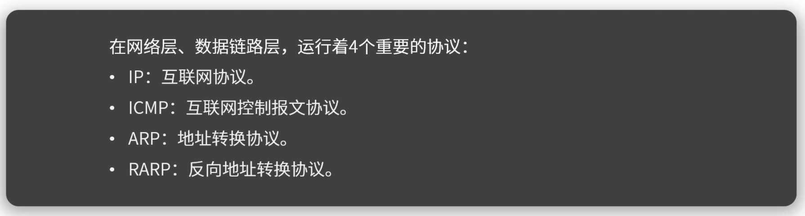

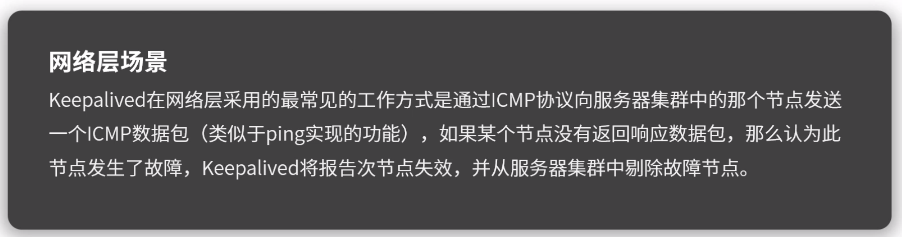

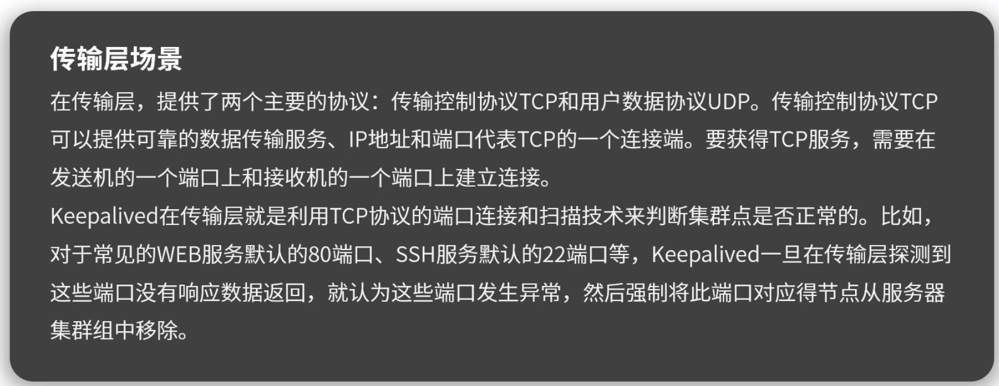

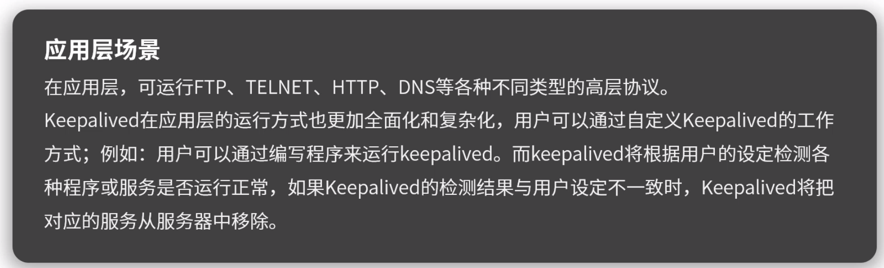

# 4.高可用集群

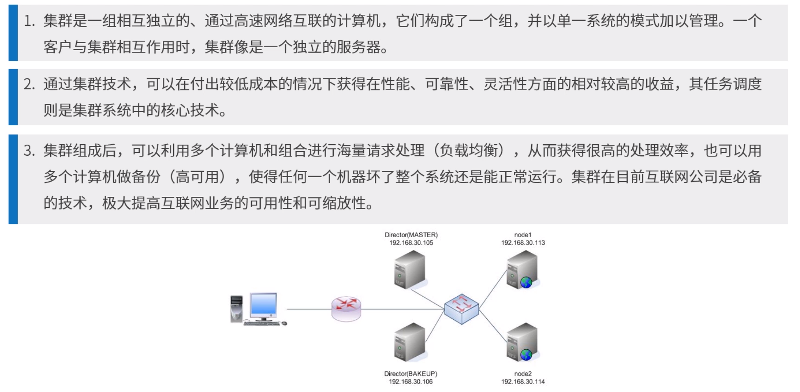

# 5.高可用架构

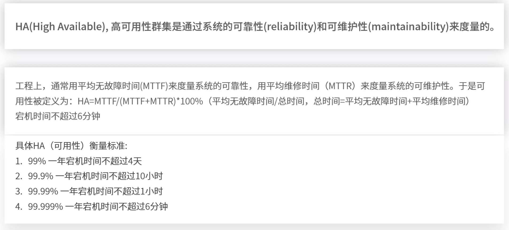

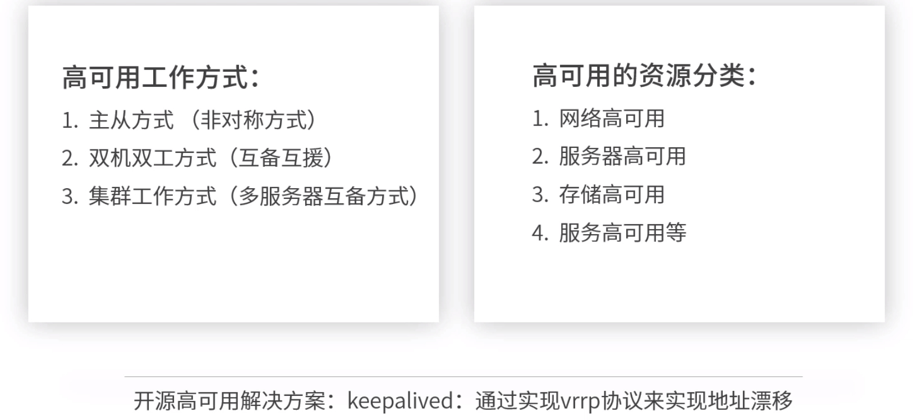

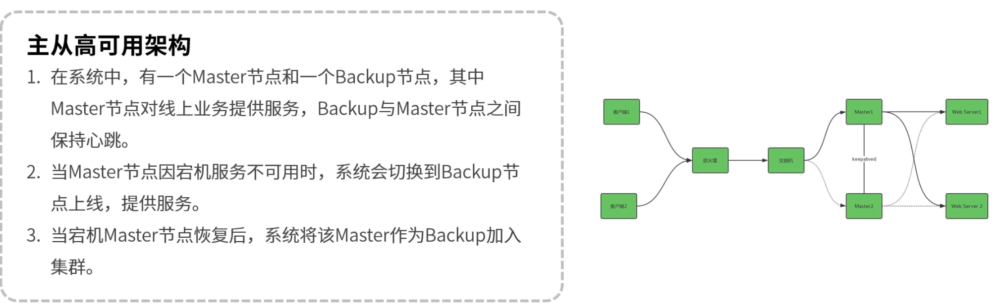

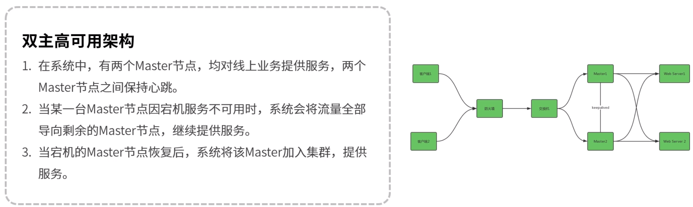

# 6.Keepalived高可用集群的解决方案

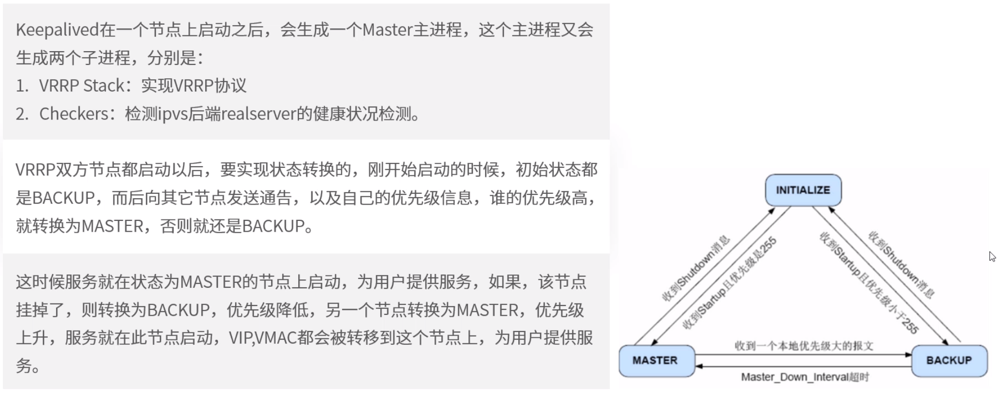

