**搭建LVS负载均衡集群**

# 1.负载均衡集群简介

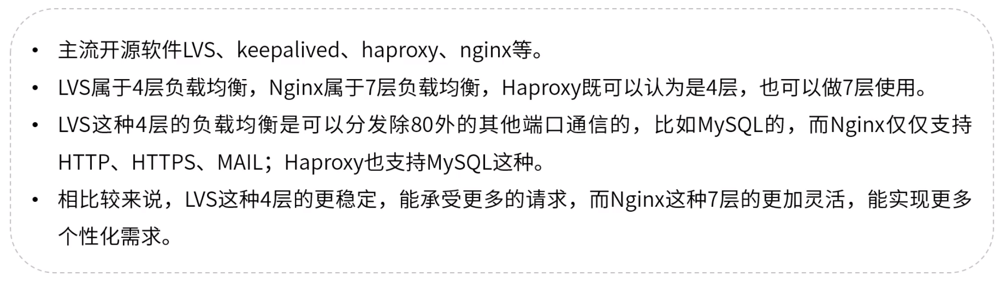

# 2.LVS简介

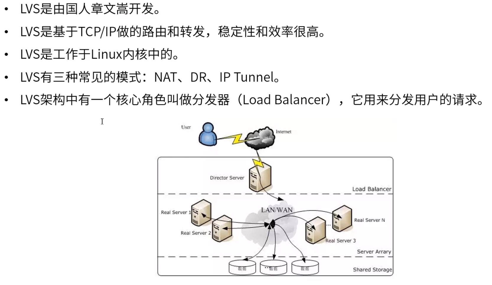

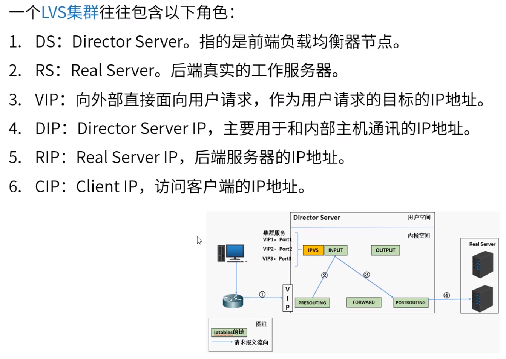

# 3.LVS NAT模式

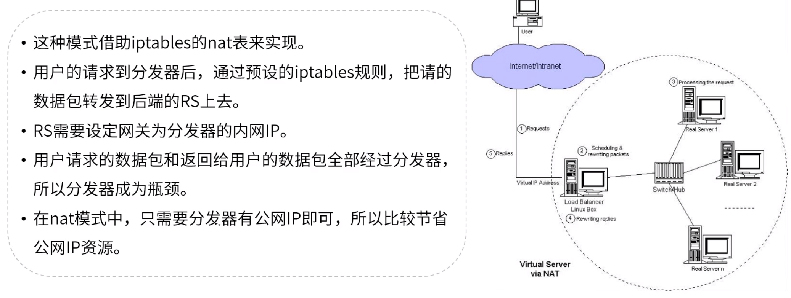

# 4.LVS IP Tunnel模式

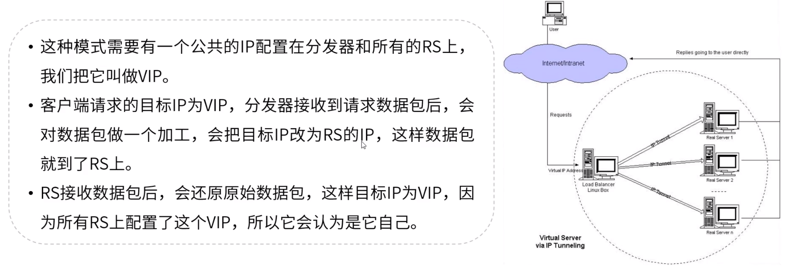

# 5.LVS DR模式

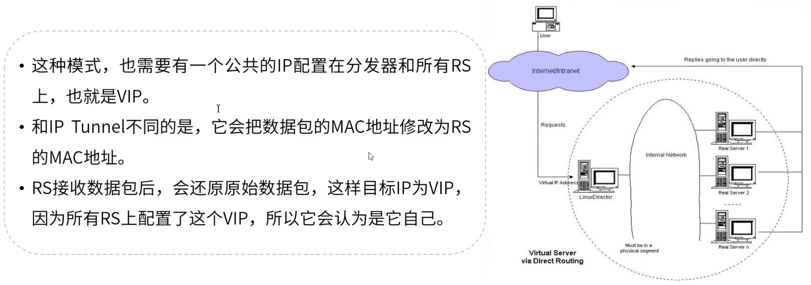

# 6.LVS调度算法

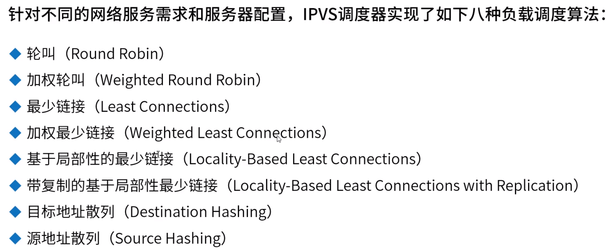

# 7.LVS集群搭建

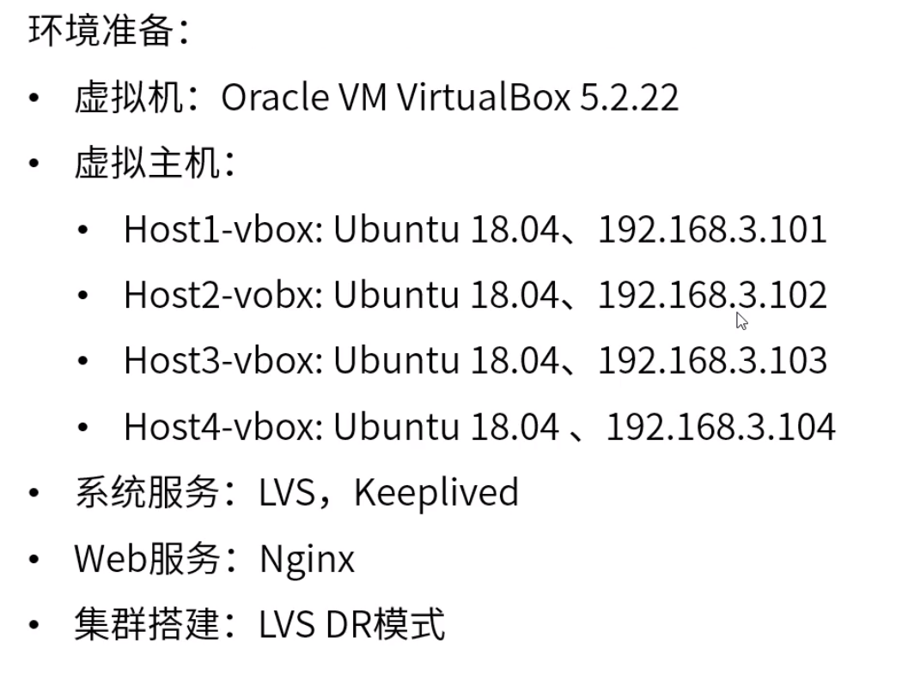

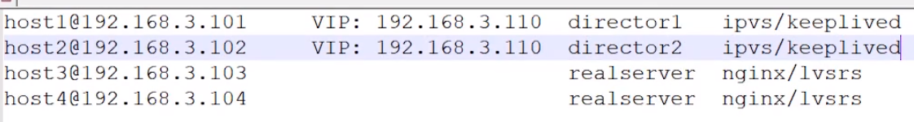

安装ipvs、Keepalived：

​	sudo apt install ipvsadm

​	sudo apt install keepalived

开启：

​	ipvsadm

查看内核是否支持：

​	sudo lsmod | grep ip_vs

1、2完成配置（需新建）:

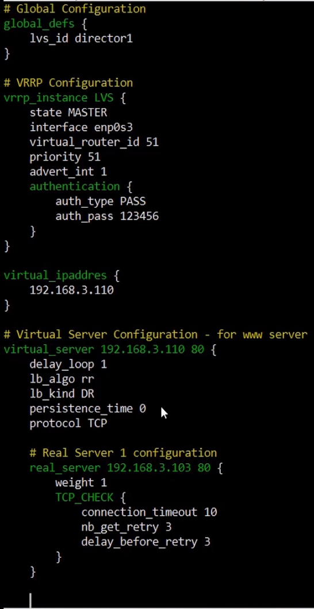

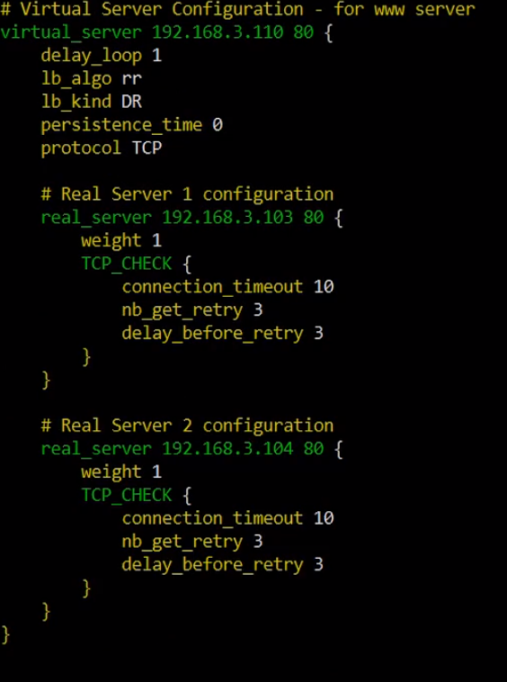

3、4

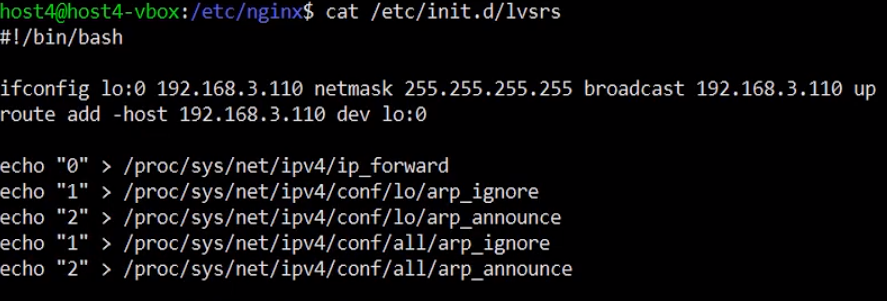

将文件修改为可执行的：

​	sudo chmod +x /etc/init.d/lvsrs

运行测试：

​	sudo /etc/init.d/lvsrs

查看LVS详情：

​	sudo ipvsadm -ln

关闭master：

​	sudo service keepalived stop

