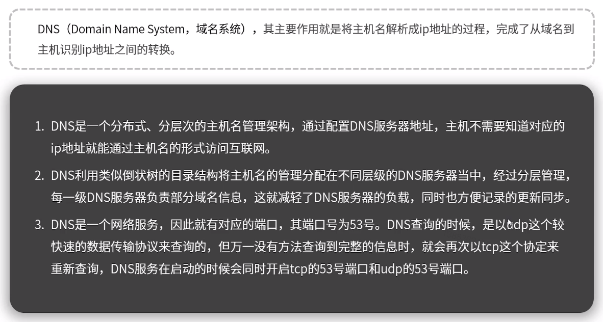
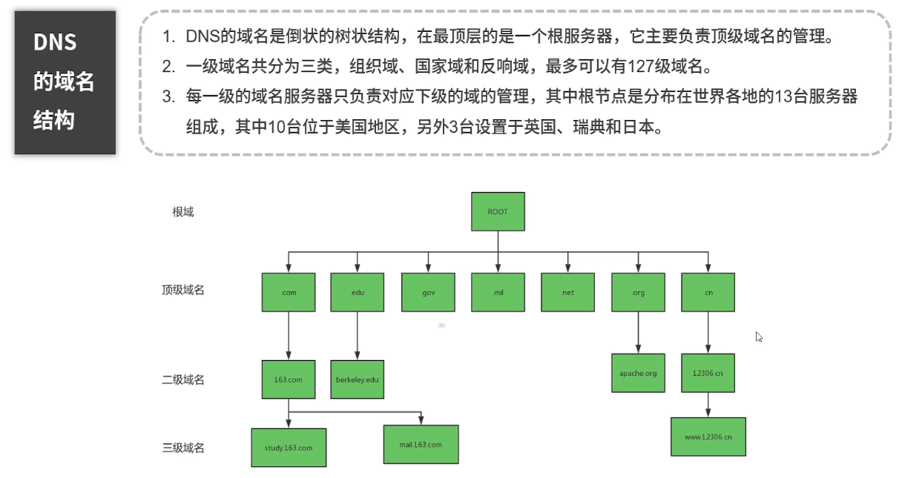
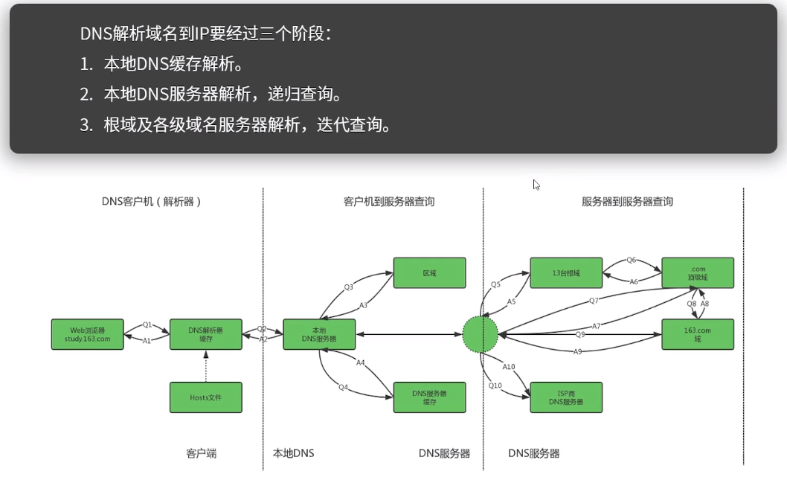
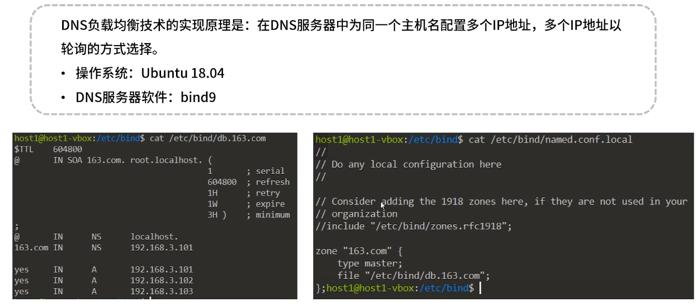
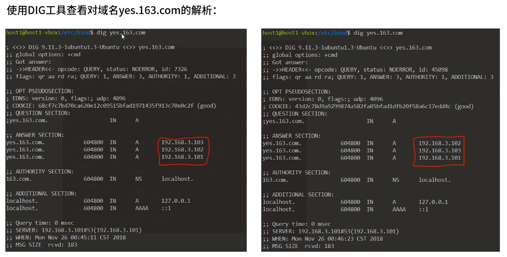
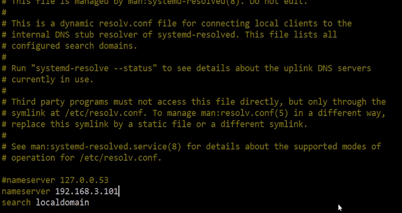
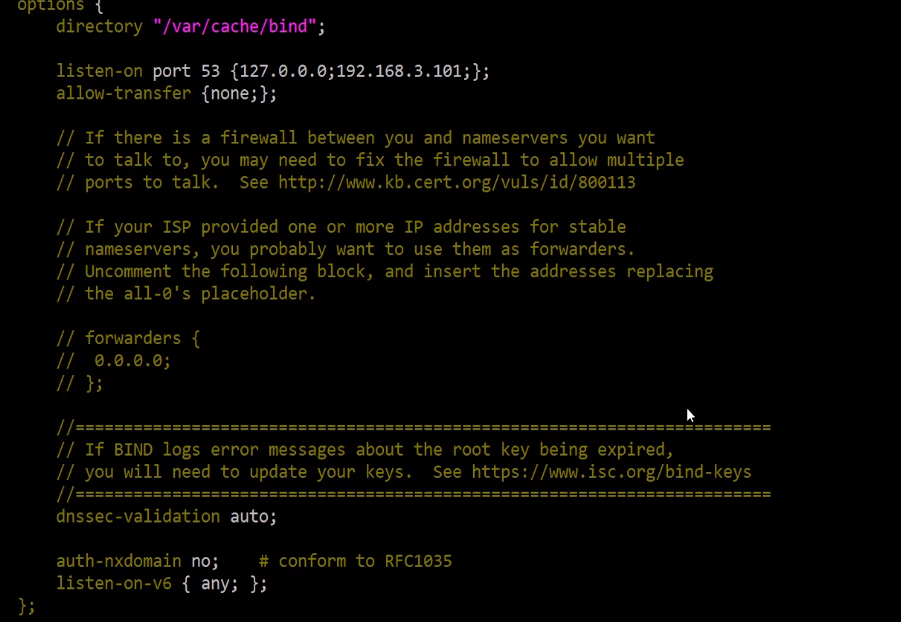
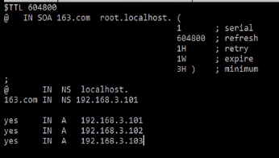
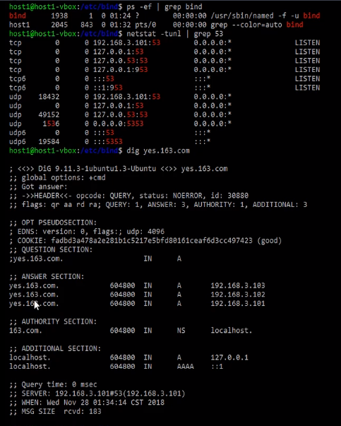

**通过DNS实现高可靠的负载均衡和访问提速**

# 1.DNS简介

套接字：tcp socket/udp socket

# 2.DNS工作原理

各级域不存储具体域名到ip的转换，只告知哪台服务器服务商上管理该域名。

# 3.DNS负载均衡

修改/etc/resolv.conf中nameserver修改为本机ip，使查找DNS时用本机的DNS，由bind9提供。

修改/etc/bind/named.conf.local

修改/etc/bind/named.conf.options

新建文件db.163.com

重启bind9服务

检查服务

# 4.DNS与其他负载均衡工具对比

​	1 -- 通过DNS劫持/DNS服务器

​	3 -- Nginx工作在内网与外网交界处

​	1 + 3 配合使用

​	4 -- 工作在内网与外网交界处

​	5 -- 使用很多，静态资源/流式数据

