**网易集团负载均衡的应用（网易云）**

第七层 -- http处理，特性多，Nginx发展最迅猛。

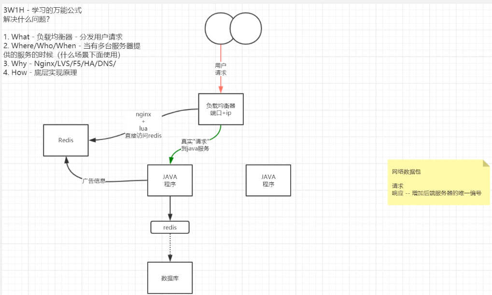

响应header头信息添加服务器唯一编号，有助于排查问题。

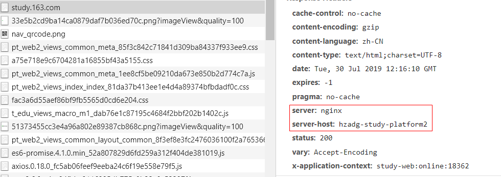

Nginx中worker关系到资源利用率，是实际处理请求的进程。多进程与CPU绑定，提高Nginx运作效率。

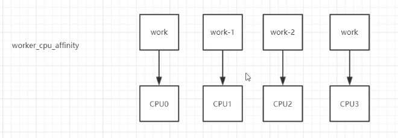

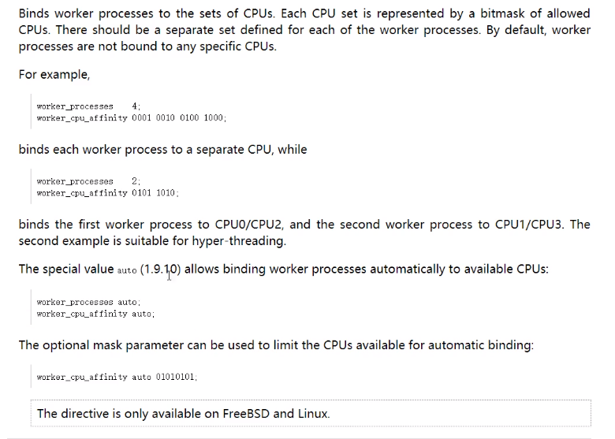

最大连接数 - max_connections 10w -- 实际上压力大约控制在3000qps。配置过大不会有资源占用，资源利用率需冗余，以防突然流量出现，导致很大堆积。在Nginx之上加集群控制压力。

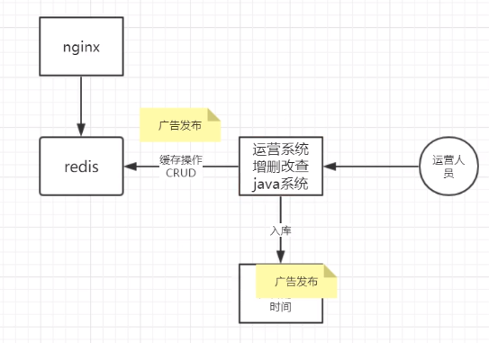

Tengine与Tair目前用的少。

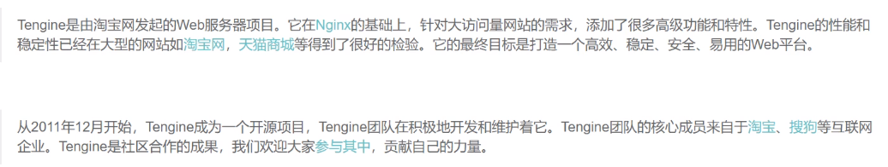

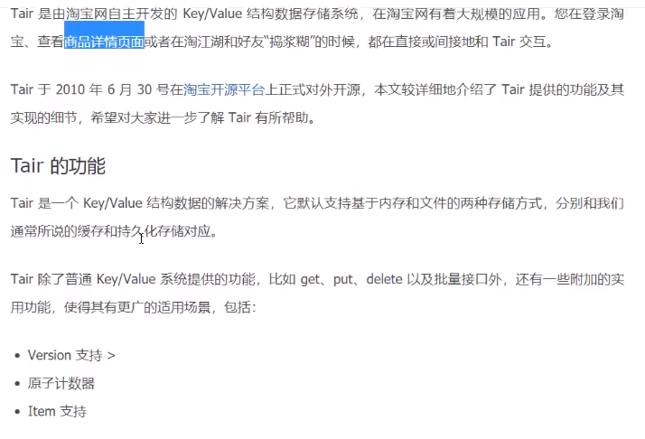

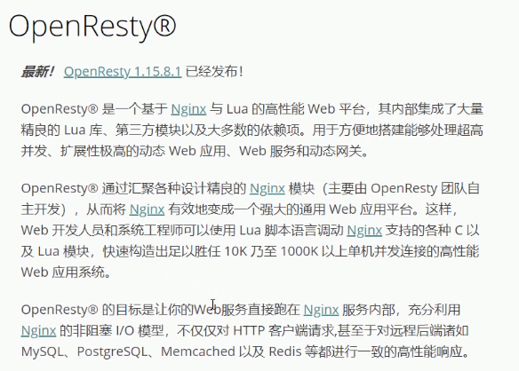

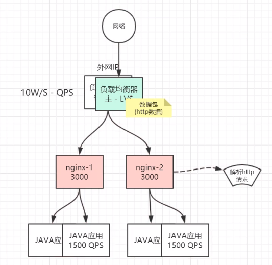

Keepalived不仅可以用于LVS，Nginx，Tomcat等等皆可，脚本自定义。

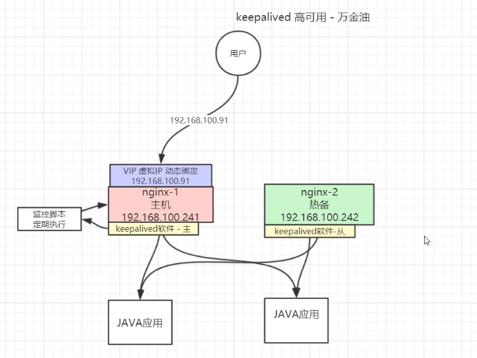

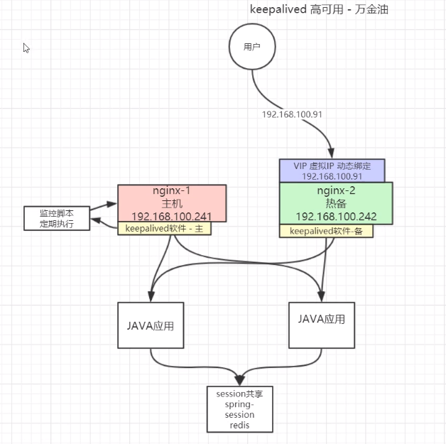