**redis数据结构和常用命令（一）**

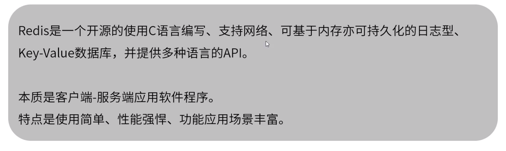

​	keys *	打印所有key（遍历，生产环境慎用）

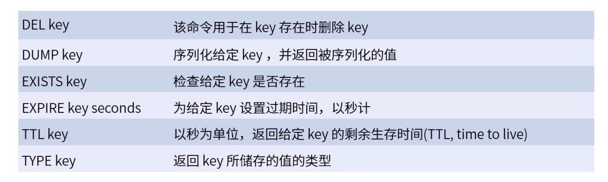

​	set：可指定失效时间（秒或毫秒），NX - 仅在key不存在时设置key；XX - 只有在键已存在时才设置。

​	将 key中储存的数字值增一。如果 key 不存在，那么 key的值会先被初始化为 0 ，然后再执行 INCR操作。如果值包含错误的类型，或字符串类型的值不能表示为数字，那么返回一个错误。本操作的值限制在 64 位(bit)有符号数字表示之内。

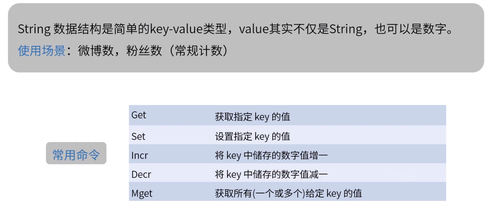

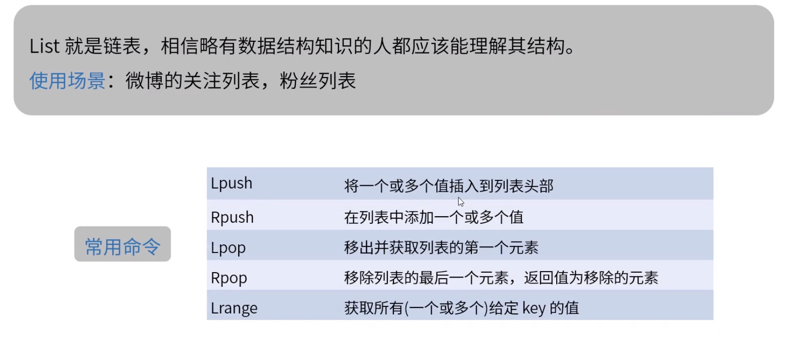

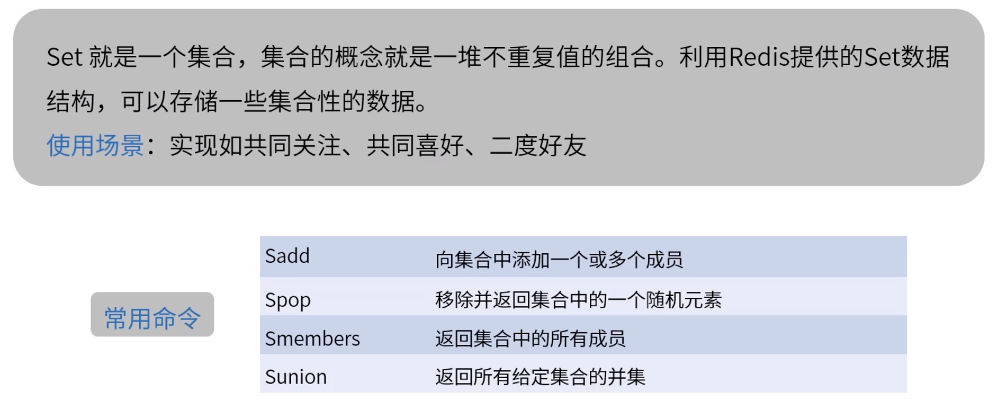

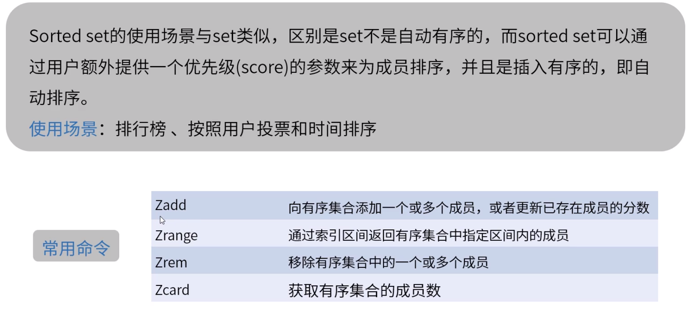

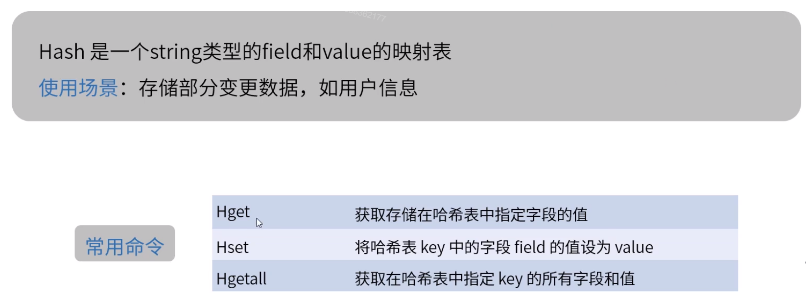

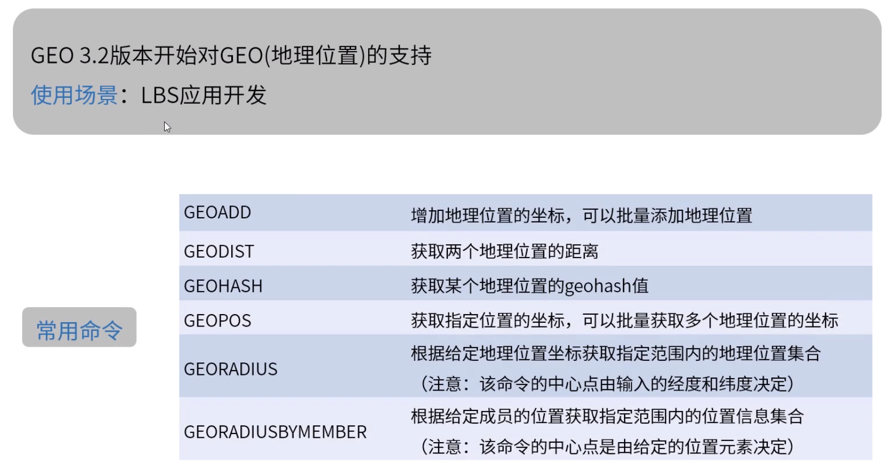

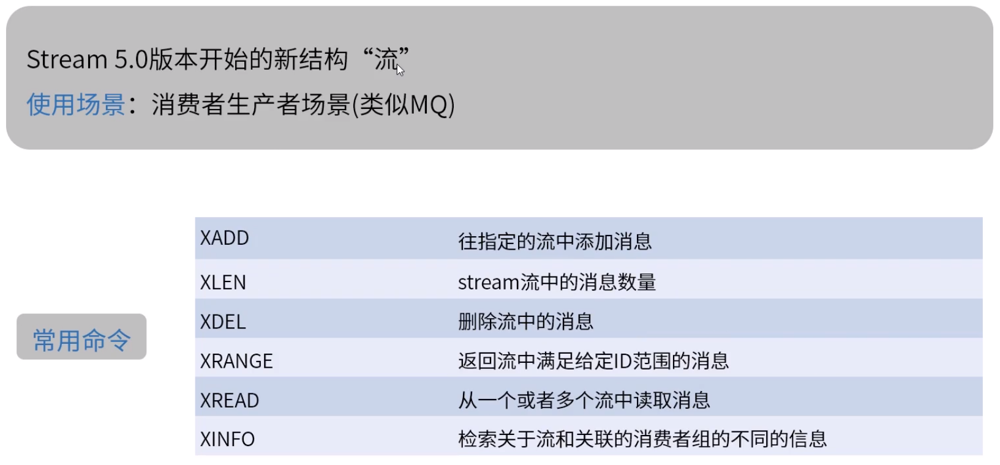

redis默认有保护机制，防止外部客户端连接，可能会导致客户端连接不上。修改方式：从服务端解决。

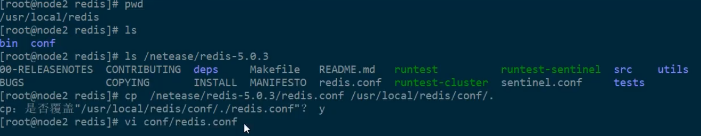

默认绑定127.0.0.1（若改成0.0.0.0，那么不论什么网段都能访问，慎用）

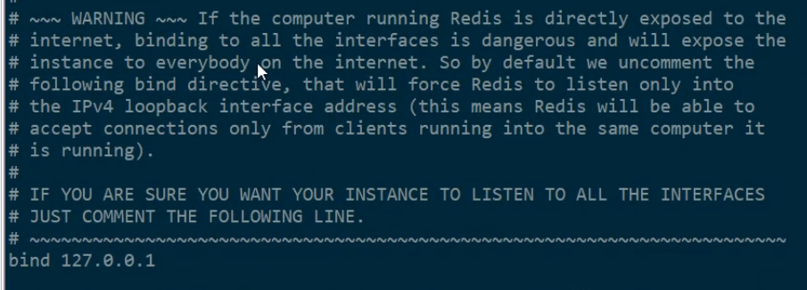

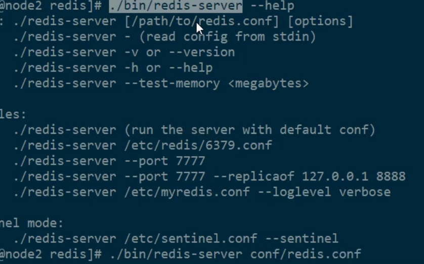

spring cache注解（重要）

操作Redis时以value+'::'+key作为Redis的key，key为Spring的*SpEL*表达

Cacheable（查找），CacheEvict（删除），CachePut（更新）

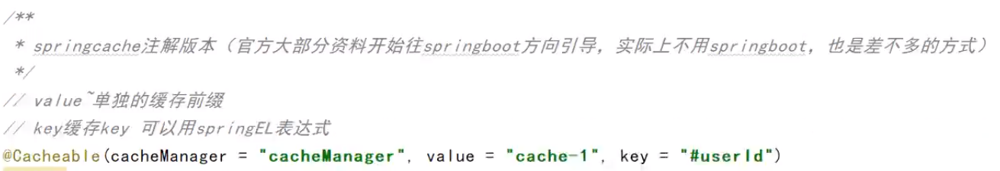

condition条件满足时才会更新Redis缓存

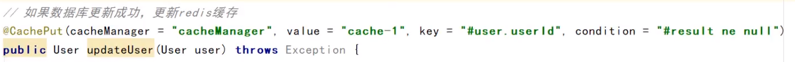

