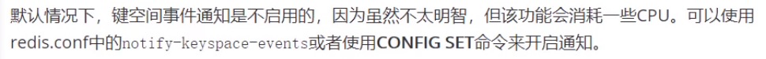
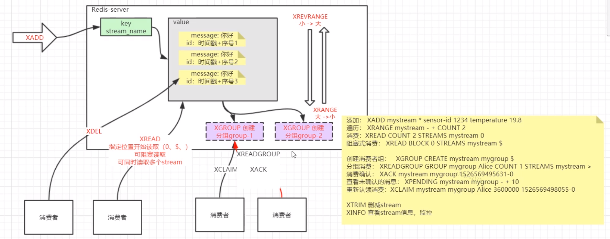

**redis数据结构和常用命令（二）**

pipeline批量处理更快

命令行输入monitor可查看java代码中对Redis的操作

Redis提供key操作监听事件（没有必要的话不要开启，该功能会消耗一些CPU）

Redis中有不同的数据库，相互之间不受影响，可用select 0,select 1等形式切换

XADD：添加数据（id可有Redis生成）

XDEL：删除数据

XREVRANGE：由小到大遍历

XRANGE：由大到小遍历	XRANGE key start end count（eg：XRANGE key_1 - + 3（最小值 最大值 遍历三条数据））

XREAD：指定位置开始读取（0、$、），可阻塞读取，可同时读取多个stream（$表示从最新的开始读）

XGROUP：创建消费者分组。Redis会将数据分派给消费者分组，并会针对每个消费小组记录对应的消费信息。

XREADGROUP：从group中读取数据。

XACK：主动消费确认，否则若消费者消费过程中出现问题，会进入Redis的pending（挂起列表）。

XCLAM：若不主动确认，数据会堆积，此时消费者调用这个命令进行重新认领消费。

增加数据时，可通过maxlen属性控制数量。

XREAD COUNT 1 BLOCK 30000 STREAMS stream_1 $ (获取最新数据，若没有，阻塞等待30s)

xreadgroup Group sms_group cm-1 Count 1 streams stream_1 > (sms_group组内消费者为cm_1继续消费stream_1中数据（从还未被消费处开始，若不xack，则进入xpending）)

xpending 查看挂起的数据

