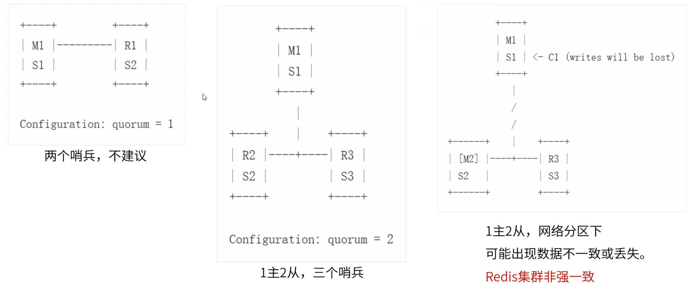

**哨兵高可用机制**


客户端通过哨兵获取最新主服务器数据。


重启后，根据保留的信息加入集群。


pubsub channels：发现当前Redis中所有通道信息。

subscribe "____sentinel__:hello"：订阅通道。


第二个网址建议细看。


确认master客观下线后，各个哨兵随机睡眠后向其他所有哨兵发送拉票命令。


可查看哨兵工作日志，同时可用monitor查看Redis变化。


```
tail -f /usr/local/redis/logs/sentinel-26381.log
```

此命令显示 log 文件的最后 10 行。当将某些行添加至 notes.log 文件时，tail 命令会继续显示这些行。 显示一直继续，直到您按下（Ctrl-C）组合键停止显示。


哨兵与Redis可以部署在一起，也可以单独部署。

一主二从，M1与R2、R3网络断开，R2与R3会产生一个新的master（M2），M1与M2数据不一致。当网络恢复后，由于M2版本号较高，M1在这段时间内的数据变化会丢失。



