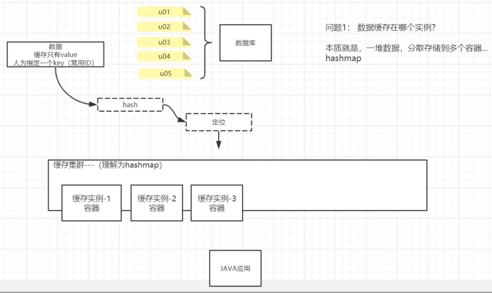

**memcached分布式算法（分布式一致性hash算法）**

此处定位即hash值取绝对值后与容器数量取余。问题：容器扩容后原缓存部分失效。

虚拟节点编号由他所对应的容器随机生成。缓存失效概率降低。但是数据倾斜仍然无法避免，若虚拟节点数值都比较小，很多值较大的缓存都会存至第一个容器内。若新增的容器的虚拟节点数值介于已有节点数值之间，难免会有部分缓存失效，可通过增多容器或增多单个容器对应的虚拟节点数进行调整。

服务端控制（Redis中，虚拟节点数不变，Redis服务器对应虚拟节点手动控制，还可有效减轻数据倾斜）

# 1.分布式一致性hash算法详解

一致性hash算法：读写规则

  

hash值不可控，新节点位置不可控。

memcached需要用到第三方工具，如codis。

# 2.手写实现一致性hash算法

见源码。

