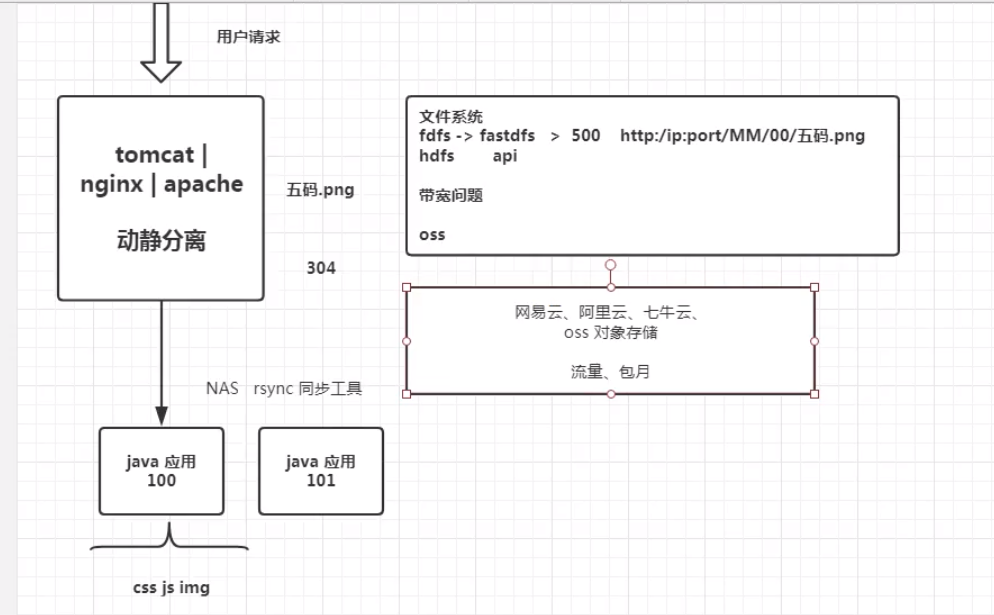
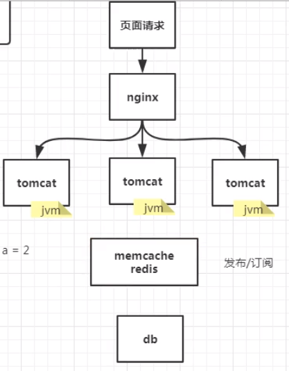
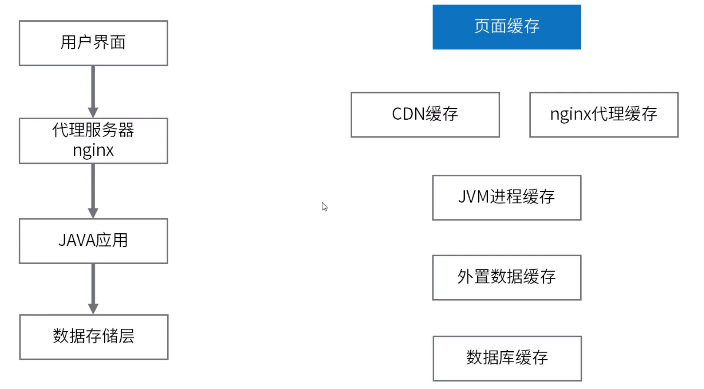
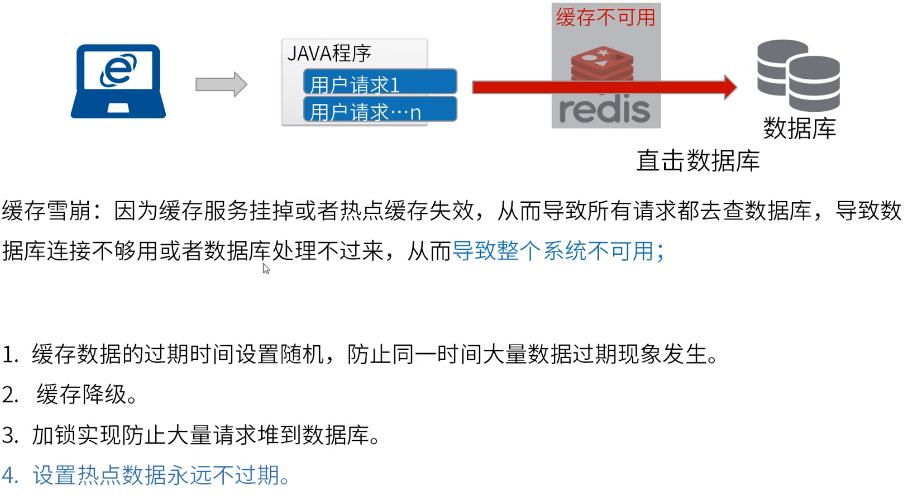
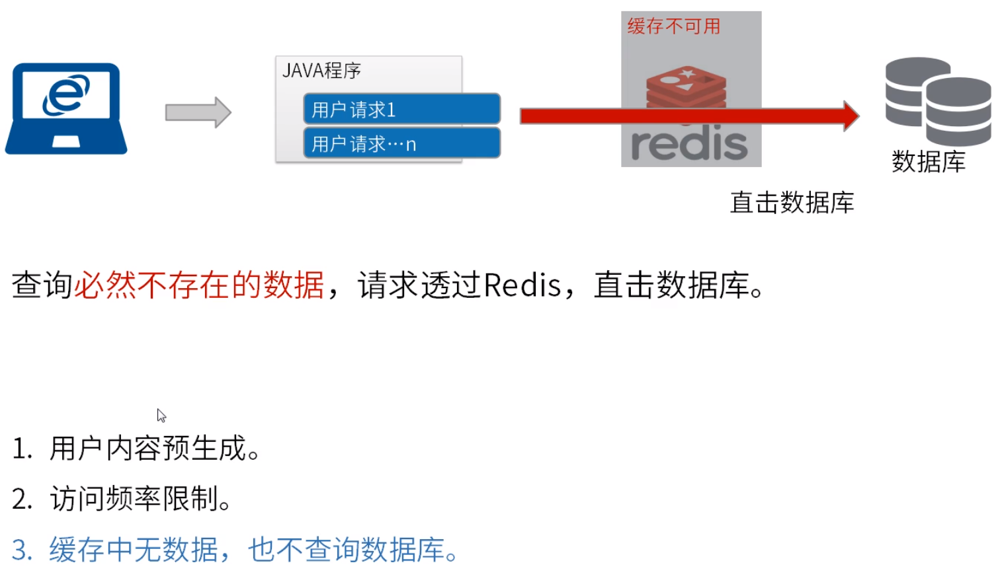
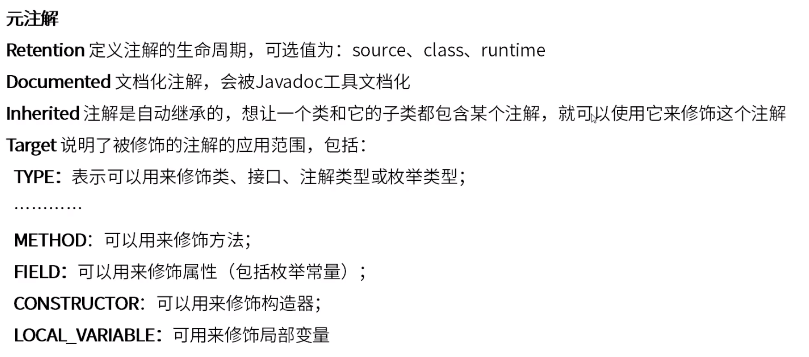
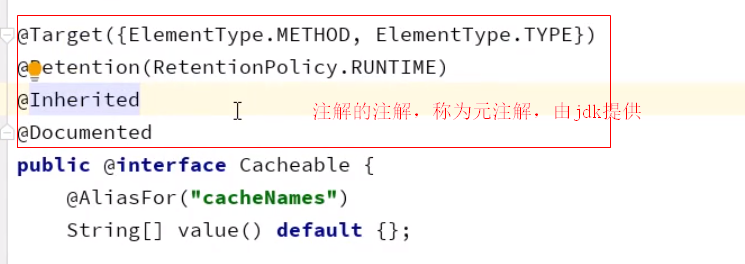

**大型互联网高并发缓存架构**

Redis哨兵机制数据一致性较好于集群分片存储。

304状态码是对客户端有缓存情况下服务端的一种响应。第一次访问 200，按F5刷新（第二次访问） 304，按Ctrl+F5强制刷新 200。

利用同步工具同步不同java应用可能会耗时，不推荐使用，建议使用文件服务器。fdfs存储数据建议小于500m，fdfs的网络请求文件服务器对应目录结构。hdfs可用于存储大容量数据。

对象存储 OSS

防DOS攻击：软防、硬防。

在用户第一次访问网站后，网站的一些静态资源如图片等就会被下载到本地，作为缓存，当用户第二次访问该网站的时候，浏览器就会从缓存中加载资源，不用向服务器请求资源，从而提高了网站的访问速度，而若使用了CDN，当浏览器本地缓存的资源过期之后，浏览器不是直接向源站点请求资源，而是向CDN边缘节点请求资源，CDN边缘节点中也存在缓存，若CDN中的缓存也过期，那就由CDN边缘节点向源站点发出回源请求来获取最新资源。源站点可以主动向CDN中推送新数据。

JVM进程缓存属于多级缓存中的二级缓存。减轻第三方缓存中间件压力。

Java 两级缓存框架：https://gitee.com/ld/J2Cache

缓存雪崩

缓存降级：当访问量剧增、服务出现问题（如响应时间慢或不响应）或非核心服务影响到核心流程的性能时，仍然需要保证服务还是可用的，即使是有损服务。系统可以根据一些关键数据进行自动降级，也可以配置开关实现人工降级。降级的最终目的是保证核心服务可用，即使是有损的。而且有些服务是无法降级的（如加入购物车、结算）。

缓存击穿（第三条不建议）

Java应用层-自定义缓存注解

元注解

存入Redis内的对象建议转为json存入，方便问题排查。

尽量保证数据库与缓存一致性：

查询：先查询缓存，缓存没有再查询数据库，并将数据保存至缓存（并发情况下有问题）。

修改：先修改数据库，再删除缓存（注：不要直接修改缓存），再加入缓存（或等待下次其他请求时加入缓存）（优点：保证一致。坏处：多查询一次数据库；可能造成缓存雪崩/击穿）（如果将数据库与缓存操作放至同一锁内，先后顺序便无所谓）（互联网公司一般先操作缓存，后操作数据库）。

不同业务场景可能有不同操作方式。

