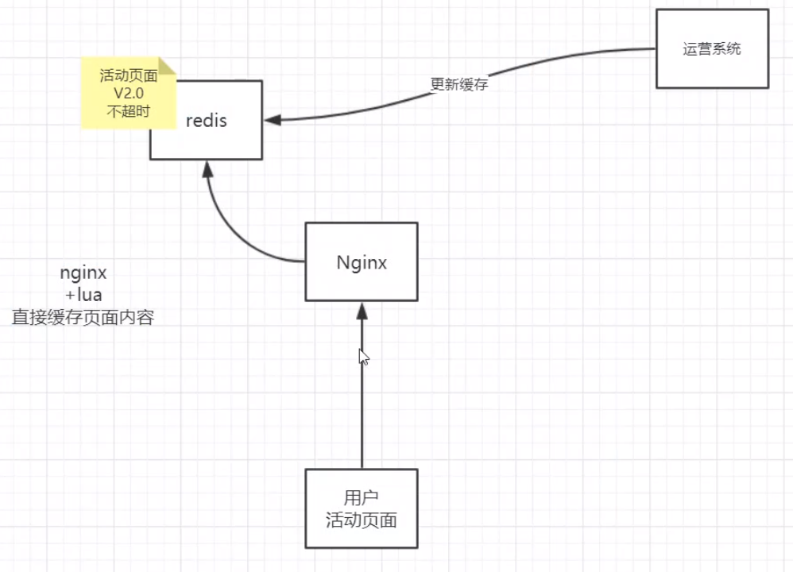
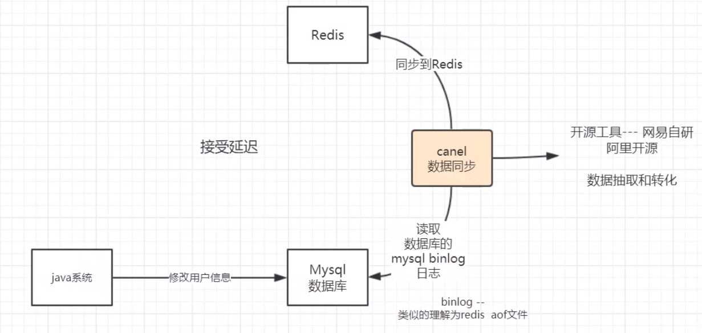
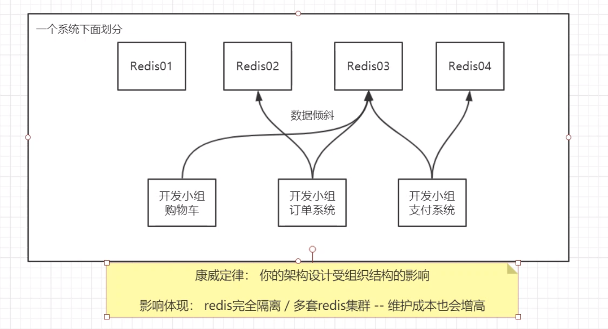
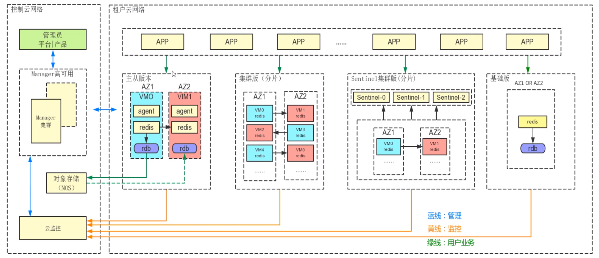
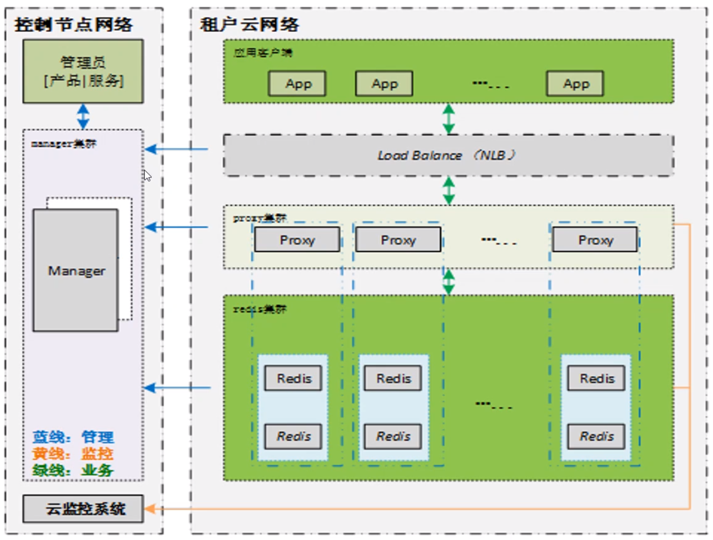
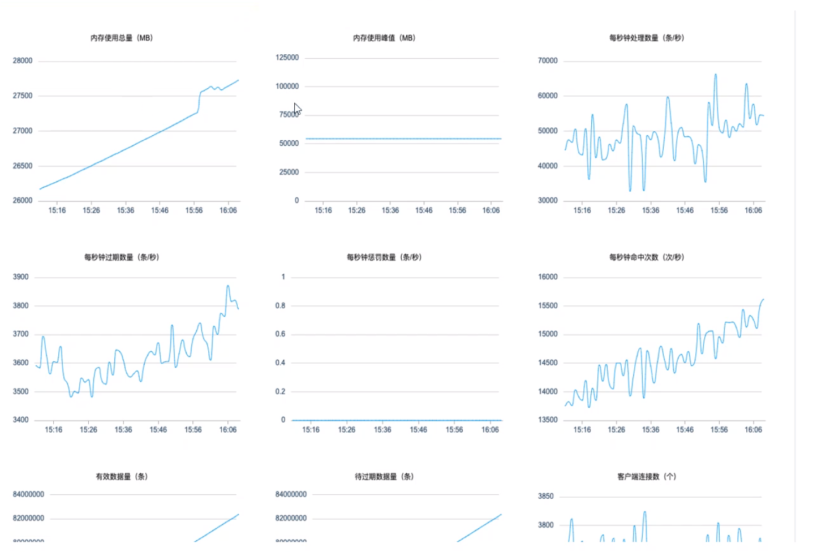
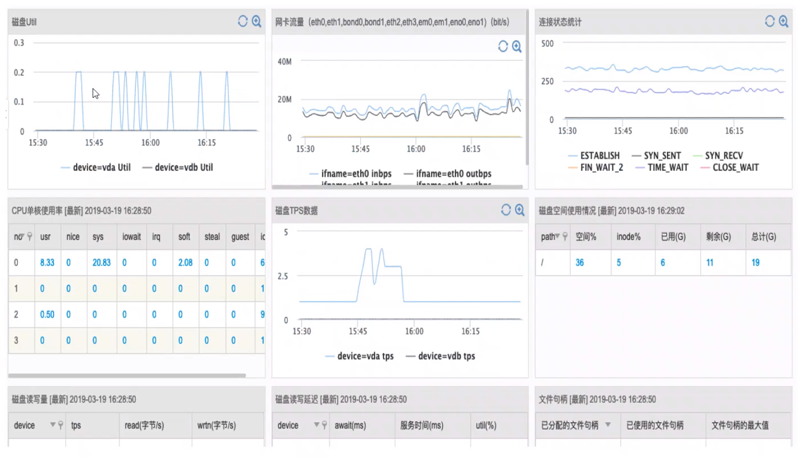
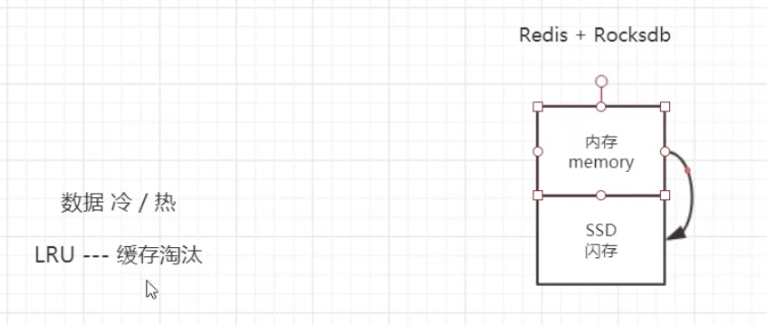
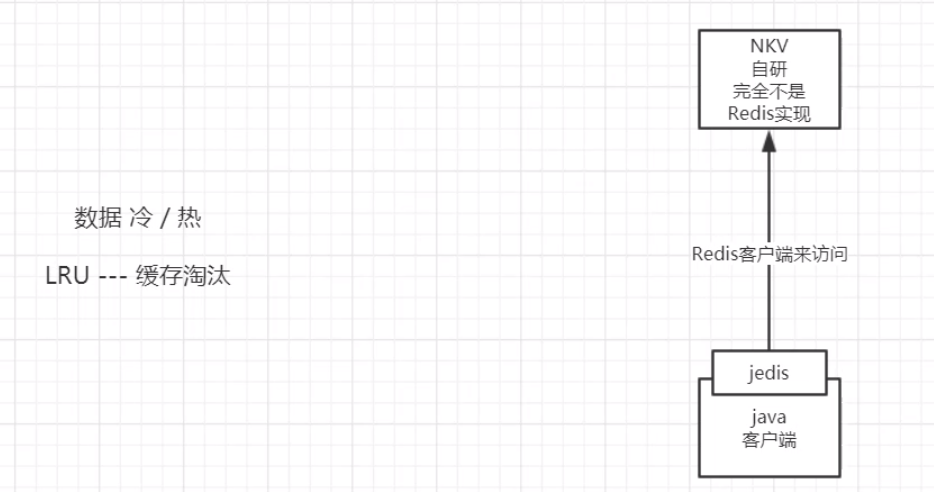
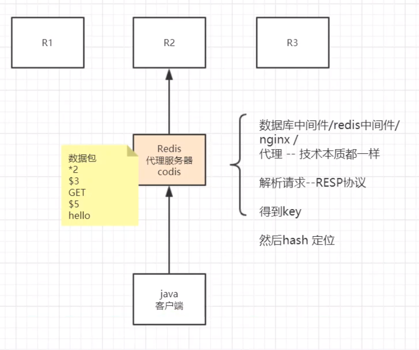

**网易后端架构中缓存方面设计**

Redis单线程事件模型，原子操作。但是Redis单进程单线程不是绝对的，如RDB子进程，多线程体现在部分命令异步执行，如FLUSHDB [ASYNC]等带有[ASYNC]的命令，命令操作时如FLUSHDB ASYNC便是异步执行的多线程命令。

缓存和数据库的数据同步，总结一句话：接受延迟，接受不一致，若要完全一致就会牺牲高性能。
更新数据库-> 更新缓存；  删除缓存-> 更新数据库；更新数据库-> 删除缓存
多线程情况下，都会有问题。

网易考拉Redis使用场景其一

延迟，一段时间内会不一致。

不同开发小组可能考虑过数据倾斜，但总体看来数据倾斜问题可能依然存在。解决：隔离。Redis提供简单的隔离手段：database（默认使用0，仅作为隔离使用，不会造成资源浪费）（select 0,select 1），不会这么使用。部分应用需要这么使用它，类似一个数据库服务器上有多个database。这里推荐用物理隔离。

通过info命令进行监控。

很多云平台提供缓存服务兼容Redis客户端（用户使用时感觉与Redis一样）。

Redis专用协议：RESP协议。

