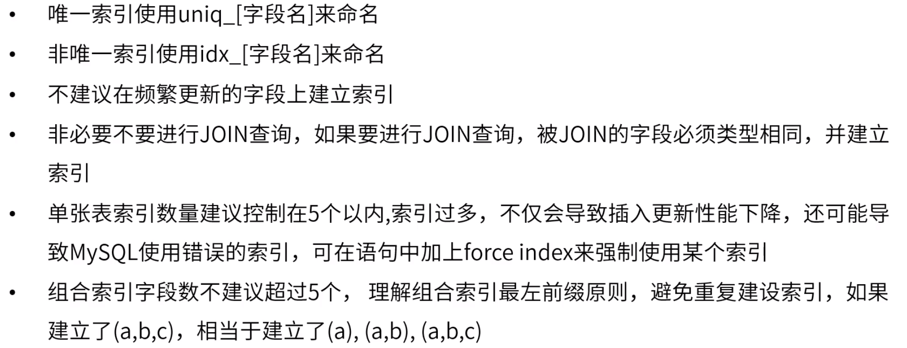

**分布式数据库在网易的最佳实践（网易云课堂）**

# 1.网易分布式数据库DDB

QS：查询服务器

尽量避免跨库join。

索引：B+树。可以添加索引字段：数值、时间、字符串。时间在数据库存储为时间戳（毫秒数），排序方式即数值。字符串以字符编码形式存储，排序按各个字符对应编码大小排序。字符串各字符需比较的次数与字符串长度相关。

使用数字效率高。

# 2.网易数据库设计规范

## 2.1 基础规范

外键严重影响操作效率与性能，此处指不建立外键约束。

超过1000w，不超过1亿，不用进行分库分表，可以使用分区表提高性能。如果并发查询非常高，需要进行分库提高并发处理能力。

此处单实例指数据库实例。

分表+分区表可存储更多数据。

如果保留详情字段，单条记录会占用更多的硬盘空间，记录在硬盘中挨个存储，查询时硬盘需要转更多圈数。

## 2.2 表设计规范

## 2.3 列设计规范

ip的查找可能存在区间的比较。

## 2.4 索引规范

若join字段类型不同，join时会发生类型转换，建立在该字段上的索引会失效。

第七条中，若要正确使用索引，查询时a='' and b='' and c = ''，若仅有b='' and c = ''等类似条件无法充分利用索引。

## 2.5 SQL规范

若ID为索引，select ID from t运行直接从索引查找不经过原表。

第四条，若大量查询条件中用到函数，可建立函数索引。

镜像库：从库，对生产库没有影响。

同一个字段上出现多个OR查询，建议改为IN（使用索引时IN查询索引次数比OR少）。

# 3.网易数据库设计案例

4：（1.扩展表，无法使用原表索引；2.扩展字段存储json，无法使用索引）

# 4.其它

分库分表后一定存在分布式事务问题，若数据要求必须一致性，那么需要采用事务（XA规范，TCC柔性事务等）。

分库分表尽量避免跨库join。如果避免不了，跨库不能join，只能在应用中查出主表子表，进行多次查询。

如果经常需要对文本字段进行模糊查询，如果表数据量不大，千万到亿级别，可以直接建立全文检索索引，若数据量特别大，用搜索引擎。

Sharding-JDBC配置中心用持久类型。

配置中心存储整个库的定义信息，数据库的元信息。

TCC：事务补偿机制

如果不允许数据的任何延迟，这种场景不能使用读写分离。

Etcd - 分布式配置中心