**安装**


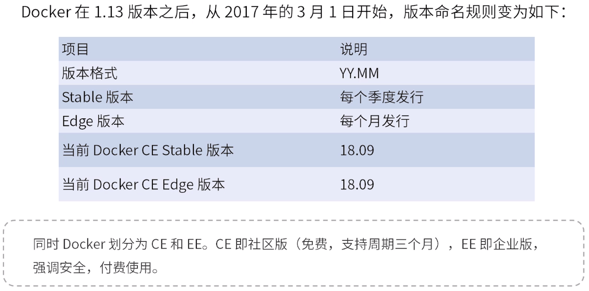


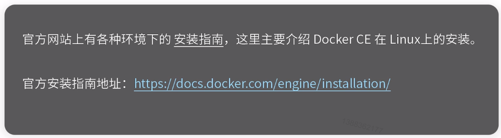


uname -r : 查看内核版本。

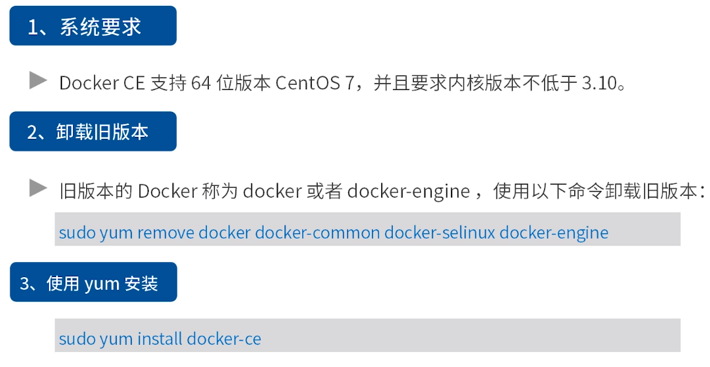


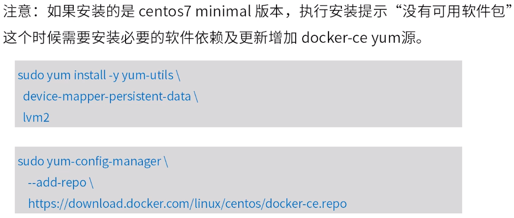


docker info : 查看docker信息。

docker --version

docker rmi hello-world : 删除镜像

docker ps -a : 列出所有的容器

docker rm -f : 删除容器

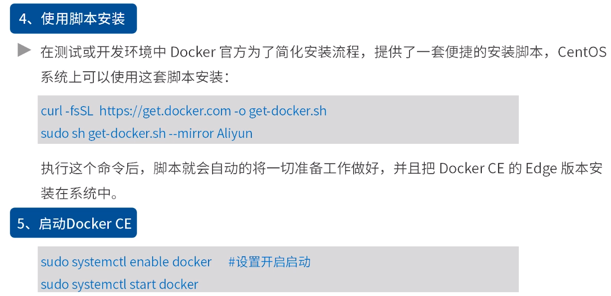


```
newgrp docker #更新用户组
```

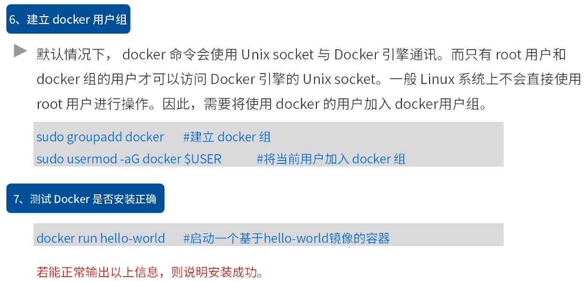


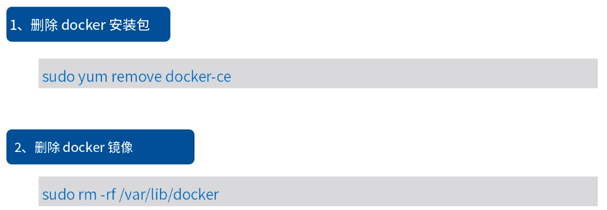


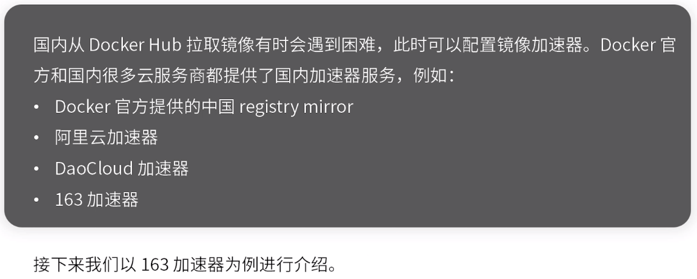


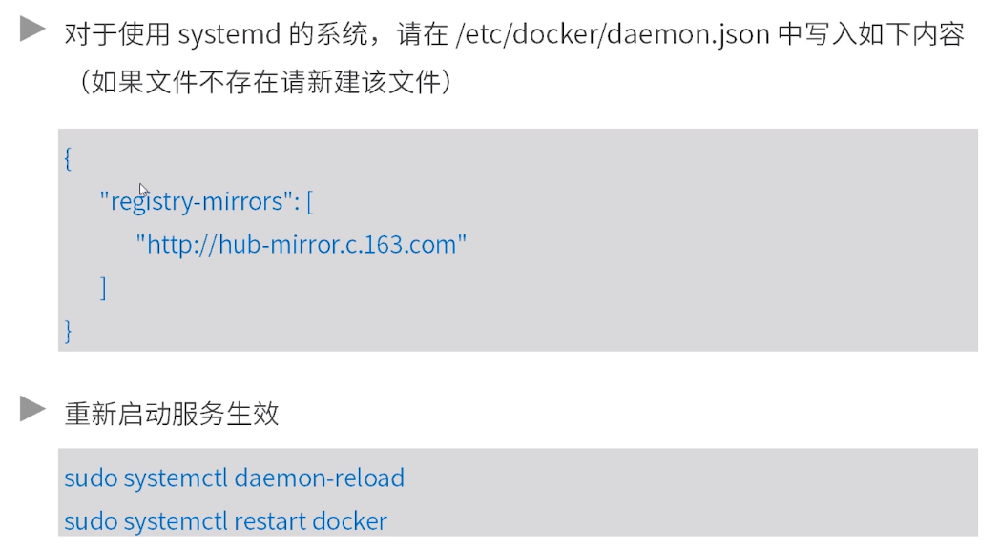


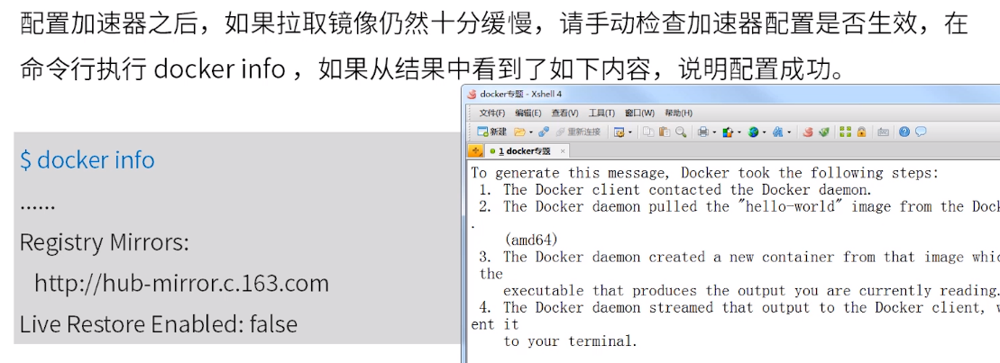


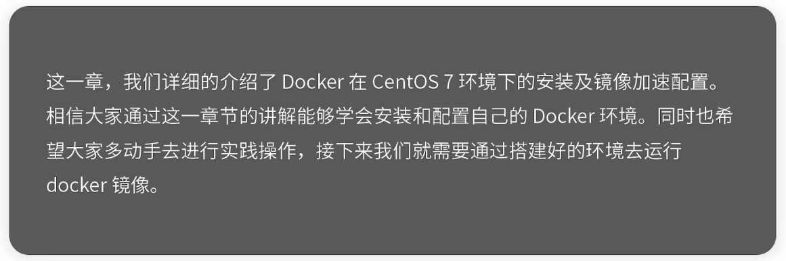

