**资源管理**


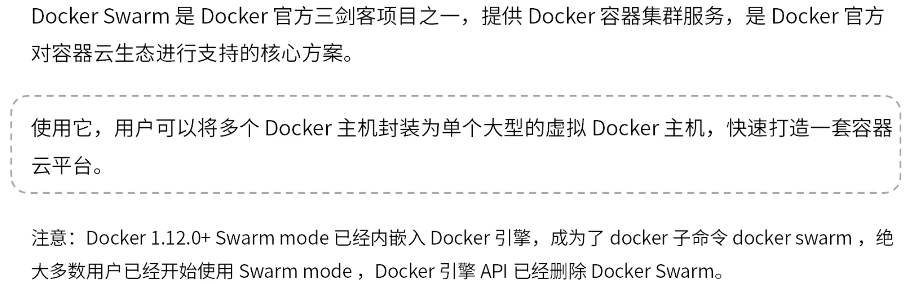


管理节点也可作为工作节点运行任务。

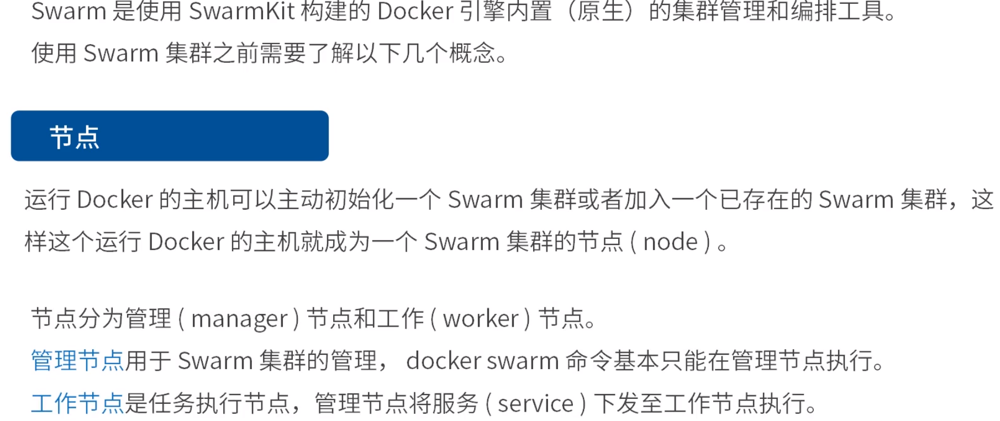


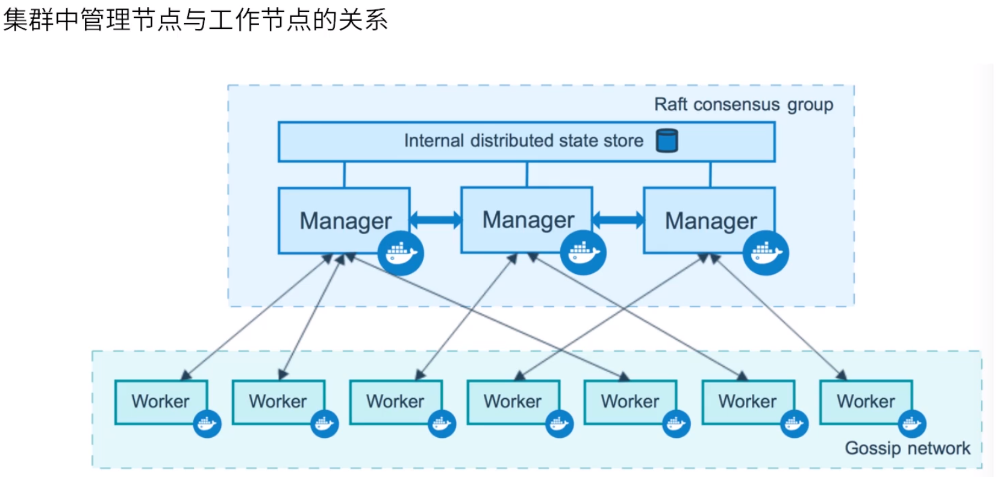


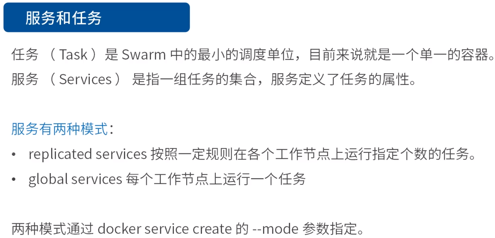


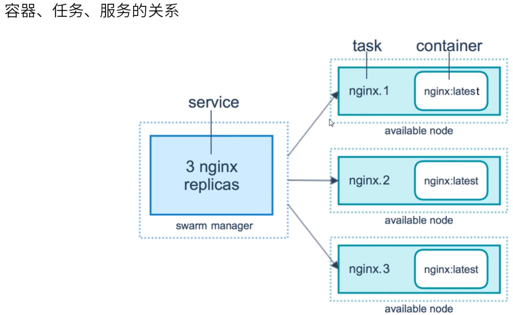


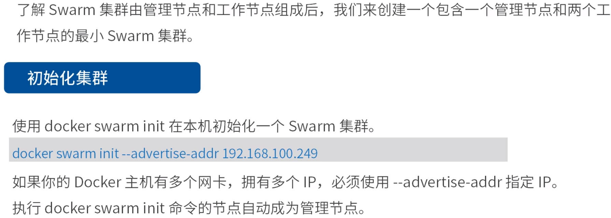


```
docker swarm join-token manager //查看加入swarm集群命令
docker node promote nodename //将node名为nodename的节点变为manager，若当前leader失效，该节点有能力成为新的leader（高可用）
```

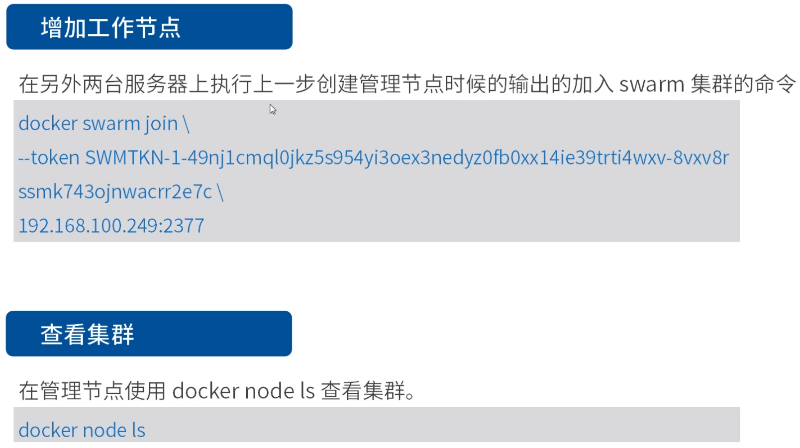


3个副本

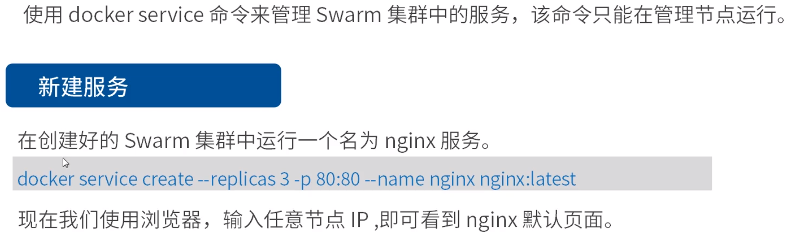


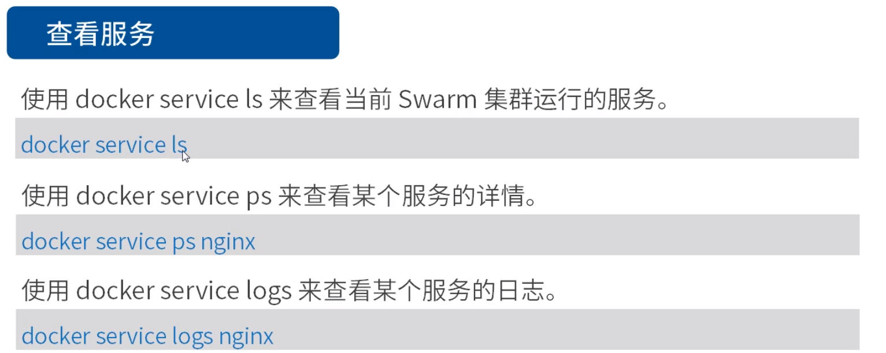


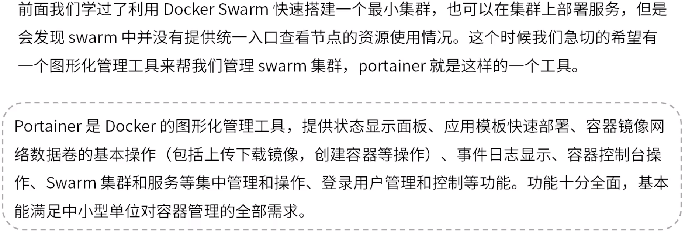


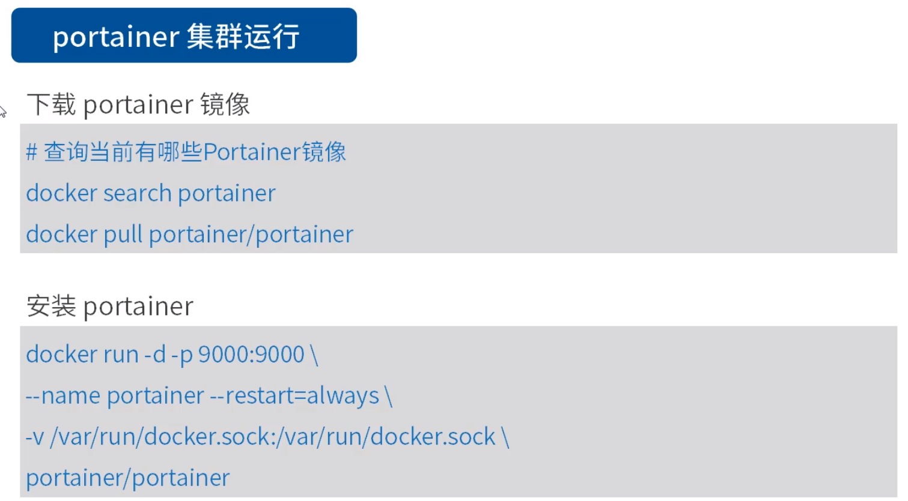


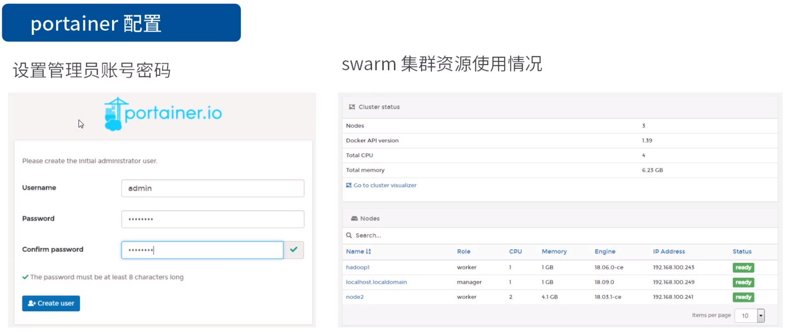


