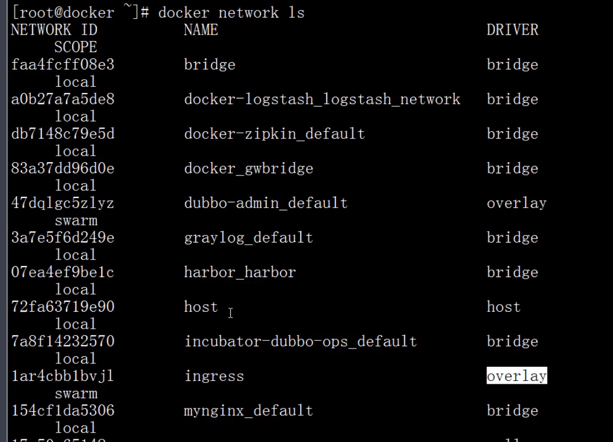

**K8S核心概念及名词讲解**

overlay：覆盖网络，基于此可以实现swarm网络通信。

pod：容器化之上的扩展，k8s编排的最小单位。

etcd：类似zookeeper，作为服务的注册与发现。

每个k8s集群至少有一个master节点。

master中kube-api-server与node中kubelet连接下发任务。

pod中pause经过Google优化，存活性很高。

swarm中容器间可以互通，k8s中pod可以互通。

