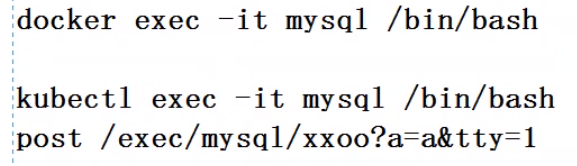

**K8S集群架构方案**

master根据自己策略选择合适的node节点。若都不满足，不启动，或停掉node中部分服务。

进行的是post请求

通过service访问pod。

free -h：看内存。

ssh username@ip：登录其他linux。

dos2unix：将Windows下文件转为Unix下文件。

将DEVICE的值替换上图中IFACE的值。

stream：4层；http：7层。

通过yum默认安装的服务，在/usr/lib/systemd/system中存在模板文件，systemctl启动的服务在此处查找。

approve CSR手动或自动，不要全选，建议自动，安装完成后需等待一段时间。

service ip 是vip，不是人工干预一般不会变。pod ip易变。

