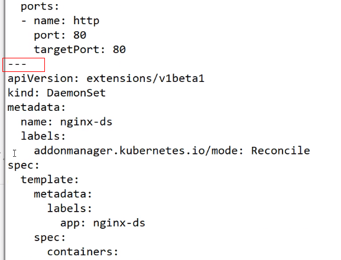
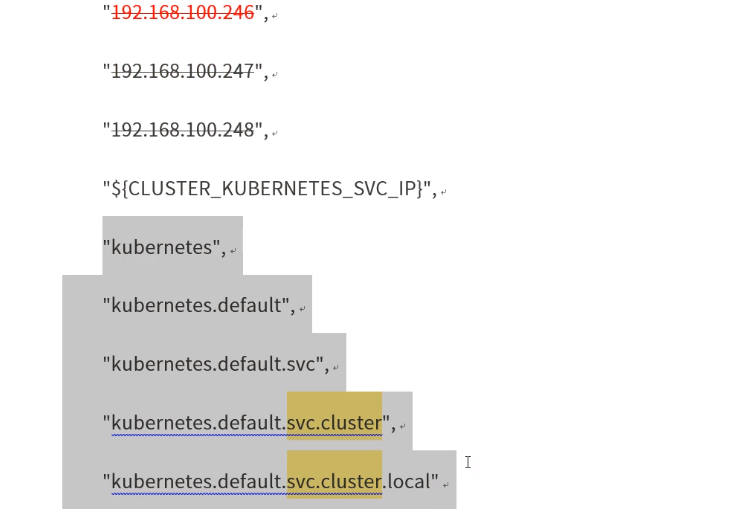
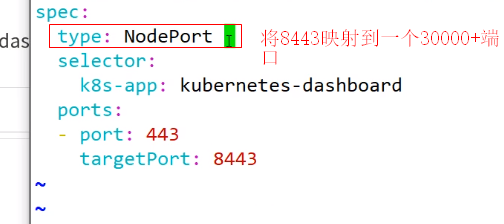

**搭建K8S高可用集群及K8S网络方案详解**

---：用于区分资源模板

kubectl apply与create，推荐使用apply。

pause镜像先拉取，再拉取需要的镜像如nginx。

kubectl get nodes -o wide：查看node详细信息。

kubectl get pods -o wide：查看pod详细信息。

kubectl get svc：等同于kubectl get services。

service名称不能相同。

kubectl get all：查看默认命名空间内资源。

kubectl get all -n kube-system：查看kube-system命名空间内资源。

/etc/resolv.conf：存放DNS信息。

证书不仅适用于三个ip，还适用于满足dns域的。

kubectl apply -f . ：对当前符合的yaml文件启用。

kubectl delete -f xxx.yaml：在work文件夹下运行停止服务。与apply对应。

