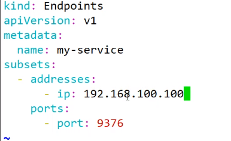
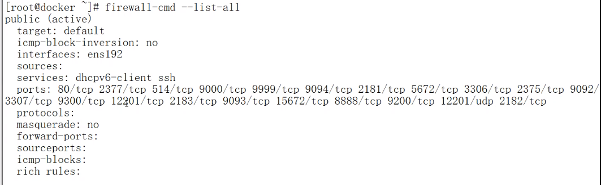
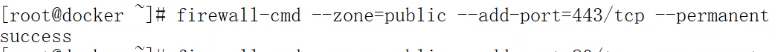
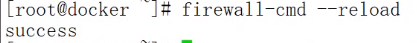

**K8S可视化自动化工具及日志收集**

通过name即可访问ip:port提供的服务。引入外部资源（不属于k8s的服务）

    {
    	“kind”: “Service”,
    
    	“apiVersion”: “v1”,
    
    	“metadata”: {
    
        	“name”: “my-service”,
    
        	“namespace”: “prod”
    
    	},
    
    	“spec”: {
    
        	“type”: “ExternalName”,
    
        	“externalName”: “my.database.example.com”
    
    	}
    }

当访问服务my-service.prod.svc.CLUSTER时，cluster的dns服务会返回记录my.database.example.com 的CNAME，这个重定向是发生在dns解析阶段。

查看防火墙信息。

将签署 harbor 证书的 CA 证书拷贝到/etc/docker/certs.d/192.168.100.249 目录下，登录前需reload docker，使docker加载证书。登录密码在.../harbor/harbor.cfg文件中查找。

~/.docker/config.json若删除，登录会失效。

netstat -nplt | grep 80：查看端口占用情况。

清理节点不会删除work中内容。

