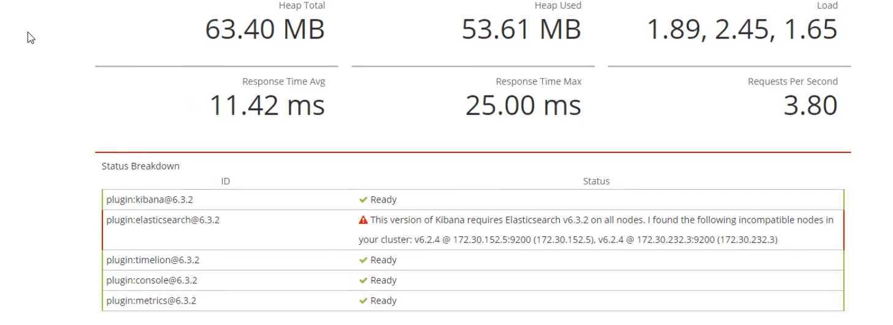
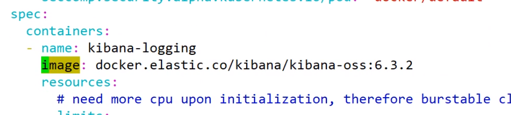
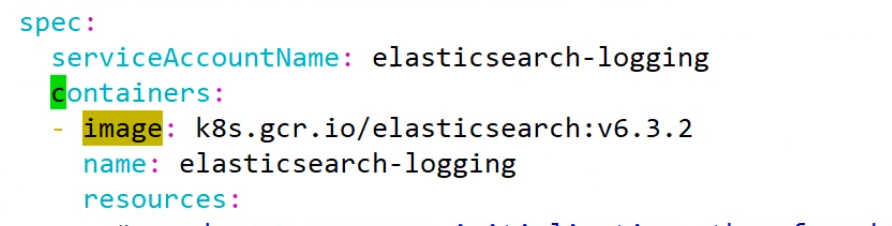
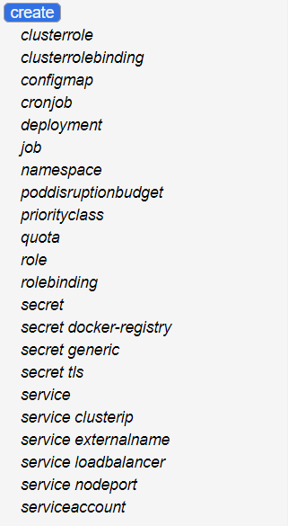
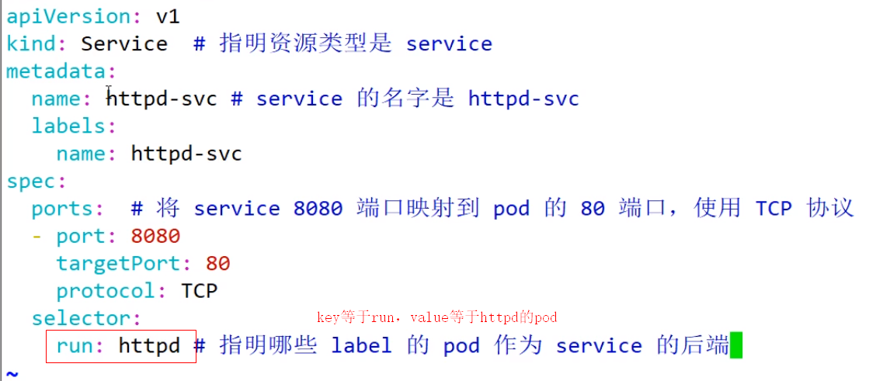

**结合K8S的系统监控及业务部署**

kubectl get service -o wide：输出service详细信息（-o wide：flag）。

kubectl edit -f my-nginx.yaml：编辑运行时信息。

[https://kubernetes.io/docs/reference/generated/kubectl/kubectl-commands](https://kubernetes.io/docs/reference/generated/kubectl/kubectl-commands)

可创建的资源

kubectl pods -o json：以json格式查看pod信息。（支持json/yaml）

使用apply代替create。

annotation与label区别。

kubectl --help

kubectl label --help

service可以提供对外访问，pod不建议对外访问

pod的ip易变，受rc管理，service的ip轻易不会变，service可管理

kubectl get pods：默认 --ns default，而docker ps则是 --ns all

kubectl get pods只能获取到业务数据（自己创建的），每个pod对应一个根pod， /root pause（每一个pod在此共享ip，共享数据卷）

yaml中template：定义容器模板

Deployment定义pod。rc的升级，可以看到pod部署情况。

targetPort是pod的端口号，pod内各容器的targetPort不能相同。

containerPort是容器端口号，互不相干。

作为service负载访问的pod

