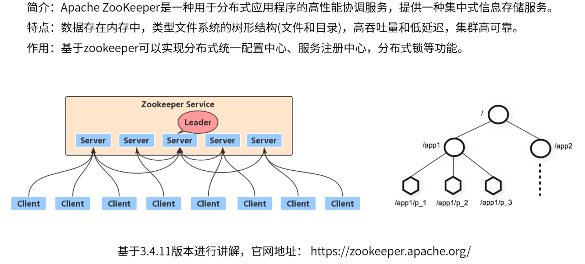
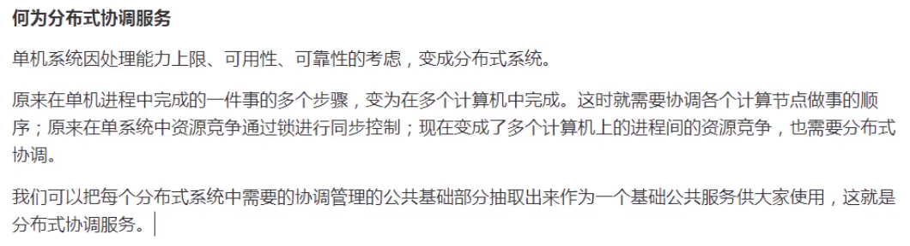
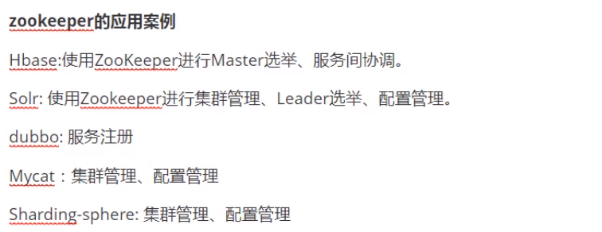
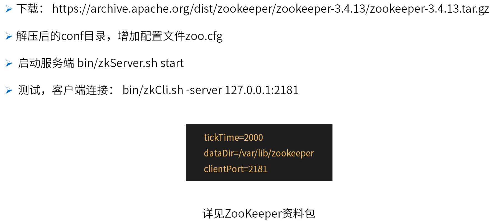
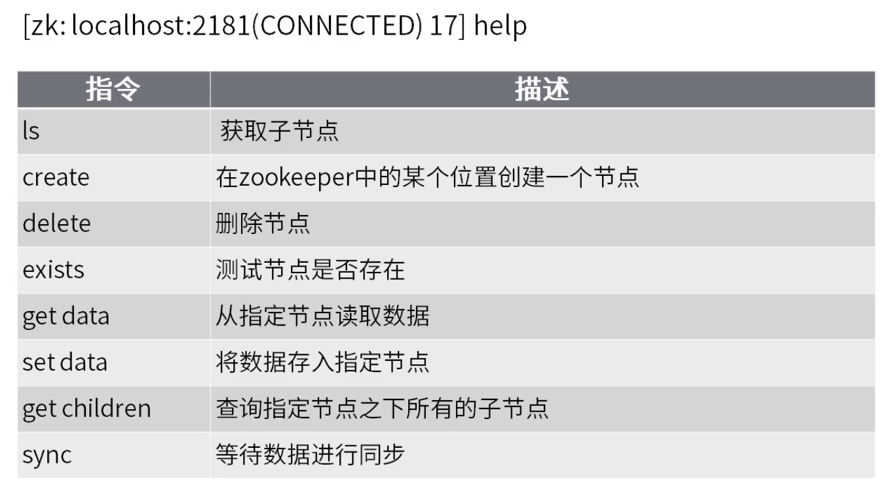
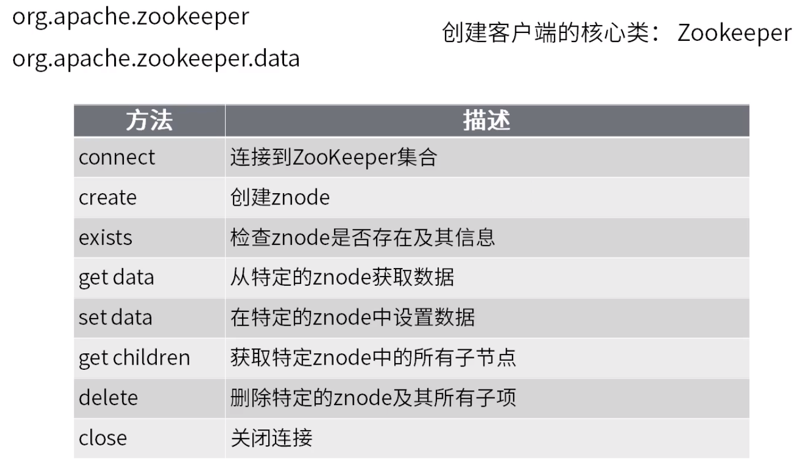
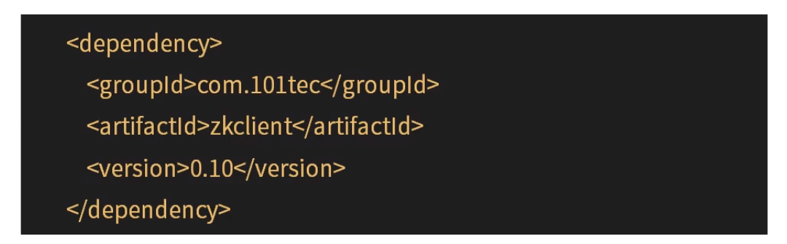
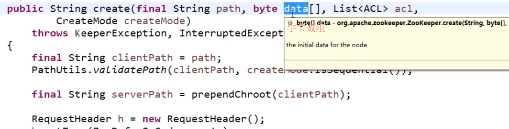
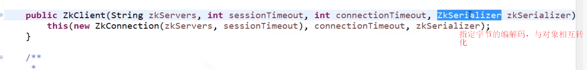

**zk入门**

zookeeper同类产品：consul、etcd、Doozer，etcd为轻量级。

可参考zoo_sample.cfg，具体配置可查看官网[https://zookeeper.apache.org/doc/current/zookeeperAdmin.html#sc_configuration](https://zookeeper.apache.org/doc/current/zookeeperAdmin.html#sc_configuration)

rmr：递归删除，删除带有子节点的节点。

setquota：设置节点配额，非强制，超出可创建成功但会记录异常日志。

sync：同步。

connect：连接到另一个zookeeper服务节点上去。

close：退出。

quit：取消当前连接。

zkClient、Curator

