**zk核心概念**

# 1. Session会话

tickTime可配置。

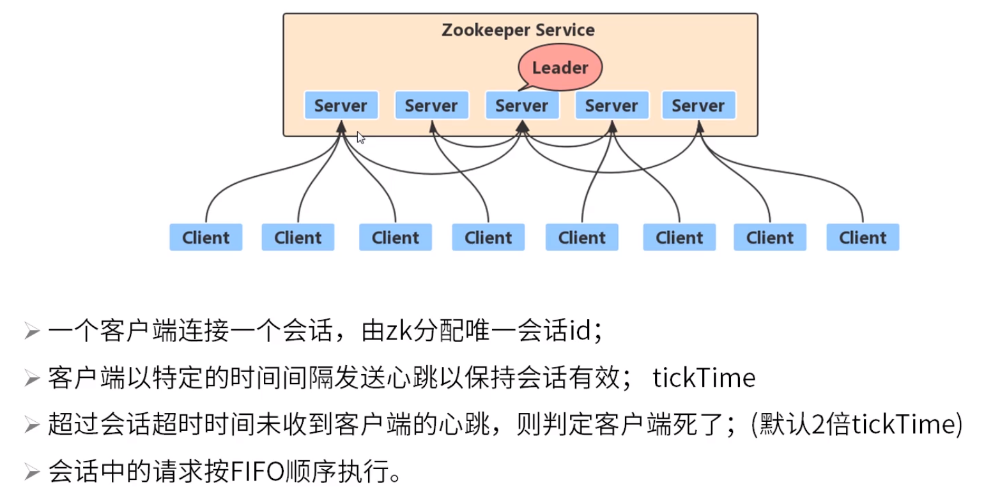

# 2. 数据模型

节点的路径一定为绝对路径。

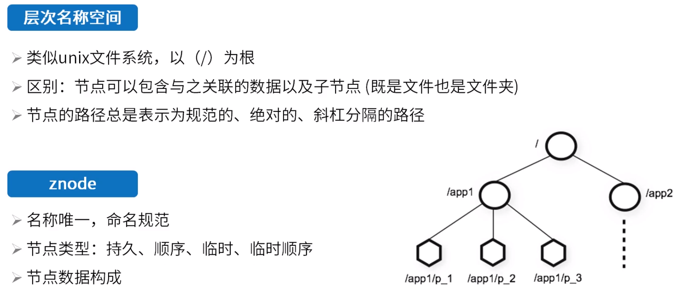

/a.b/可以。

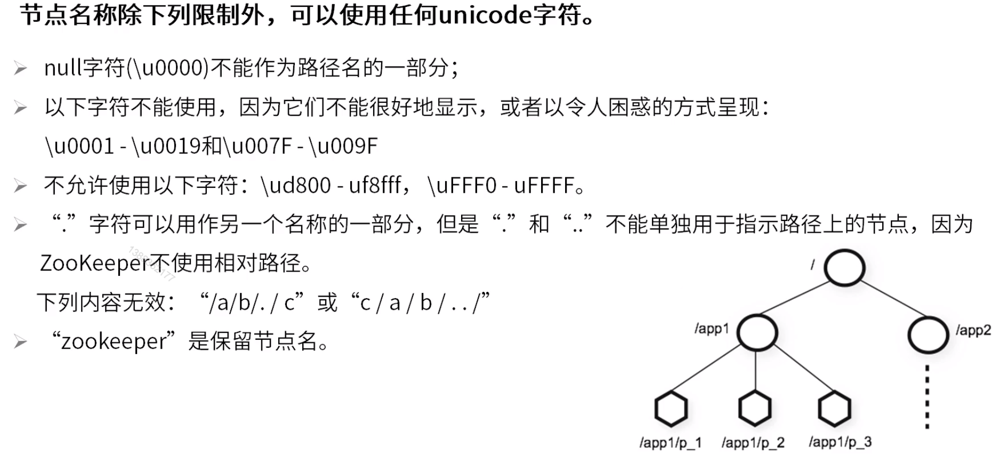

临时节点与会话相关，会话结束节点会被删除。

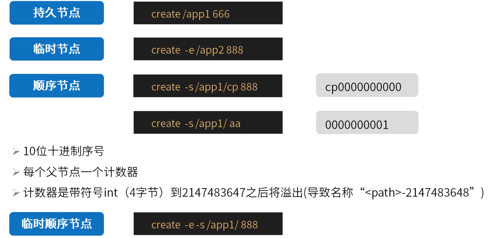

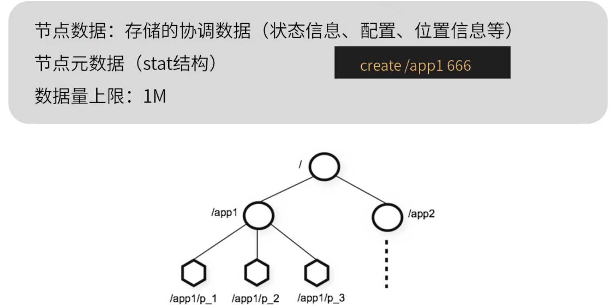

zxid：事务ID。zookeeper内每次数据更新对应一个事务。

aclversion：访问控制列表变更次数。acl权限版本号。

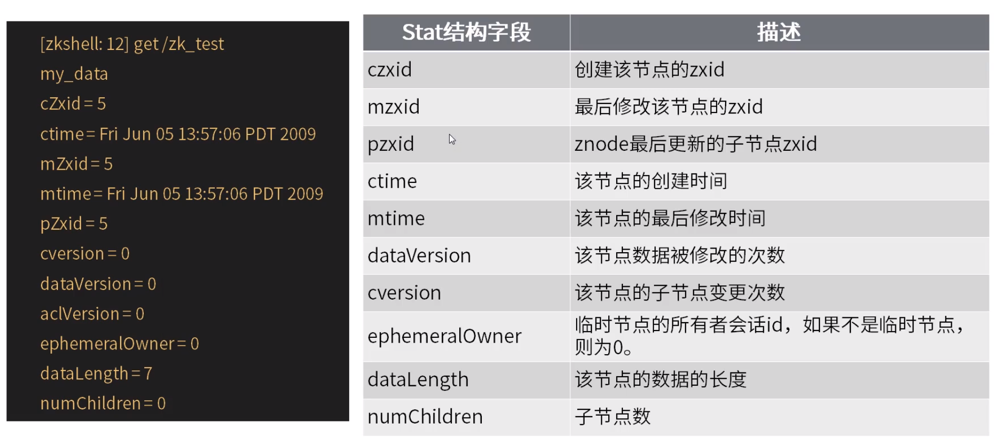

编写访问控制（很少用到）见[https://zookeeper.apache.org/doc/current/zookeeperProgrammers.html#sc_ZooKeeperAccessControl](https://zookeeper.apache.org/doc/current/zookeeperProgrammers.html#sc_ZooKeeperAccessControl)

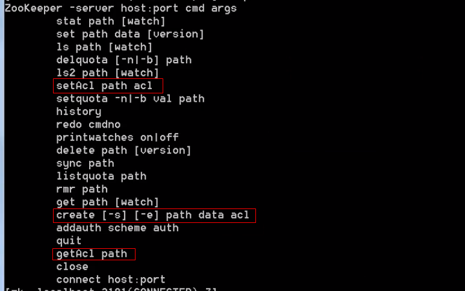

19.22.0.0/16网段可以读。

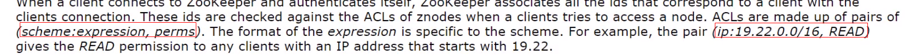

ticks：基本时间单位。基于它决定的各种时间都是它的多少倍。

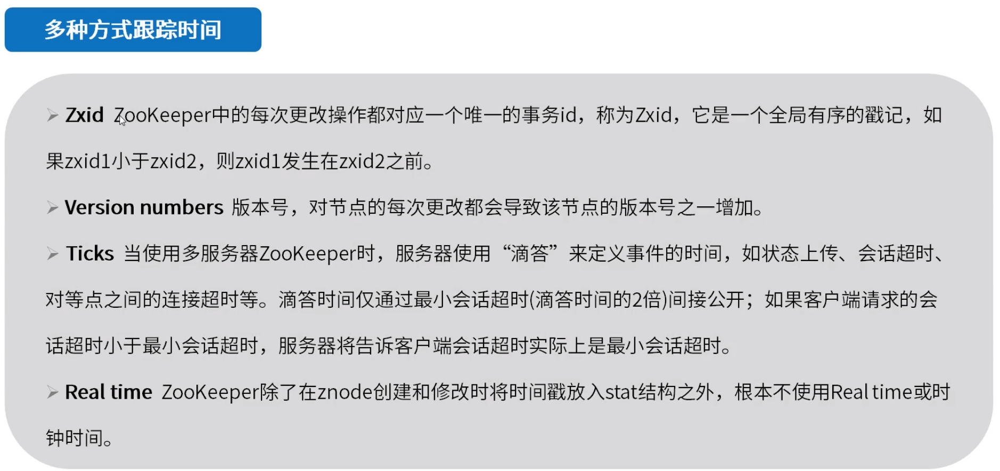

# 3. watch

get /app1 1：1表示打开监听，0表示不打开。

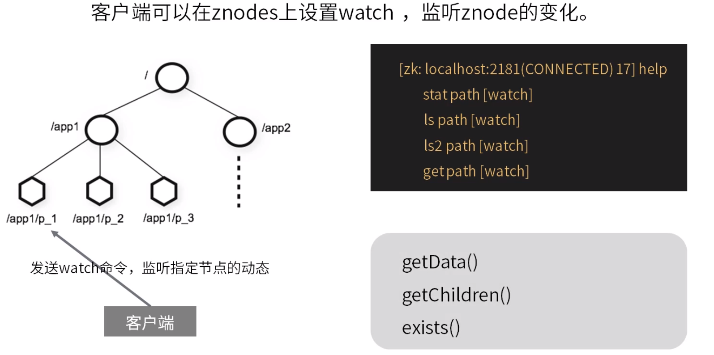

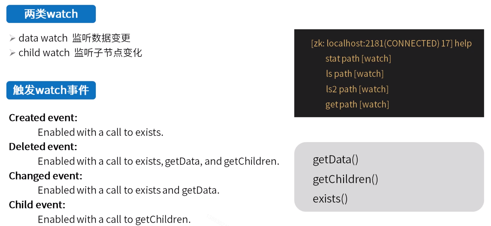

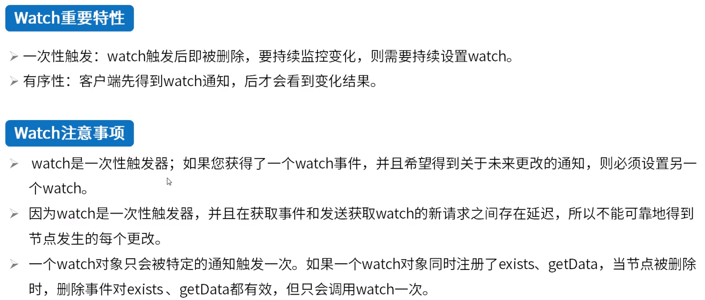

zkclient内封装了订阅方法，内部实现watch重设置。

# 4.特性

每一次变更在zookeeper内都有对应的事务日志记录。先写日志记录（发起集群相关的一致性处理后），再进行修改。

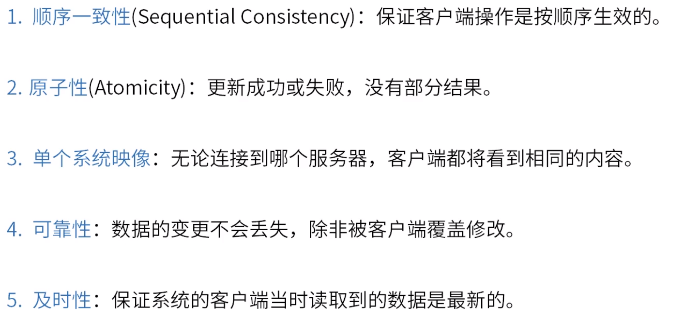

