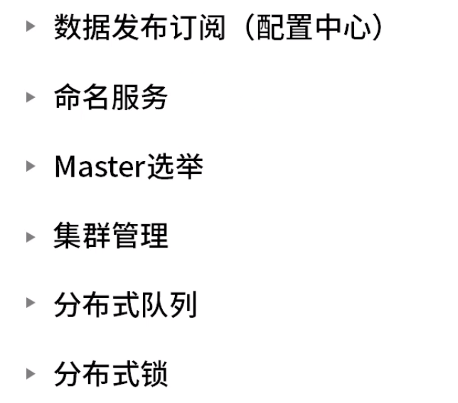
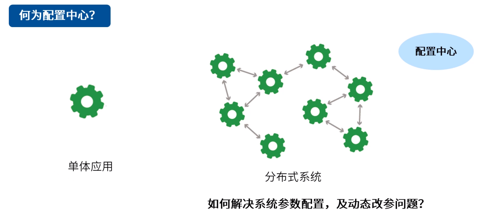
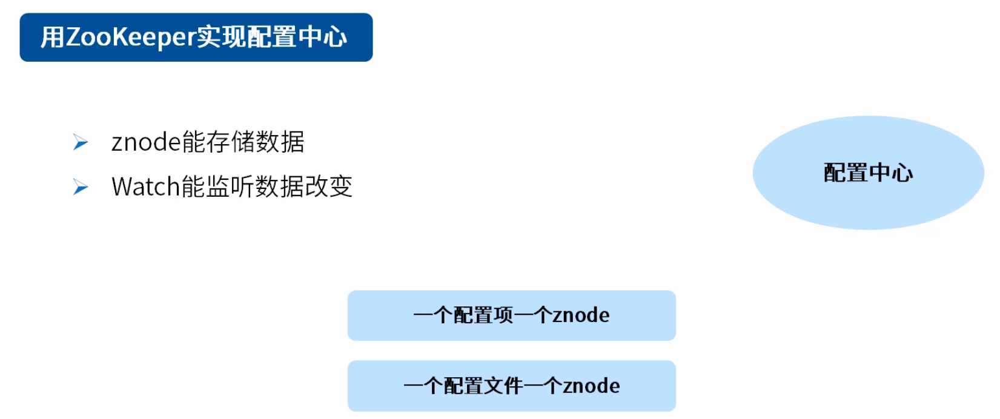
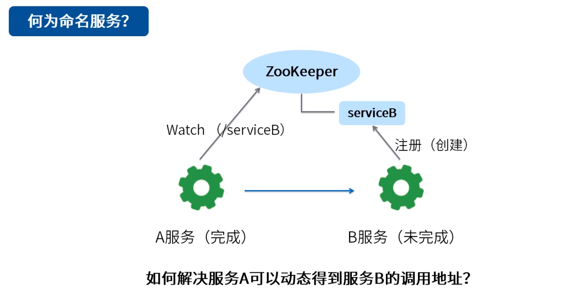
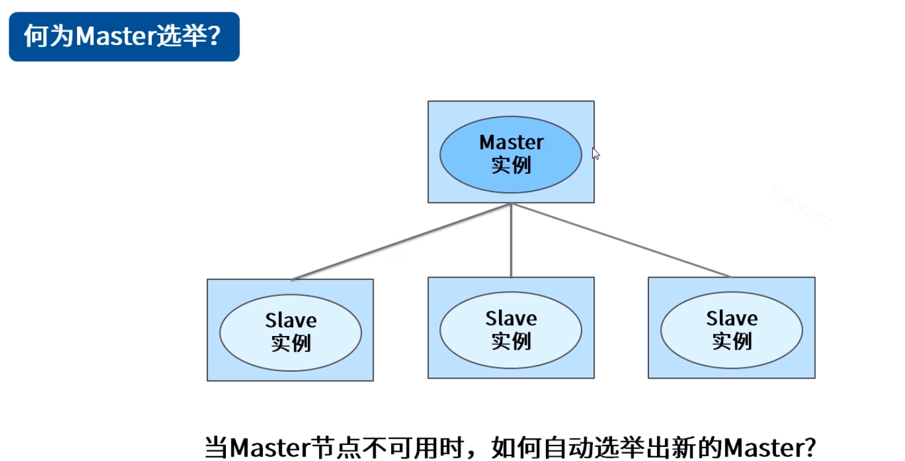
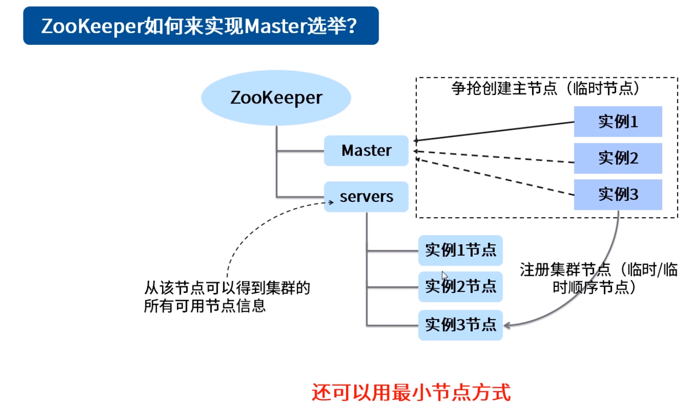
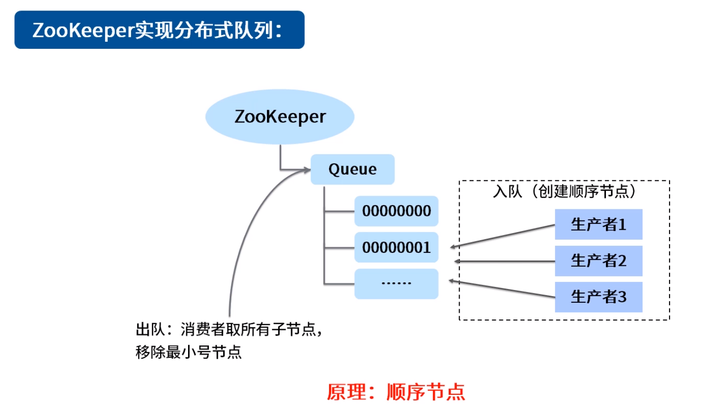
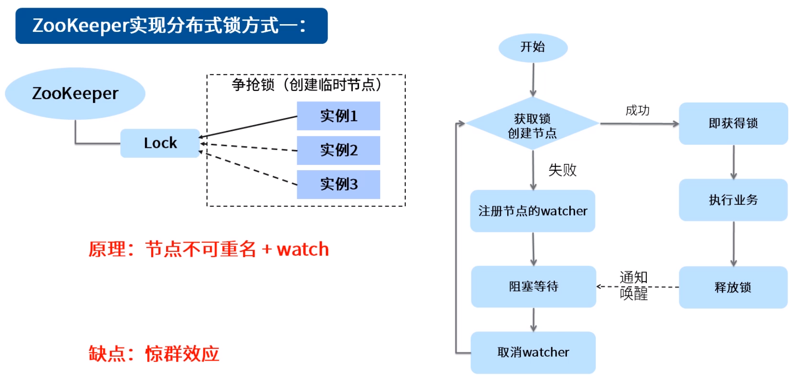
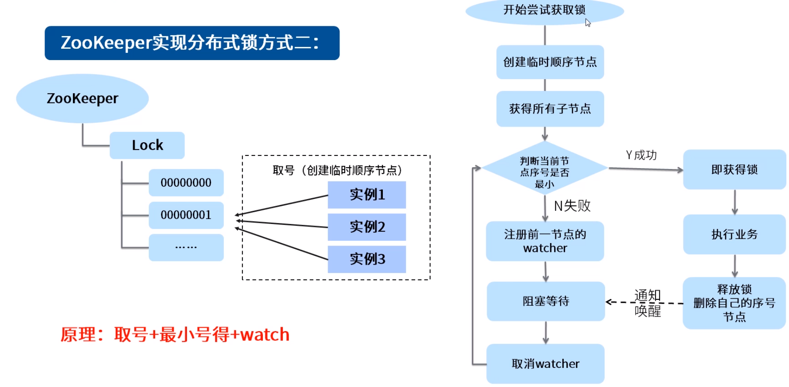

**zk典型应用场景**

# 1. 数据发布订阅（配置中心）

# 2. 命名服务

# 3. Master选举

使用zookeeper实现Master选举只是方法之一。

实例1挂掉后，对应Master临时节点会被删除。Master临时节点一旦消失，其他节点争抢创建主节点。若主节点需要实时获知所有节点，可添加servers节点存储。选举也可采用最小节点方式（如序号最小，需要临时顺序节点）。

# 4. 分布式队列

有界队列创建节点需要分布式锁，以免出界。

# 5. 分布式锁

方法之一，常用。还可以用Redis等等。

之所以选用临时节点而不是持久节点：防止争抢到锁的实例出现异常退出（如断电）未及时删除节点。

适用于并发小的场景。

