**zk集群**


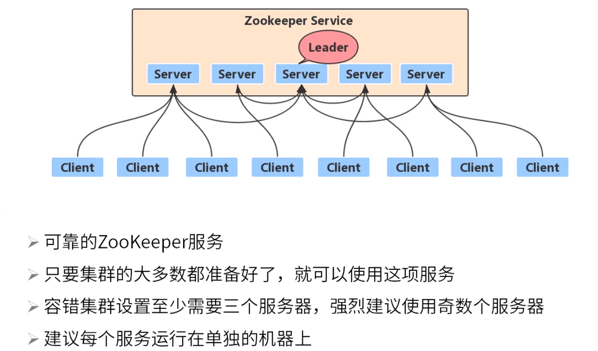


集群leader选举也有initLimit限制。

Leader选举需超过配置文件中配置的节点总数的半数。

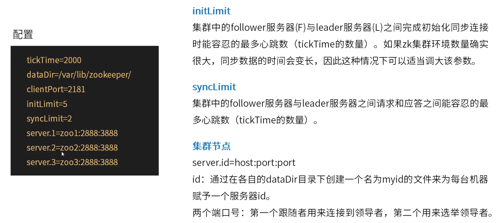


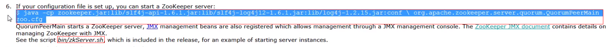

If your configuration file is set up, you can start a ZooKeeper server:

```
$ java -cp zookeeper.jar:lib/*:conf org.apache.zookeeper.server.quorum.QuorumPeerMain zoo.conf 
```

QuorumPeerMain starts a ZooKeeper server, [JMX](http://java.sun.com/javase/technologies/core/mntr-mgmt/javamanagement/) management beans are also registered which allows management through a JMX management console. The [ZooKeeper JMX document](https://zookeeper.apache.org/doc/current/zookeeperJMX.html) contains details on managing ZooKeeper with JMX. See the script *bin/zkServer.sh*, which is included in the release, for an example of starting server instances.

Test your deployment by connecting to the hosts: In Java, you can run the following command to execute simple operations:

```
$ bin/zkCli.sh -server 127.0.0.1:2181
```


[https://zookeeper.apache.org/doc/current/zookeeperAdmin.html#sc_monitoring](https://zookeeper.apache.org/doc/current/zookeeperAdmin.html#sc_monitoring)

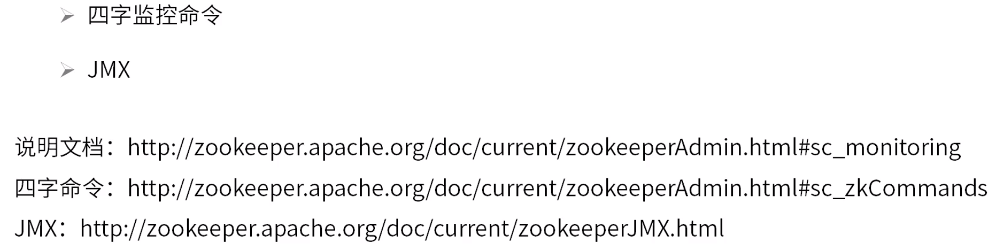


每一台server中存储着同样的全量数据。

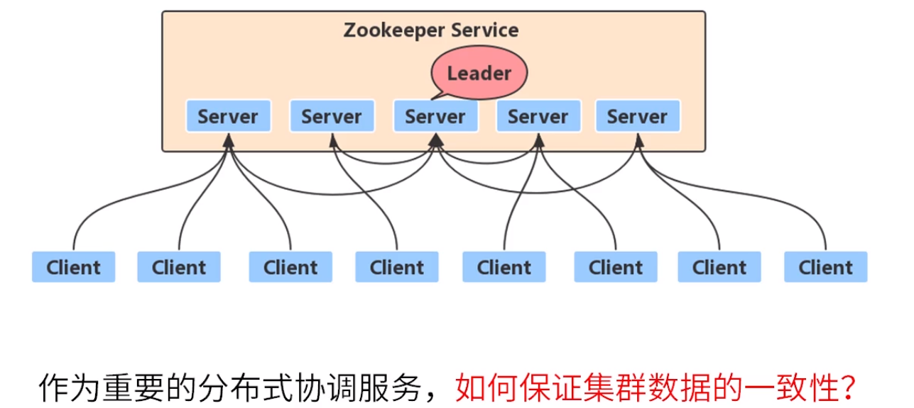


每个server都可以接受客户端的写请求，接收后转发至leader节点。

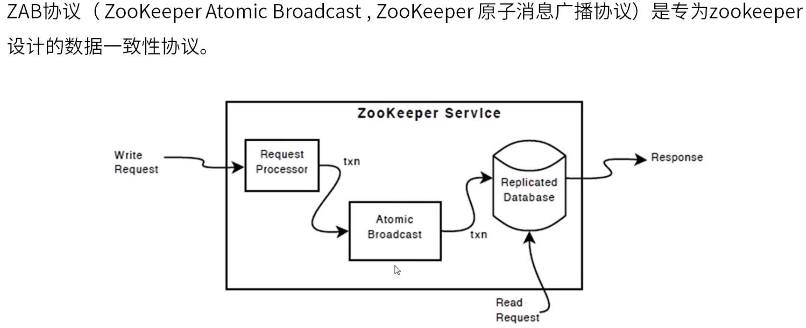


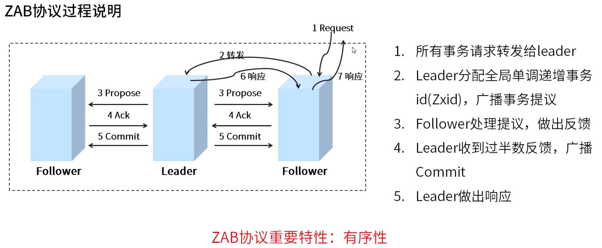


崩溃恢复模式中，zookeeper不能对外提供服务。

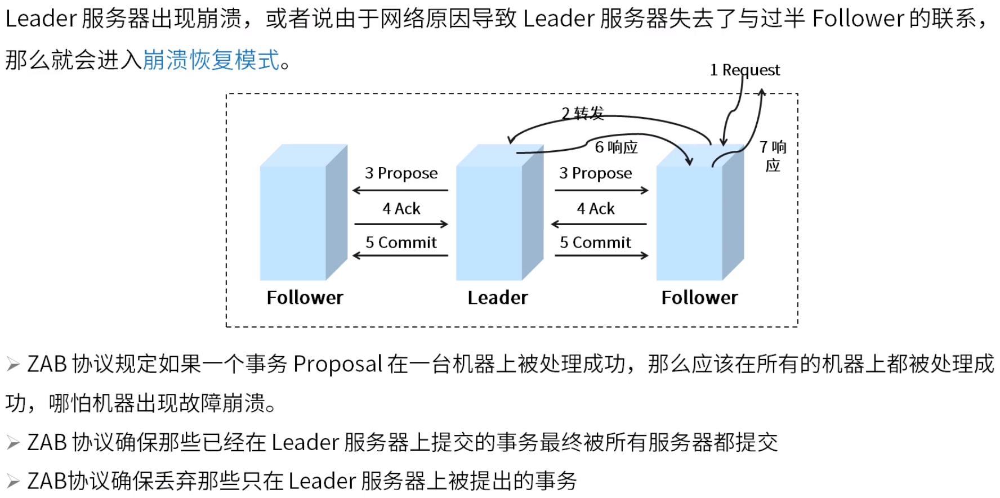


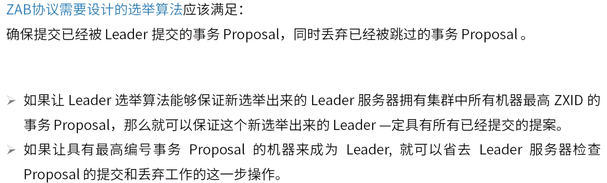


加入到可用Follower列表中：确认Follower数目是否达到半数。

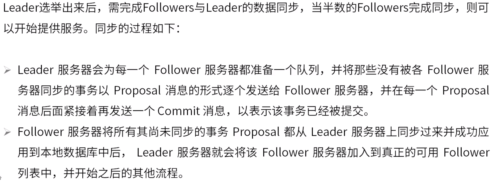


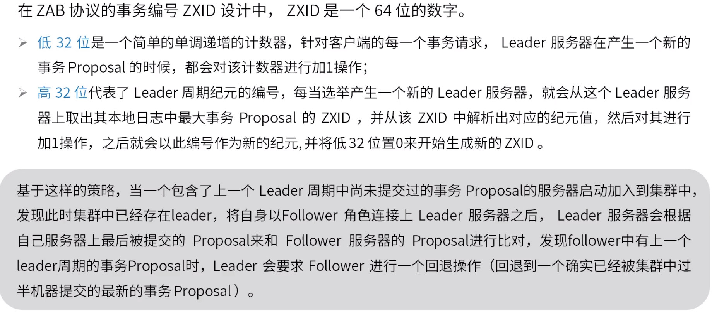


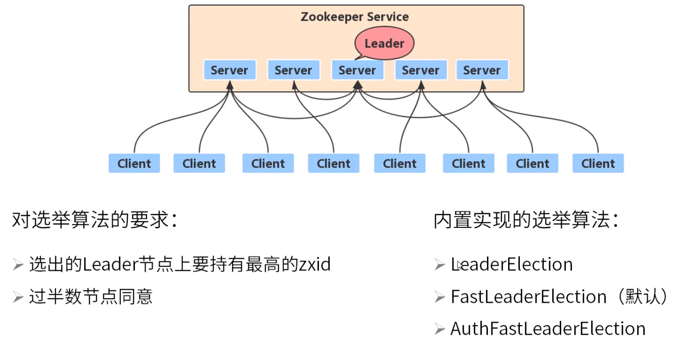


逻辑时钟：防止受到前一轮投票影响。

集群数目较大时，不用让所有节点参与竞选，不参与的节点处于Observing状态。

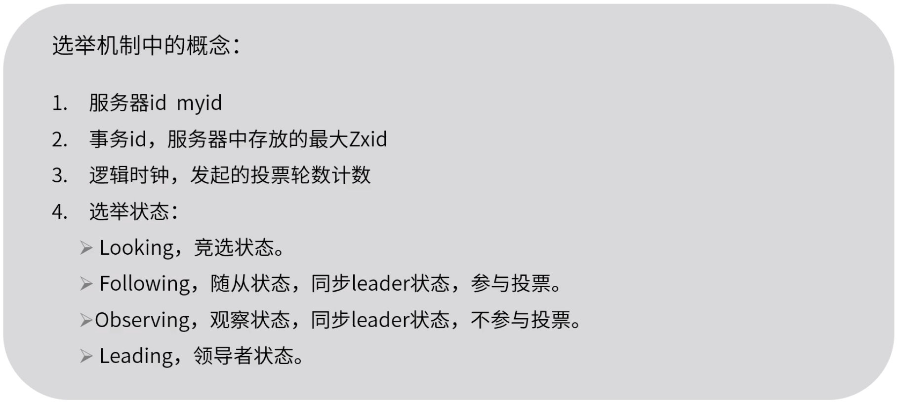


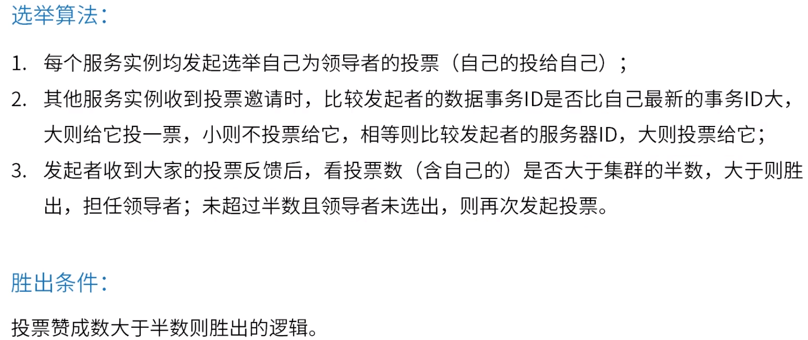


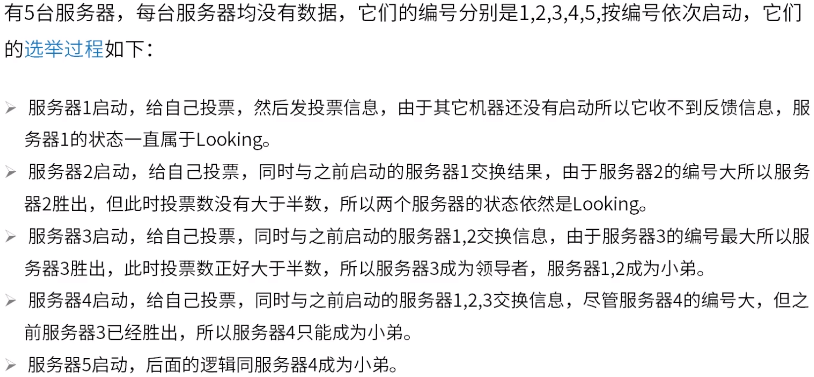


CAP理论告诉我们，一个分布式系统不可能同时满足以下三种

- 一致性（C:Consistency）
- 可用性（A:Available）
- 分区容错性（P:Partition Tolerance）

zookeeper：c、p，牺牲了部分可用性。

