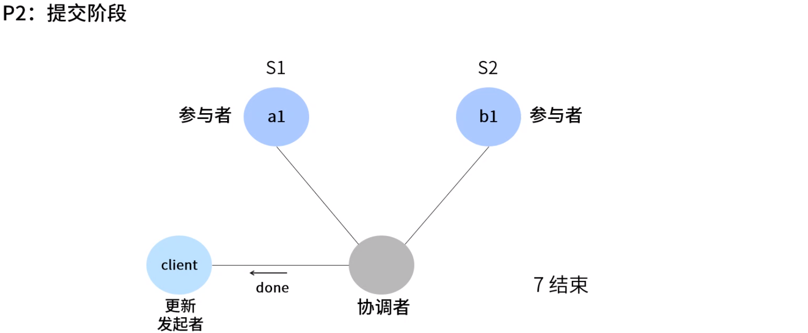
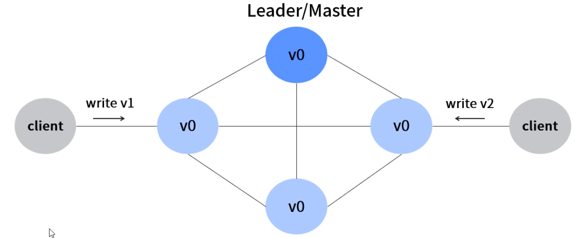

**详解分布式一致性协议**

目标：掌握常见分布式一致性算法原理

# 1. 2PC

2PC：XA标准（工业标准） java实现：JTA。会记录日志，记录事务的交互过程。

协调者：事务的管理

参与者与协调者彼此阻塞等待

# 2. 3PC

少用。超时时长无法估量。没有工业级实现。与2PC一样，需要完备的日志记录。

# 3. 添加Leader

实际实现应用中需要规避的问题。Leader的高可用。

# 4. Paxos

保证数据一致。较复杂，很少直接使用。基石。重要。

接受者一般有多个。

# 5. 其他

ZAB：严格的顺序 flow 应用变更时，严格按照提案的txid

