**Dubbo服务化思想及mock/容错/负载均衡机制**

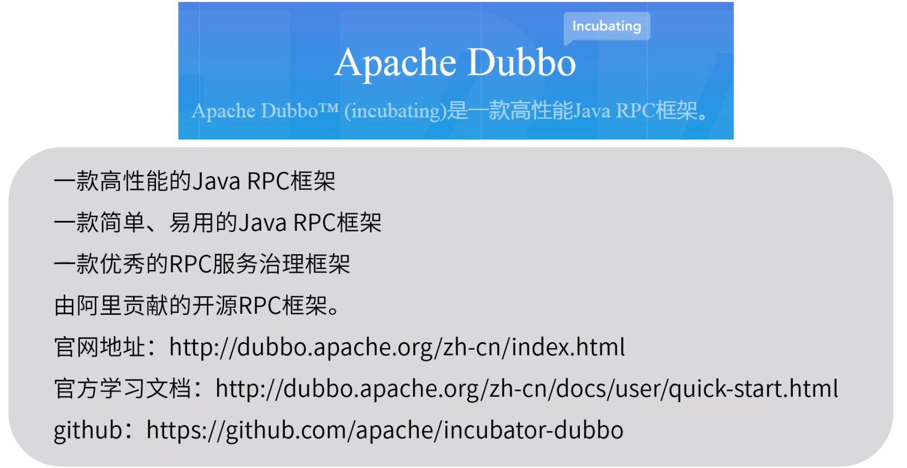

2.6版本较2.7更稳定

dubbo中服务依赖管理、服务监控、服务治理不够好，不完善

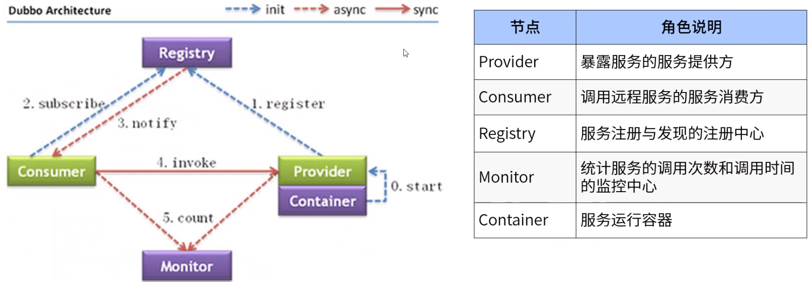

dubbo架构特点

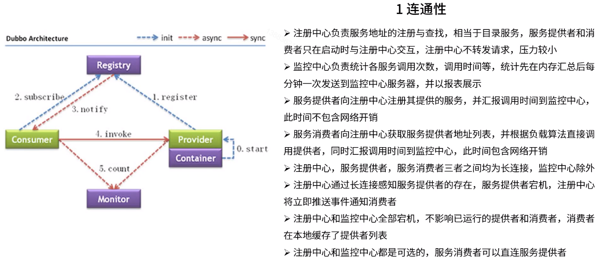

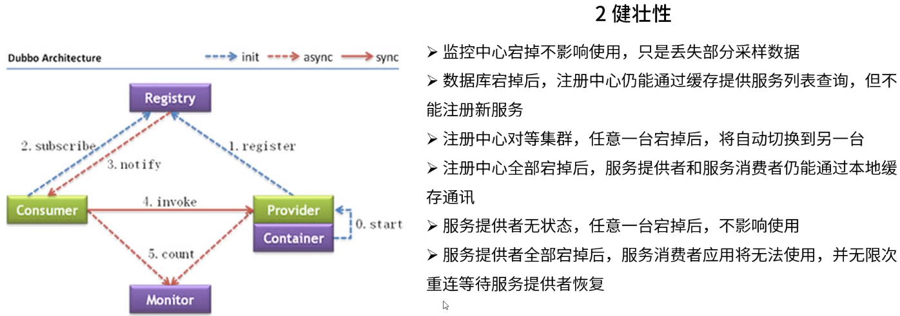

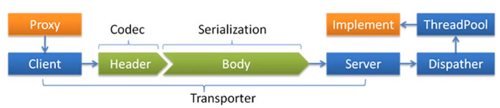

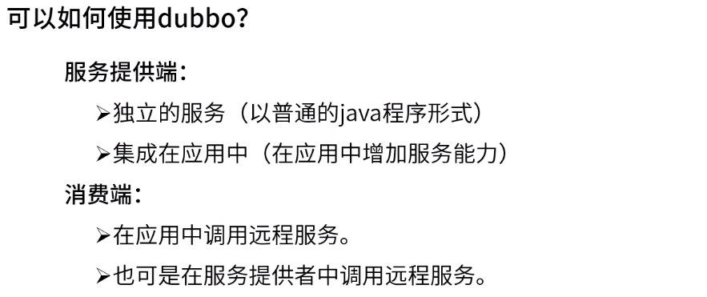

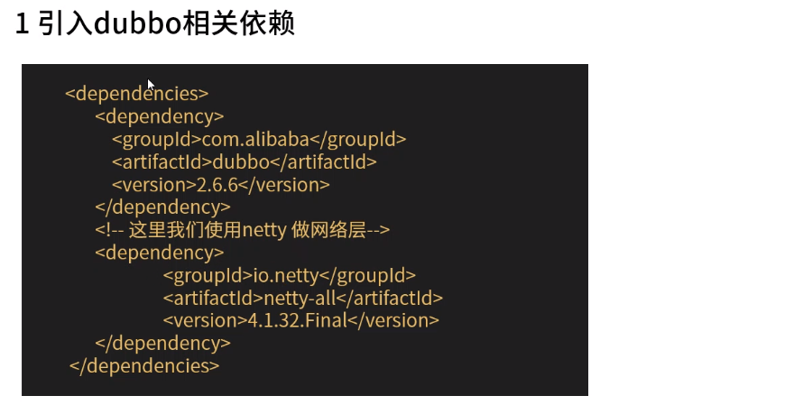

消费者xml配置中不用加协议配置：可从配置中心获知。

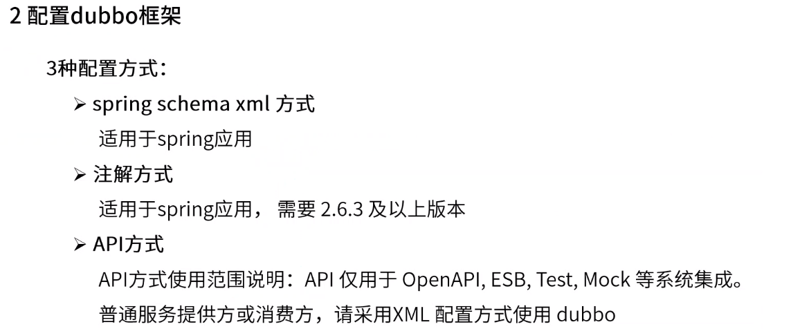

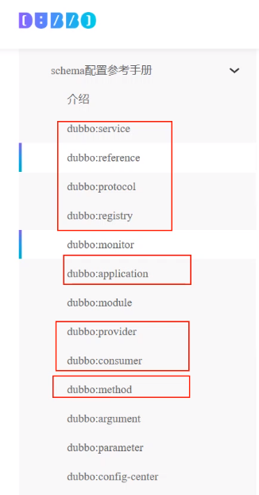

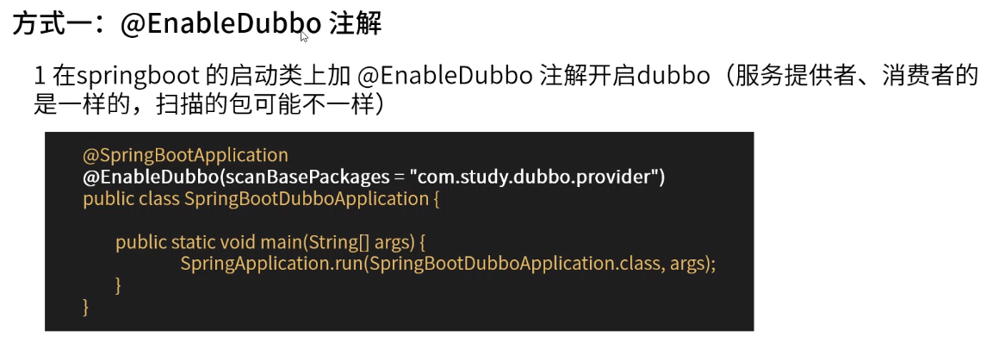

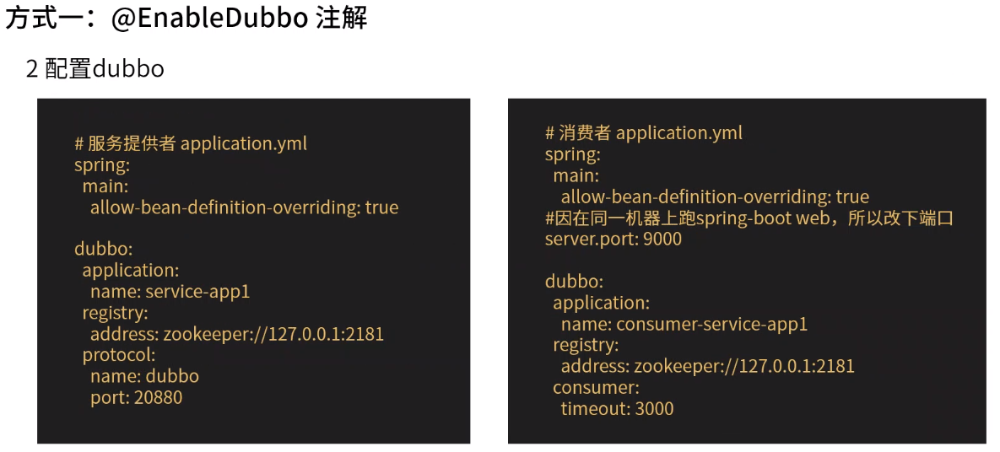

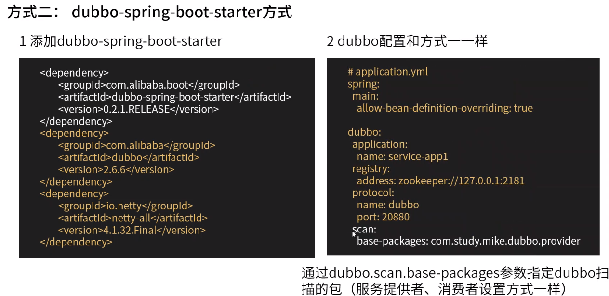

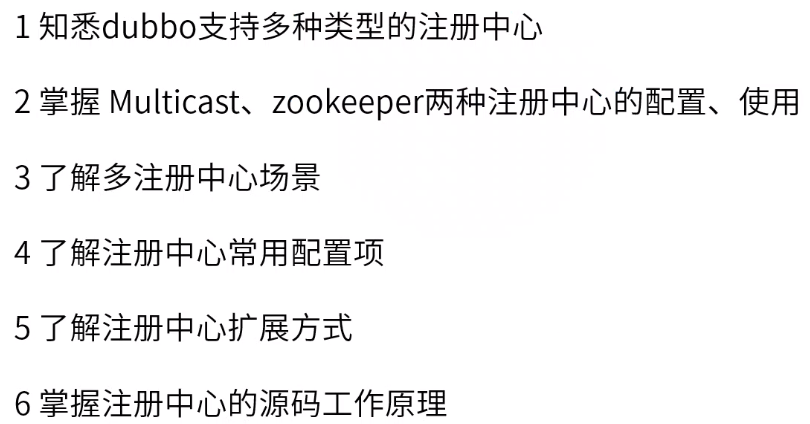

multicast注册中心（测试使用）

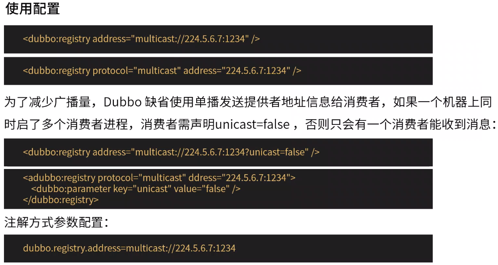

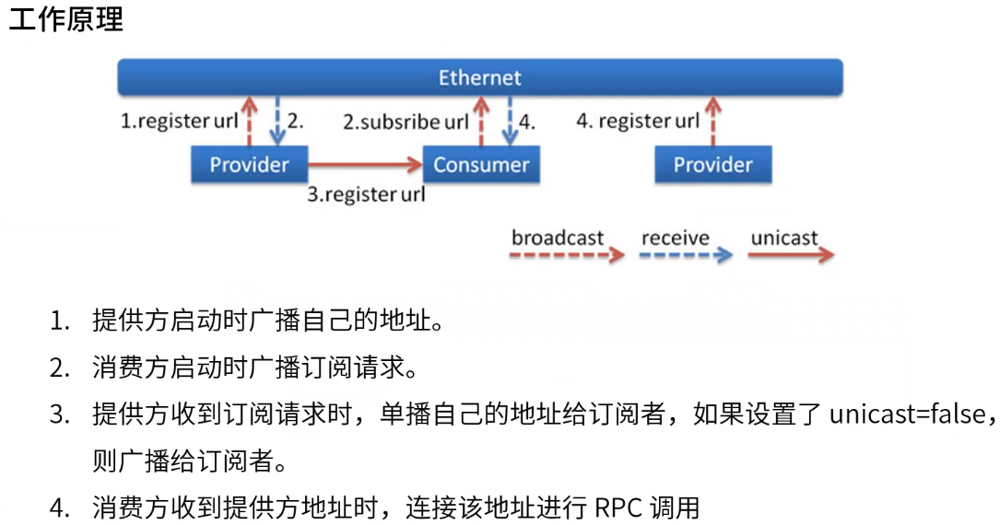

组播：局域网使用

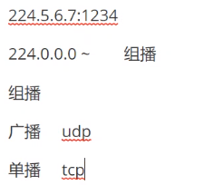

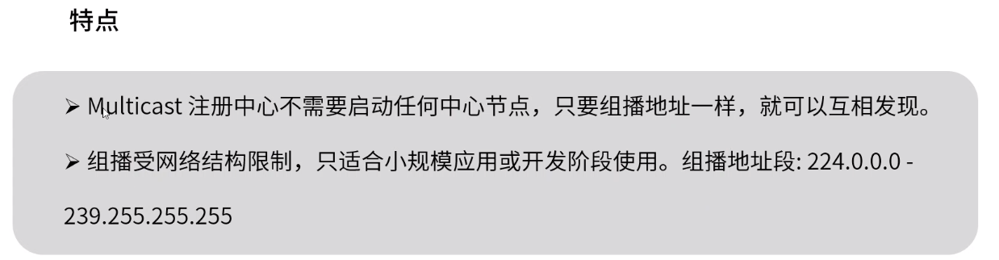

zookeeper注册中心

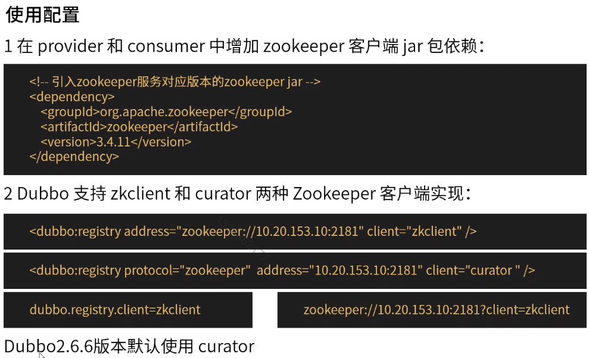

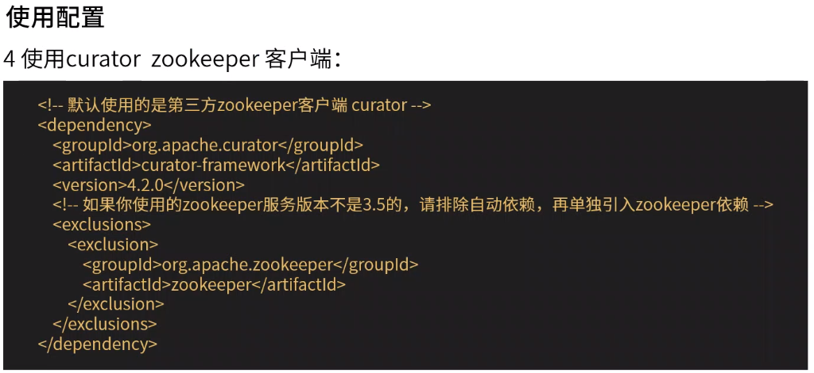

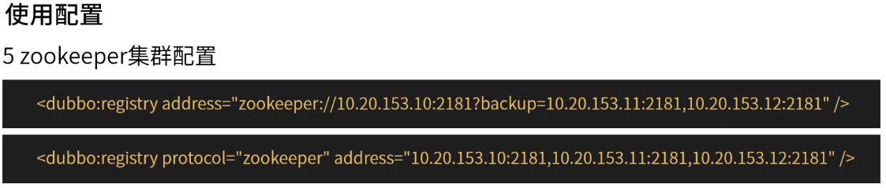

zooinspector：zookeeper客户端工具

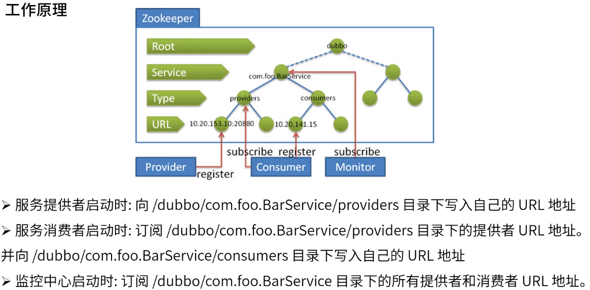

不指定分组时默认为dubbo

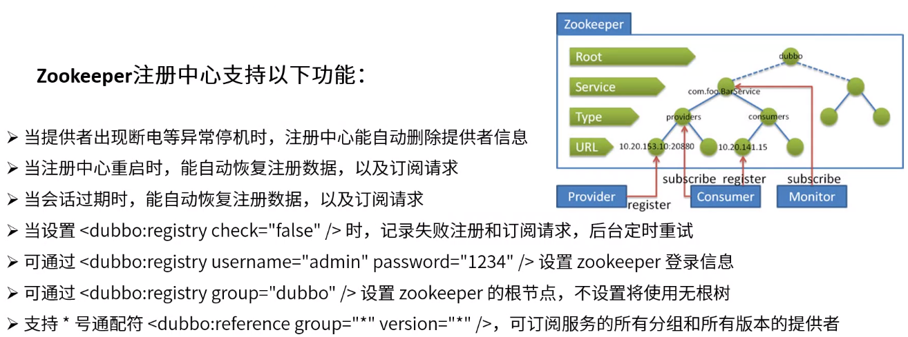

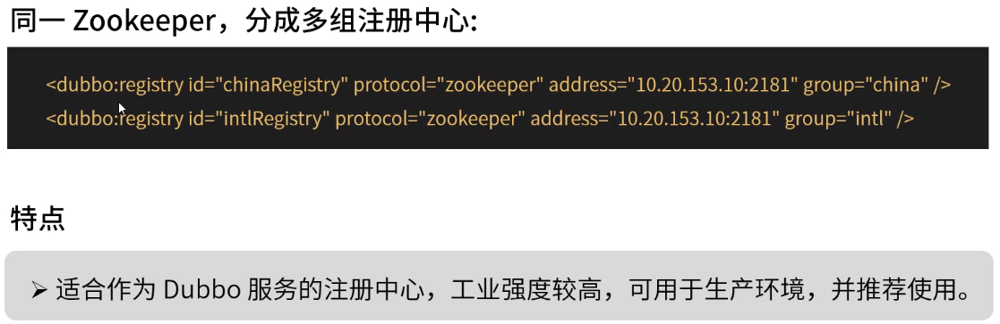

多种注册中心

不指定时注册到默认的注册中心

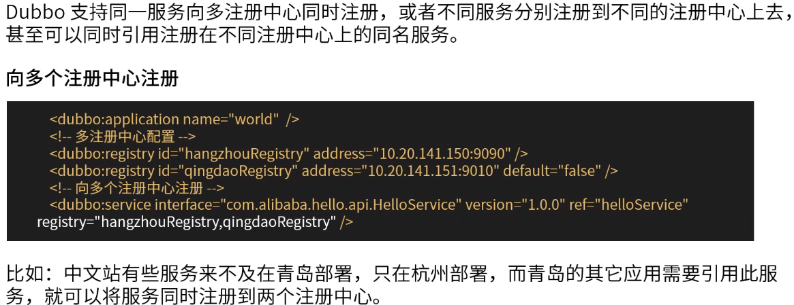

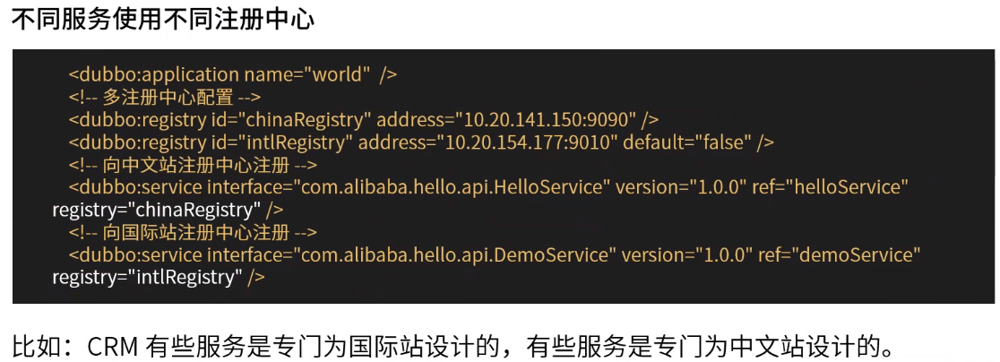

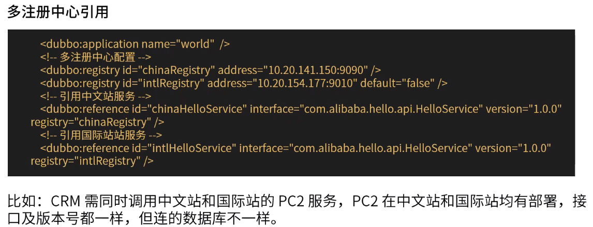

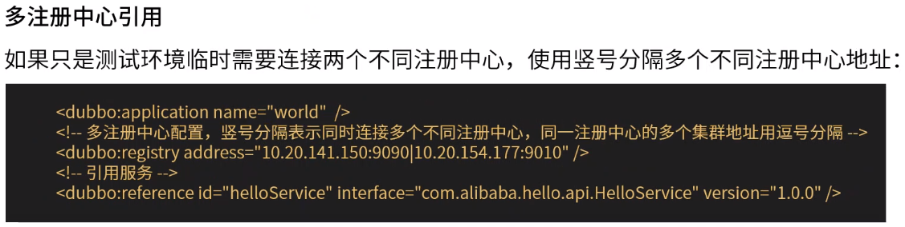

多种使用场景

默认动态服务。静态服务（屏蔽故障服务）

可配置项

