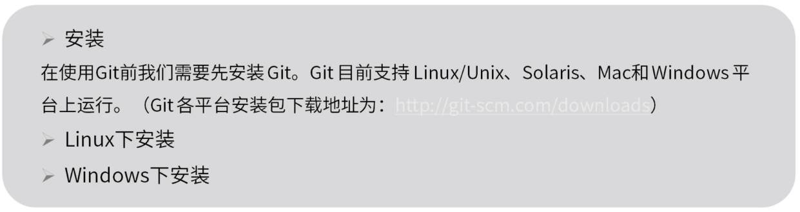
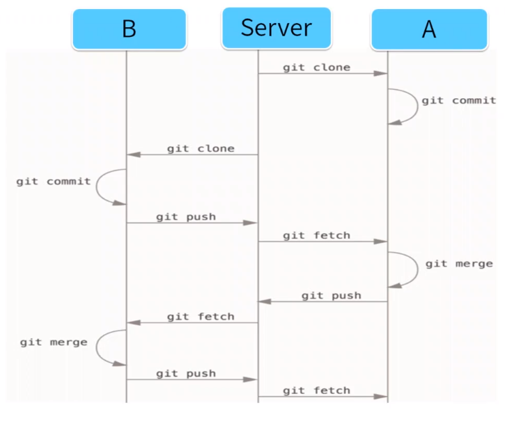

**git**

## git概述

#### 版本控制概述

追溯历史，多人协作

#### git简介

分布式，多为增加数据而不是删除数据（对历史追溯比较好），分支操作有优势

#### git安装

## git基础

#### git仓库

#### git基本概念

#### git基本操作

## git进阶--分支

## git协作开发

#### Gitflow

#### 远程仓库

第一次上传时添加 -u 

#### 多人协作

#### GitLab搭建

