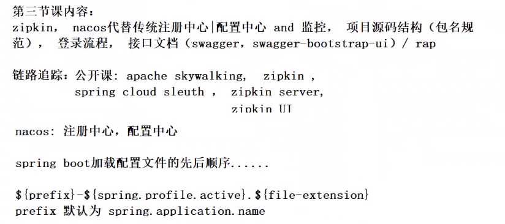

**项目代码功能实现2**

zipkin不如skywalking专业，可结合spring boot admin查看日志。

nacos：使用方便、对接容易

https://nacos.io/zh-cn/docs/quick-start-spring-cloud.html

file-extension默认为properties

java项目中可添加package-info类，用于描述项目信息。

阿里 rap2

